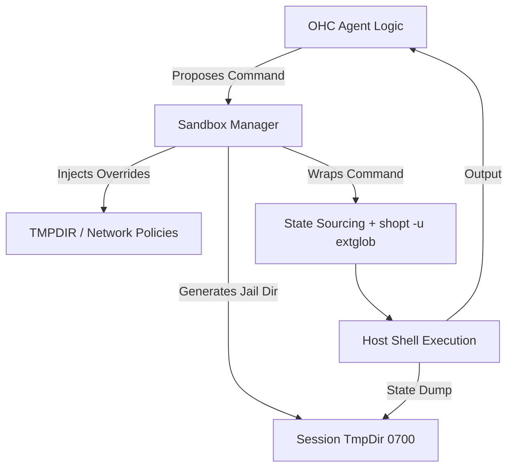

# 🔬 OHC Oracle Research Report: Agent Harness & Execution Isolation

**Date:** 2026-04-16
**Target Analyzed:** Claude Code (v2.1.88)
**Focus Area:** Agent Harness Environment, Sandboxing, Shell Execution Lifecycle

## 1. Executive Summary
This research investigates the operational harness of *Claude Code*, a leading CLI-based AI agent, to identify structural gaps in OHC's local and hybrid execution models. The analysis focused heavily on how the competitor isolates untrusted shell commands, manages execution state across turns, and handles security boundaries. The findings highlight immediate opportunities to harden OHC's `AgentWorker` and `TerminalCall` implementations to match industry-standard isolation and state persistence.

## 2. Competitive Architectural Analysis

Claude Code utilizes a sophisticated **Sandbox Adapter** wrapping an external `@anthropic-ai/sandbox-runtime` package. This layer intercepts, isolates, and monitors all interactions between the LLM and the host OS.

### Shell Provider Strategies
- **Bash & PowerShell Isolation:** Instead of raw `exec` calls, Claude Code constructs intricate wrapper commands. For Bash, they enforce security by disabling extended globbing (`shopt -u extglob`) to prevent post-validation expansion attacks.
- **Stateful REPL Simulation:** Agents require context (working directory, environment variables) to persist across command invocations. Claude Code solves this by writing environment snapshots (`declare -p`) and path snapshots (`pwd -P`) to temporary files, and `source`ing them before subsequent commands.
- **TMPDIR Jailing:** Every spawned shell process has its `TMPDIR`, `CLAUDE_CODE_TMPDIR`, and `TMPPREFIX` (for zsh heredocs) overridden to point to a strictly permissioned (`0700`) temporary directory specific to that session.

### Network & File Restrictions
- **Intercept Callbacks:** The sandbox utilizes a `sandboxAskCallback` to intercept unapproved network requests, allowing for graceful UI prompting ("Sandbox Violations") rather than raw crashes.
- **Defensive Redirects:** The engine detects and rewrites dangerous LLM behaviors, such as Windows CMD-style `2>nul` redirects, which create literal files named `nul` on POSIX systems, breaking git operations.

## 3. OHC vs. Market Reality (Comparative Chart)

| Feature | OHC (Current State) | Claude Code (v2.1.88) | Gap Impact |
| :--- | :--- | :--- | :--- |
| **Command Execution** | Raw `exec.Command` | Wrapped via `ShellProvider` | High (Security/Stability) |
| **State Persistence** | Stateless per command | Snapshot/Restore (`source` + `pwd`) | High (Agent UX) |
| **TMPDIR Isolation** | Host Default (`/tmp`) | Session-isolated `0700` Jail | Medium (Security) |
| **Network Interception** | Allowed (Host Network) | Hooked via `sandboxAskCallback` | Medium (Control) |
| **Glob Attack Mitigation** | None | Explicitly disabled (`-u extglob`) | High (Security) |

## 4. Architectural Flow & Recommended Design

## 5. Actionable Roadmap (Missions Injected)

The following missions have been created via OHC-GTP to close these gaps:

1. **[backend] Implement Sandboxed Execution Environment for Agent Harness (#5295)**
   - Introduces the `SandboxManager` to handle `TMPDIR` jailing, `0700` permissions, and security flags (`shopt -u extglob`) for Bash/PowerShell execution within the Go backend.
2. **[backend] Implement Shell Environment Snapshot & Restore for Agents (#5296)**
   - Introduces stateful REPL simulation by reading/writing `env_snapshot.sh` and `cwd_snapshot.txt` between command invocations.

