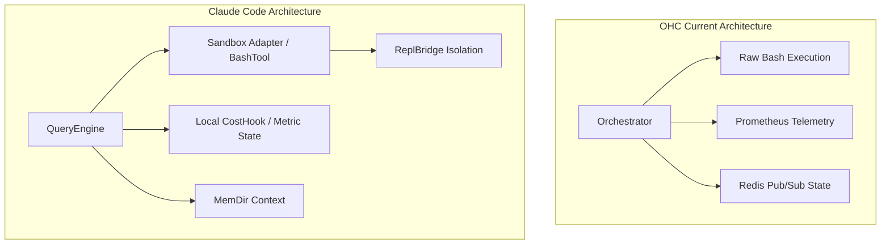

# OHC Agent Harness: Competitive Analysis & Market Architecture

## 1. Executive Summary
This report provides a deep technical analysis of the Agent Harness structures employed by leading market architectures, specifically focusing on the internal mechanics of Claude Code based on source code analysis. The goal is to inform OHC's execution environment strategy, ensuring we meet our absolute autonomy and metric fidelity mandates.

## 2. Deep Technical Audit: Claude Code
Claude Code employs a modular tool structure driven by a central `QueryEngine.ts`. Its harness architecture is defined by several distinct layers:

### 2.1 Context and Memory Management (QueryEngine.ts)
The `QueryEngine` operates as the central control loop, managing the agent's context and execution state.
- **State Management**: Uses `bootstrap/state.js` to persist session IDs and toggle persistence flags (`isSessionPersistenceDisabled`).
- **Memory Directives**: Local memory is managed via `memdir/memdir.js`, with support for auto-path overrides (`memdir/paths.js`), allowing dynamic context loading based on the execution directory.
- **Cost Tracking Integration**: The `QueryEngine` directly hooks into `cost-tracker.ts` during execution loops to fetch metrics like `getTotalCost`, `getModelUsage`, and `getTotalAPIDuration`, effectively interleaving financial telemetry with the operational execution flow.

### 2.2 Execution Isolation: The Bash Sandbox
Claude Code does not execute raw bash commands unconditionally. Instead, it relies on a sophisticated `BashTool` (located in `src/tools/BashTool/`) built around a `SandboxManager`.
- **Security & Validation**: Commands pass through rigorous validation pipelines including `bashPermissions.ts`, `bashSecurity.ts`, and `readOnlyValidation.ts` before execution.
- **Dynamic Policy Engine**: The `shouldUseSandbox.ts` module determines execution safety based on feature flags (`tengu_sandbox_disabled_commands`) and dynamic user configurations, allowing flexible, rule-based execution environments rather than hardcoded blocks.
- **Bridged Execution**: The Harness uses a `bridge/` directory pattern (e.g., `replBridge.ts`, `bridgeMain.ts`) to orchestrate execution, establishing a flush-gate pattern to stream stdin/stdout and control process lifecycle cleanly.

## 3. OHC Architectural Comparison

### Architecture Diagram (Mermaid)

### Comparative Features Table
| Feature Category | OHC Current Implementation | Market Leader (Claude Code) | Gap Analysis |
|------------------|---------------------------|-----------------------------|--------------|
| **Command Execution** | Unrestricted `run_in_bash_session` | Guarded via `SandboxManager` & validation rules (`readOnlyValidation.ts`) | **Critical**: OHC lacks pre-execution security validation and isolated bridging. |
| **I/O Streaming** | Basic Stdout capture | Advanced `replBridge.ts` with FlushGate mechanics | **High**: Need structured streaming for long-running processes. |
| **Telemetry** | Centralized Prometheus metrics | Interleaved local cost and token tracking (`cost-tracker.ts`) | **Medium**: OHC needs session-level financial tracking injected directly into the orchestrator loop. |
| **Context State** | Distributed Redis Vectors | Local `memdir` file-backed context | **Low**: Redis is superior for Cloud-Native, but `memdir` is better for Standalone mode. |

## 4. Pending Missions / Actionable Roadmap
Based on this analysis, the following capabilities must be built into OHC:

1. **Mission: Implement Ghost Sandbox Bridge**
   - **Details**: Replace raw bash execution in `srcs/server/bash_sandbox` with a robust `ReplBridge`-style flush gate. This will stream I/O efficiently and provide a hook for security validations.
   - **Target**: Implement `ExecuteInIsolation` and dynamic sandbox validation rules.

2. **Mission: Unified Metric Telemetry Layer**
   - **Details**: Integrate session-level cost and token tracking into the execution loop, similar to Claude's `cost-tracker.ts`, to provide per-agent financial observability in real-time.
   - **Target**: Expose metrics to Grafana dashboards per OHC standards.
