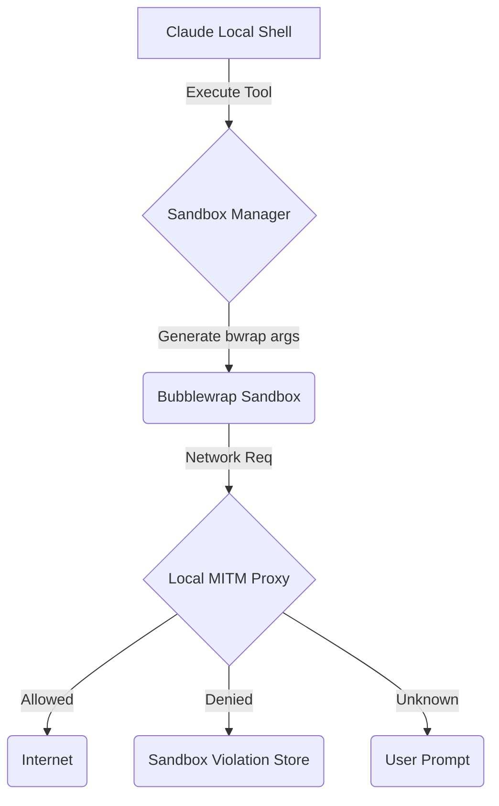

# 🔬 OHC Market Research Report: Claude Code Harness Network Proxy and Security Analysis

**Author:** Principal Product Researcher & Oracle (L7)

## 1. Executive Summary
This report analyzes the leaked Claude Code execution environment to extract architectural insights for OHC's Agentic OS, specifically focusing on its **Network Proxy** and **Filesystem Security** capabilities. It also includes an audit of OpenClaw and Hermes to establish a comprehensive competitive analysis.

## 2. Core Harness Architecture Findings

### 2.1 OS-Level Sandboxing (Bubblewrap)
Claude Code leverages `bwrap` (Bubblewrap) on Linux to achieve unprivileged filesystem sandboxing. It strictly enforces `allowRead` and `denyWrite` rules by dynamically generating mount points. Non-existent deny paths are protected by creating empty files on the host and bind-mounting `/dev/null` over them.

### 2.2 Network Telemetry and Proxying
The harness forces all agent traffic through a local custom HTTP/SOCKS MITM proxy. The proxy checks each domain against `allowedDomains` and `deniedDomains`. Unknown domains trigger a user prompt (`askCallback`).

### 2.3 System Call Restrictions
It utilizes dynamically generated `seccomp-bpf` filters to block the creation of UNIX domain sockets and other restricted system calls inside the sandbox.

### 2.4 Component Interaction (Mermaid)

## 3. Competitive Analysis: OHC vs Market

| Feature | OHC Agent Harness | Claude Code | OpenClaw | Hermes |
| :--- | :--- | :--- | :--- | :--- |
| **Filesystem Isolation** | Weak | bwrap (strict ro-bind) | Docker | Docker |
| **Network Gateway** | Open | Proxy + socat | Proxy | Internal Bridge |
| **Seccomp Filters** | None | Yes (socket AF_UNIX blocked) | Yes | Yes |

## 4. OHC Hybrid Architecture Strategy (Actionable Roadmap)

To close the gap, OHC's internal Agent Harness must implement:
1. Native `bwrap` wrappers in Go for `srcs/backend/harness`.
2. A built-in HTTP proxy for strict network gating.
3. OpenTelemetry integration to export sandbox violations.
4. Implement Seccomp BPF filters to prevent untrusted execution from opening new sockets or bypassing restrictions.

