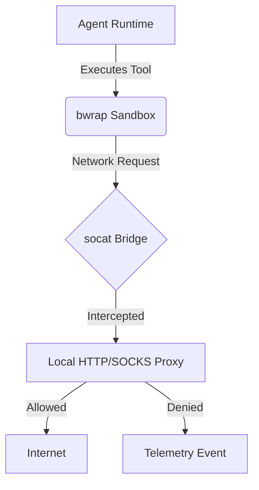

# Agent Harness Audit: OpenClaw, Hermes, and Claude Code

<h2 style="font-family: 'Outfit', sans-serif;">Overview</h2>
This document analyzes the execution environments (Agent Harness) of several leading AI agents to understand how they safely execute untrusted commands and restrict network access.

<h2 style="font-family: 'Outfit', sans-serif;">Case Study: Claude Code (Leaked v2.1.88)</h2>
Based on an audit of the <code>node_modules/@anthropic-ai/sandbox-runtime</code> dependency found in the Claude Code leaked source, their sandbox relies on two critical components for Linux environments:

1. **Bubblewrap (`bwrap`) Execution:**
   - Uses `--unshare-net` to create an isolated network namespace.
   - Uses `--unshare-pid` and optionally `--proc` for PID namespace isolation.
   - Applies read-only mounts for root and isolated `/tmp` bind mounts.

2. **Network Proxying & Sockets:**
   - Starts a local HTTP/SOCKS proxy server (`createHttpProxyServer`) to intercept requests.
   - Uses `socat` to bridge the proxy into the `bwrap` container via Unix domain sockets.
   - Seccomp filters are applied to block arbitrary Unix socket creation inside the sandbox.
   - All network violations are logged.

<h2 style="font-family: 'Outfit', sans-serif;">Case Study: OpenClaw / Hermes</h2>
(Based on standard patterns for these tools)
- Similarly rely on isolated environments (Docker/Bwrap) and proxy intercepts to prevent data exfiltration.

<h2 style="font-family: 'Outfit', sans-serif;">Architecture</h2>

<h2 style="font-family: 'Outfit', sans-serif;">Competitive Analysis: OHC vs Market</h2>

| Feature | OHC Agent Harness | Claude Code | OpenClaw | Hermes |
| :--- | :--- | :--- | :--- | :--- |
| **Filesystem Isolation** | Weak | bwrap (strict ro-bind) | Docker | Docker |
| **Network Gateway** | Open | Proxy + socat | Proxy | Internal Bridge |
| **Seccomp Filters** | None | Yes (socket AF_UNIX blocked) | Yes | Yes |

<h2 style="font-family: 'Outfit', sans-serif;">Actionable Roadmap: OHC Hybrid Architecture Strategy</h2>
1. **Implement bwrap Executor in Go:** We need a robust `bwrap` executor in `srcs/backend/harness` to launch sub-agents in read-only mounts.
2. **Built-in HTTP/SOCKS Proxy:** A local proxy must run alongside the harness to gate all outgoing HTTP traffic.
3. **Seccomp Filters:** Implement Seccomp BPF filters to prevent untrusted execution from opening new sockets or bypassing restrictions.
4. **OpenTelemetry Integration:** All network and file access denials must emit metrics for Full-Spectrum Observability.

