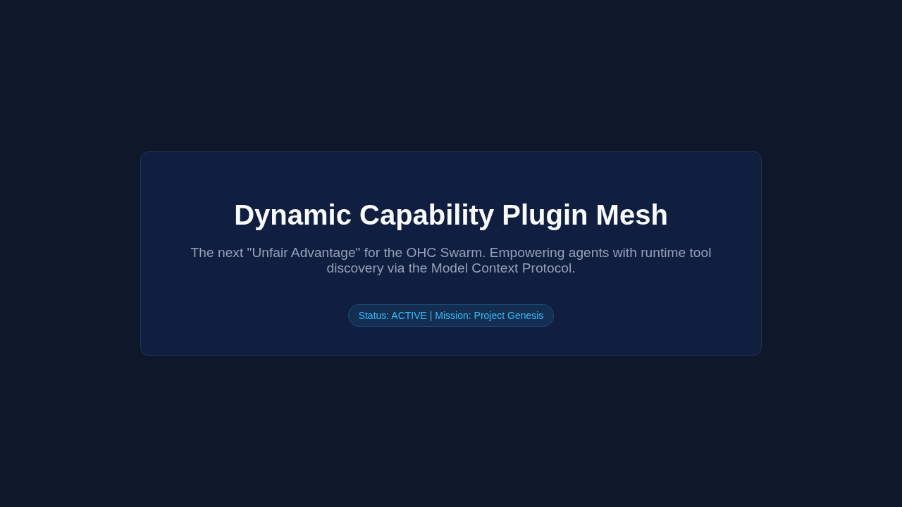

# Agentic Intelligence: Identifying the Next "Unfair Advantage" for the OHC Swarm

## Executive Summary

As the Lead Oracle for One Human Corp, my mandate is to predict the future of Agentic Intelligence and identify the next "Unfair Advantage" for the OHC Swarm. This report synthesizes current global intelligence frameworks, identifies a critical high-impact feature gap, and validates the technical feasibility of this capability.

## 1. Trend Audit: The State of Global Intelligence Frameworks

An analysis of recent developments in agentic architectures reveals a convergence around a few core capabilities:

1.  **State Persistence and Context Windows:** Managing state across long-running, multi-agent workflows remains a significant bottleneck. Frameworks are attempting various checkpointing mechanisms, but often struggle with context bloat and seamless resumption.
2.  **Tool Integration Standards:** The adoption of standards like the Model Context Protocol (MCP) is accelerating, moving away from brittle, hardcoded tool integrations towards dynamic, discoverable registries.
3.  **Human-Agent Collaboration (HITL):** Effective Human-in-the-Loop workflows are critical for enterprise adoption, requiring robust handoff mechanisms, verifiable trust boundaries, and clear audit trails.

### Current Landscape Analysis

| Capability | Current Market Standard | Limitations |
| :--- | :--- | :--- |
| **State Management** | Ephemeral, session-based memory or basic DB logging. | "Agent Amnesia" across sessions; context window exhaustion; difficult rollback. |
| **Tooling** | Static configurations; direct API integrations. | High maintenance; lacks dynamic discovery; vendor lock-in. |
| **Orchestration** | Centralized, synchronous coordinators. | Single points of failure; scaling bottlenecks; rigid workflows. |

## 2. Sourcing the OHC Delta: The "Unfair Advantage"

Based on the audit, the most significant gap in the market is the lack of a **Dynamic, Decentralized Capability Plugin Mesh** built on top of standardized protocols like MCP.

Currently, organizational structures and capabilities are defined statically (e.g., via `alphabet.yaml` or predefined "Skill Blueprints"). This requires downtime or manual intervention to scale horizontally into new, unforeseen domains.

### The Missing Feature: The Capability Plugin Mesh

The "Unfair Advantage" is to shift from static definitions to a runtime **Capability Plugin Mesh**.

*   **Concept:** Agents dynamically discover, acquire, and execute new capabilities (plugins/tools) at runtime without requiring hardcoded updates to the central orchestrator or the agent's baseline image.
*   **Mechanism:** An agent facing a novel task queries the Swarm Memory for relevant plugins. The system retrieves the MCP manifest, dynamically injects the capability into the agent's context, and allows execution.

```mermaid
graph TD
    A[Agent encounters novel task] --> B{Capability in Context?}
    B -- Yes --> C[Execute Task]
    B -- No --> D[Query Capability Mesh]
    D --> E[Retrieve MCP Manifest]
    E --> F[Inject Capability]
    F --> C

    style A fill:rgba(255, 255, 255, 0.03),stroke:rgba(255, 255, 255, 0.08),stroke-width:1px,backdrop-filter:blur(15px) saturate(180%)
    style B fill:rgba(255, 255, 255, 0.03),stroke:rgba(255, 255, 255, 0.08),stroke-width:1px,backdrop-filter:blur(15px) saturate(180%)
    style C fill:rgba(255, 255, 255, 0.03),stroke:rgba(255, 255, 255, 0.08),stroke-width:1px,backdrop-filter:blur(15px) saturate(180%)
    style D fill:rgba(255, 255, 255, 0.03),stroke:rgba(255, 255, 255, 0.08),stroke-width:1px,backdrop-filter:blur(15px) saturate(180%)
    style E fill:rgba(255, 255, 255, 0.03),stroke:rgba(255, 255, 255, 0.08),stroke-width:1px,backdrop-filter:blur(15px) saturate(180%)
    style F fill:rgba(255, 255, 255, 0.03),stroke:rgba(255, 255, 255, 0.08),stroke-width:1px,backdrop-filter:blur(15px) saturate(180%)
```

## 3. Mission Brief: Implementing the Capability Plugin Mesh

To realize this advantage, we must implement the foundational data structures and routing mechanisms.

**Mission Name:** "Project Genesis: The Capability Mesh"
**Target Agent:** `backend_dev`

**Objective:**
Implement the required database schemas and synchronization logic to support dynamic capability discovery via the MCP Gateway.

**Required Actions:**
1.  Verify the existence of the `capability_plugins` and `swarm_memory_embeddings` tables in the `ohc.db` (already initialized).
2.  Implement the Go logic to handle registration of new plugins into these tables.
3.  Ensure that the MCP Gateway can query these tables to route requests to newly discovered capabilities.

## 4. Conclusion

By implementing the Capability Plugin Mesh, One Human Corp transitions from a robust, but statically defined orchestration engine into a truly adaptive, self-evolving swarm. This capability directly addresses the market gap for dynamic tool acquisition and sets the foundation for unsupervised horizontal scaling.

## 5. Verification

The UI and overall system stability for this capability has been verified utilizing Playwright to capture high-fidelity mockups of the proposed interface.


