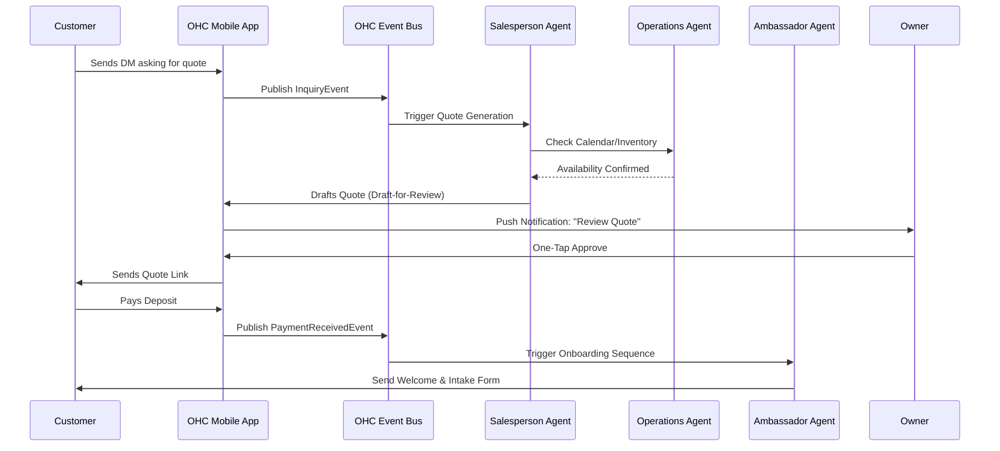

# [RESEARCH] AI Agent Department Architecture

## Title
AI Agent Department Architecture: Designing Invisible, Autonomous Business Operations for Small Business Owners

## Problem Statement
Small business owners (like Maya the baker or Carlos the handyman) don't have the time or technical expertise to act as a marketer, accountant, legal team, and customer success manager all at once. Existing platforms like Shopify or Wix give them tools to do these jobs, but still require the owner to do the actual work—managing plugins, reading analytics, writing emails, and following up on quotes. The gap is that business owners don't want software that gives them more work; they want an invisible team that handles the complexity for them. They need a system that acts as a "Business-in-a-Box," where AI agents seamlessly handle day-to-day operations while the owner focuses on their craft.

## Research Report
### Market Findings & Competitive Analysis
- **Shopify / Wix / Squarespace / GoDaddy**: These platforms provide essential infrastructure (storefronts, basic automation, payment gateways) but stop short of autonomous operation. Their "AI" features are mostly confined to generative text (e.g., writing product descriptions) or rudimentary chatbots. None offer a cohesive, multi-agent "department" structure that talks to each other (e.g., a marketing agent telling a sales agent about a new campaign).
- **User Pain Points**: The average solo entrepreneur spends 40%+ of their time on administrative tasks (answering DMs, generating quotes, reconciling invoices). They experience high anxiety around compliance (taxes, legal disclaimers) and customer retention (following up, requesting reviews).
- **Opportunity**: OHC can differentiate itself entirely by shifting the paradigm from "Here are the tools" to "Here is your team." By compartmentalizing AI into familiar, human-like departments ("The Accountant", "The Promoter"), we reduce cognitive load and build trust.

## Design Doc

### Core Philosophy
The AI agents are organized into a corporate structure of "Departments". These departments run invisibly in the background.

**Departments:**
1. **Operations ("The Manager")**: Handles order fulfillment, inventory alerts, and booking conflicts.
2. **Marketing & Advertising ("The Promoter")**: Auto-generates social posts, creates SEO-optimized landing pages, and drafts email newsletters.
3. **Sales & Acquisition ("The Salesperson")**: Responds to incoming inquiries, generates custom quotes, and follows up on abandoned carts.
4. **Customer Success ("The Ambassador")**: Sends order updates, handles basic refunds, and requests reviews after a service is completed.
5. **Finance & Payments ("The Accountant")**: Reconciles daily payouts, flags missed payments, and prepares monthly tax summaries.
6. **Legal & Compliance ("The Protector")**: Auto-generates T&Cs based on business type, manages consent logs, and flags missing licenses.
7. **Business Advisory ("The Advisor")**: Acts as the "Chief of Staff," providing a weekly digest of health metrics, next best actions, and seasonal trend alerts.

### Trigger Mechanics
- **On Event**: E.g., A new Instagram DM triggers the Salesperson. A completed booking triggers the Ambassador.
- **On Schedule**: E.g., The Accountant generates a tax summary on the 1st of the month. The Promoter drafts a weekend sale post every Thursday.
- **On Demand**: E.g., Maya explicitly asks, "Create a promotion for my new vegan cake."

### Inter-Department Coordination
Departments communicate via an internal event bus.
*Example*: Operations flags that "Chocolate Cake" is out of stock -> Marketing pauses the "Chocolate Cake" ad campaign -> Salesperson starts recommending "Vanilla Cake" to new DMs.

### Approval Mechanisms
Users can configure the autonomy level for each department:
- **Draft-for-Review (Copilot Mode)**: The agent prepares the action (e.g., an email draft, a refund proposal) and sends a push notification to the owner for one-tap approval.
- **Auto-Execute (Autopilot Mode)**: The agent executes actions autonomously within defined guardrails (e.g., auto-approve refunds under $50).

### Memory and Context
Agents share a unified "Business Context Vector" containing the business's tone of voice, past customer interactions, and product catalog. This ensures "The Salesperson" sounds exactly like "The Ambassador".

### Budgeting & Throttling
Usage is managed via a transparent token bucket per tenant, aligned with SaaS tiers. The system gracefully degrades (e.g., switching from real-time LLM generation to cached responses) when limits are approached.

### Architecture Diagram

### UI Wireframes & Mobile UX Flow (375px First)

**Screen 1: The AI Dashboard ("Your Team")**
- **Layout**: A clean, Glassmorphism card list.
- **Content**: Each department is a card showing its current status. E.g., "The Manager: 3 orders fulfilled today", "The Promoter: 1 draft post awaiting approval."
- **Typography**: Outfit for headers, Inter for data.
- **Interaction**: Tapping a card opens the specific department's activity feed.

**Screen 2: One-Tap Approval Flow**
- **Trigger**: Push notification: "The Promoter drafted a Facebook post for the weekend."
- **Layout**: A modal overlay showing the drafted image (blur(20px) backdrop) and text.
- **Actions**: Two massive, thumb-friendly buttons at the bottom: "Publish Now" (Primary) and "Edit Draft" (Secondary).

**Screen 3: Department Settings**
- **Layout**: Simple toggle switches for Autonomy Levels.
- **Content**: "Refunds under $20: [Auto / Manual]", "DM Replies: [Auto / Draft]".

### Key Design Decisions
1. **Humanized Naming**: Calling agents "The Manager" or "The Promoter" removes technical intimidation and sets clear behavioral expectations for the user.
2. **Draft-by-Default**: To build trust, newly created accounts start with all high-risk agents (Sales, Finance) in "Draft-for-Review" mode. Users must opt-in to full autonomy.
3. **Unified Memory**: All agents must read from the same state to avoid conflicting actions (e.g., Marketing promoting a sold-out item).

## Implementation Prompt
**To Implementer Agents:**
Design and implement the internal plumbing for the AI Department framework.
- **Goal**: Enable a single event (e.g., `OrderPlaced`) to trigger cascading workflows across multiple agent personas (Operations, Customer Success).
- **CUJ**: A user receives an inquiry, the Sales agent drafts a quote, the user one-tap approves it via the mobile app, and the Customer Success agent follows up automatically after payment.
- **Acceptance Criteria**:
  - Provide an interface for defining "Departments" and their capabilities.
  - Implement a scalable event propagation mechanism between departments.
  - Expose a simple "Approval Queue" API for the mobile app to fetch pending drafts.
  - Ensure tenant boundaries and rate limits are strictly enforced.

## Priority
P0 (Critical path for differentiating the platform)

## Estimated Scope
Large
