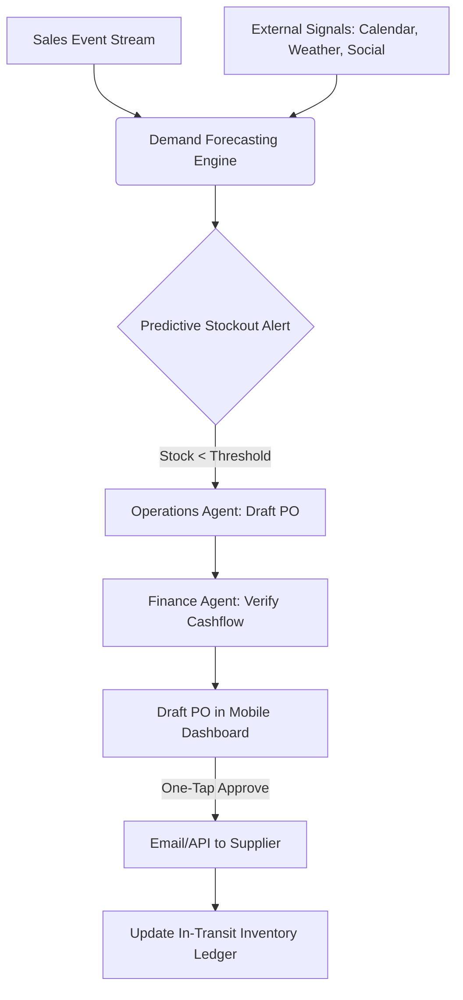

# [research] Architecture Deep Dive: AI-Driven Predictive Supply Chain and Restock Automation

## Problem Statement
Small business owners (like Maya the Baker or Priya the Boutique Owner) currently suffer from reactive inventory management. They learn they are out of stock only when a customer complains or an order can't be fulfilled. Legacy platforms (Shopify, Wix) treat inventory as a passive ledger. Restocking requires manual vendor contact, tedious spreadsheet tracking, and guess-work around seasonal demand. This leads to lost revenue from stockouts or tied-up capital in overstock.

## Research Report
### Current Market Gaps
1. **Passive vs. Active Inventories**: Current systems wait for user input. "You have 0 flour." They do not say "You will run out of flour by Tuesday; I have drafted an order to your supplier."
2. **Disconnected Vendor Relationships**: Ordering from suppliers is done outside the platform via email, phone, or disparate B2B portals.
3. **Lack of Predictive Demand Forecasting**: SMBs lack the data science tools to predict demand spikes (e.g., a local festival, a viral TikTok).

### OHC Advantage (The "Invisible Manager")
By integrating predictive demand modeling (using sales velocity, calendar events, and past trends) with the `Operations` and `Finance` AI departments, OHC can shift inventory management from a manual chore to a zero-touch, one-tap approval process.

## Design Doc

### Architecture (Mermaid.js)

### Mobile UX Flow (375px First)
1. **Push Notification:** "⚠️ Flour running low (Predicting stockout by Wed). Tap to restock."
2. **Dashboard Card (Glassmorphism):**
   - **Title:** Restock Action Required
   - **Details:** 50lbs King Arthur Flour from Vendor A ($45.00).
   - **AI Context:** "Based on your 3 upcoming custom cake orders, you will run out in 4 days."
   - **Actions:** [Approve & Send PO] [Edit Quantity] [Dismiss]
3. **Confirmation State:** Smooth transition to "PO Sent. ETA: Tuesday." In-transit inventory updated.

### Key Design Decisions
- **Decoupled Prediction vs Action:** The Forecasting Engine runs async via the pgvector-backed job queue. The action (Draft PO) requires user consensus (One-Tap) to avoid accidental cash drain.
- **Vendor Agnostic Communication:** If the vendor has no API, the system defaults to drafting and sending an email (via Resend integration) formatted exactly how the vendor expects.

## Implementation Prompt
**For the Implementer Agent:**
Implement the core entity relationships and background worker framework for the "Predictive Supply Chain" feature.
1. Create the database schemas for `Vendor`, `PurchaseOrder`, and `InventoryPrediction` linked securely via `tenant_id` row-level security.
2. Build the `Demand Forecasting` job queue worker that analyzes sales velocity for a tenant and generates an `InventoryPrediction` record.
3. Implement the `Operations` agent capability to consume an `InventoryPrediction` and draft a `PurchaseOrder`.
4. Ensure the UI API can retrieve pending PO drafts for the new mobile Dashboard Card.
5. All background tasks must use the existing Redis Redlock pattern to prevent duplicate PO drafting.

## Metadata
- **Priority:** P1
- **Estimated Scope:** Large
