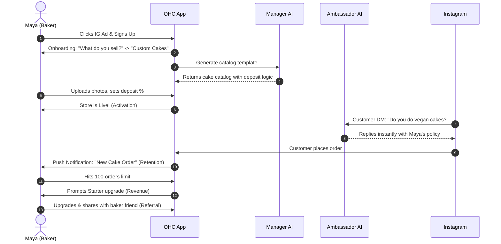
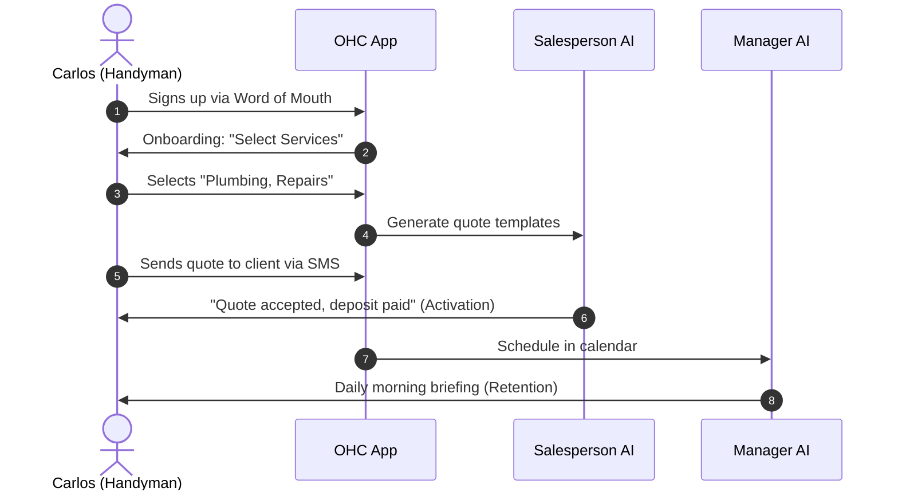
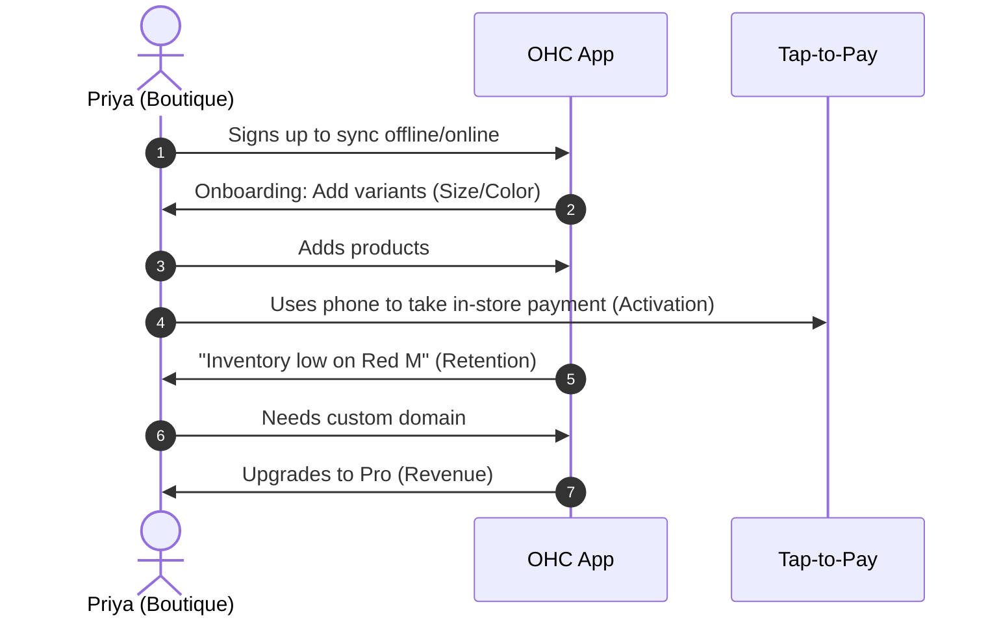
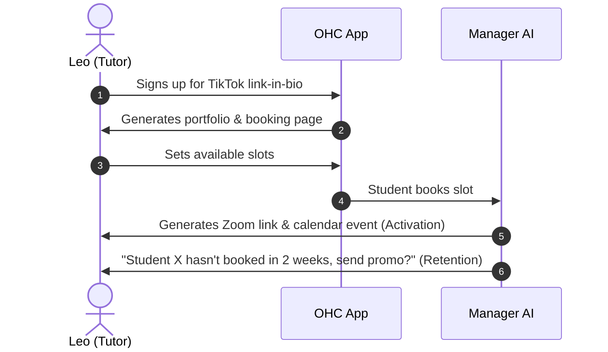
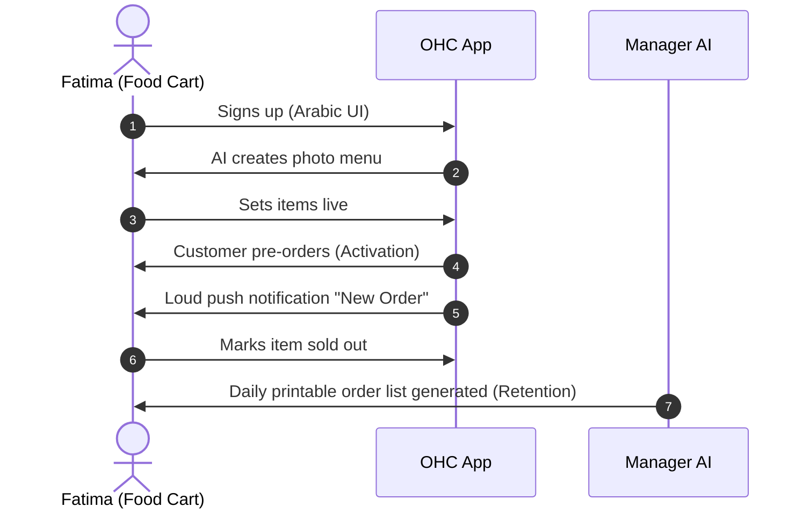

# [architecture] Business Journey End-to-End Maps

## Title
Business Journey Architecture & End-to-End Flow Refinement

## Problem Statement
Small business owners (bakers, handymen, boutique owners, tutors, and food cart operators) need a frictionless path from discovering OneHumanCorp (OHC) to running a live, revenue-generating business in under 10 minutes. Currently, the transition across Acquisition, Onboarding, Activation, Retention, Revenue, and Referral contains implicit friction points that can cause a non-technical user to abandon the process. We need a unified architectural map of these journeys to ensure AI departments handle the complexity invisibly and the mobile-first UX remains dead-simple.

## Research Report

### Findings
To support a diverse set of real-world personas, OHC must cater to highly specific needs without complicating the UI:
- **Maya (Baker, 28):** Driven by visual portfolios, needs Instagram DM AI automation and custom deposit structures.
- **Carlos (Handyman, 42):** Relies on Android. Needs quick service listing, quote generation, and deposit collection.
- **Priya (Boutique Owner, 35):** Requires online/offline sync, variant management, and tap-to-pay.
- **Leo (Music Tutor, 22):** Digital bookings, subscription billing, Zoom links, and link-in-bio TikTok integration.
- **Fatima (Food Cart, 50, limited English):** Pre-orders, sold-out toggles, bilingual support, push notifications on low-end Android.

### Competitive Analysis
- **Shopify:** Powerful but requires a steep learning curve and heavy setup. Not purely mobile-first natively.
- **Wix/Squarespace:** Website builders first; e-commerce is bolted on. No built-in AI agents acting as "employees."
- **GoDaddy:** Basic, but lacks the advanced booking, deposit, and AI-driven automation required for service/food businesses.
- **OHC Advantage:** Zero code, zero manual, 10-minute setup, invisible AI departments acting as employees.

## Design Doc

### Key Design Decisions
1. **Mobile-First Absolute:** All journeys are designed for a 375px screen first. Touch targets >= 44x44px. Native mobile keyboards for forms.
2. **Invisible AI:** Users don't "configure AI." They simply "hire a Promoter" or "hire a Manager." The AI proactively suggests actions.
3. **Progressive Onboarding:** Minimal initial data capture. Onboarding only asks for what is absolutely necessary to go live.
4. **Actionable Retention:** Notifications are transactional and actionable (e.g., "New order from Sarah. Tap to accept and print receipt.").
5. **Glassmorphism & Premium UI:** The interface will use Outfit/Inter typography, subtle motion, and glassmorphic overlays to feel high-end, inspiring trust.

### AI Integration Points
- **The Promoter (Marketing):** Automatically generates SEO, Instagram copy, and a TikTok link-in-bio.
- **The Salesperson (Acquisition):** Suggests custom quotes in DM, tracks referrals.
- **The Manager (Operations):** Auto-toggles sold-out items (Fatima), manages lesson bookings (Leo).
- **The Ambassador (Customer Success):** Follows up for reviews, answers basic DM questions (Maya).
- **The Accountant (Finance):** Triggers upgrade prompts, handles deposit splitting.

### UX Flow & UI Wireframes (Mobile 375px)
- **Screen 1 (Acquisition / Landing):** Hero image, clear CTA ("Start your business").
- **Screen 2 (Onboarding Wizard):** "What do you sell?" -> AI generates initial catalog/services.
- **Screen 3 (Dashboard / Activation):** Glassmorphic cards. "Your store is live. Add a photo to your first product."
- **Screen 4 (Retention / Daily View):** "Today's Orders / Bookings". One-tap actions (Accept, Complete, Message).
- **Screen 5 (Revenue / Upgrade):** "You've hit 100 orders! Upgrade to Starter for custom domains."

### Architecture Diagrams (Mermaid.js)

#### 1. Maya's Journey (Baker)

#### 2. Carlos's Journey (Handyman)

#### 3. Priya's Journey (Boutique)

#### 4. Leo's Journey (Tutor)

#### 5. Fatima's Journey (Food Cart)

## Implementation Prompt
**To the Implementer:**
Using the defined end-to-end journey maps and persona constraints, construct the platform's core Onboarding and Dashboard UI flows. The system must support the diverse needs outlined (products, services, bookings, food pre-orders).
1. Build the mobile-first (375px base) onboarding wizard that dynamically adapts based on the business type selected.
2. Integrate the AI departments seamlessly so they feel like passive employees rather than config screens.
3. Ensure the daily dashboard provides actionable retention hooks (e.g., immediate 1-tap responses to AI suggestions or new orders).
4. Do not prescribe specific database schemas or API endpoints; implement the frontend states and the domain logic boundaries to satisfy the defined CUJs.

## Priority
P0 (Critical)

## Estimated Scope
Large
