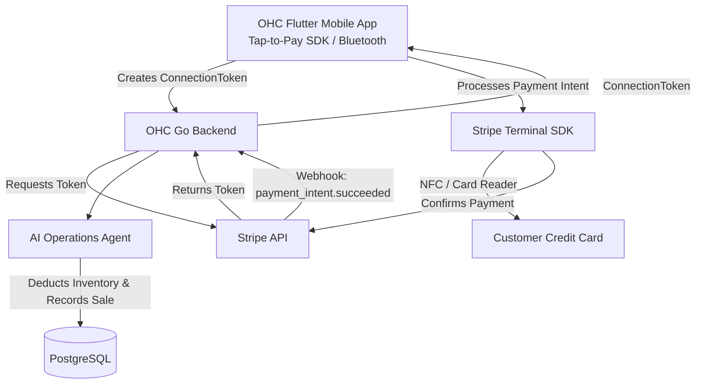

# [Architecture] In-Person POS & Tap-to-Pay (Stripe Terminal) Integration

## Problem Statement
For omni-channel retail personas like **Priya (The Boutique Owner)**, the ability to take in-person payments seamlessly is a hard requirement. Currently, OneHumanCorp (OHC) handles online orders but lacks the infrastructure for physical, in-store Point-of-Sale (POS) transactions. If Priya cannot accept a customer's credit card via Tap-to-Pay on her iPhone or via a physical Stripe Terminal card reader, she cannot use OHC to run her boutique. She needs an integration that bridges her online inventory with her offline sales instantly.

## Research Report
### Competitor Analysis
- **Shopify POS:** Offers a robust, native POS app with proprietary card readers and iPhone Tap-to-Pay support. It seamlessly syncs with their online inventory. Shopify's major advantage is its vertically integrated hardware and software.
- **Square:** The pioneer in mobile POS. Extremely easy to set up with physical readers and Apple/Android Tap-to-Pay. However, their online store offering is weaker than their POS.
- **Wix/Squarespace:** Offer POS integrations, but they often feel bolted-on or require third-party apps, causing friction for non-technical users.

### Opportunity for OHC
OHC can leverage **Stripe Terminal** to offer a completely invisible, zero-config POS experience. By using Stripe's native Tap-to-Pay SDKs within the Flutter mobile app, users like Priya won't even need to buy physical hardware initially—they can just use their existing iPhone/Android to accept contactless payments. For larger volumes, we will support pairing physical Stripe Terminal readers over Bluetooth or local network, managed invisibly by the AI Operations department.

## Design Doc

### Architecture Diagram

### Mobile UX Flow
1. **Checkout Screen:** Priya adds items to the cart in the OHC mobile app. She taps "Charge $45.00".
2. **Payment Method Selection:** The app presents options: "Tap to Pay on iPhone", "Card Reader", "Cash".
3. **Tap to Pay (No Hardware):** If selected, the native iOS/Android Tap-to-Pay UI slides up. The customer taps their card or phone to Priya's device.
4. **Processing & Success:** A smooth glassmorphic loading spinner appears, transitioning to a success checkmark.
5. **Post-Sale:** The AI Operations Agent instantly updates inventory (syncing the local and online store) and the AI Finance Agent records the sale.

### AI Agent Integration Points
- **AI Operations Agent:** Instantly decrements inventory for the sold items across all channels. If inventory drops below a threshold, it drafts an alert for Priya.
- **AI Finance Agent:** Reconciles the physical payment with daily online sales, generating a unified "Daily Earnings" report.

### Key Design Decisions
- **Zero-Config Hardware:** Prioritize Tap-to-Pay on iPhone/Android first. It requires zero hardware investment, lowering the barrier to entry for users like Maya (baker) who might take an occasional in-person deposit.
- **Unified Inventory:** A single source of truth in PostgreSQL for both online and in-store inventory. The Stripe Terminal payment intent will include metadata linking it to the OHC order ID.

## Implementation Prompt
**For the Implementer Agent:**
Implement the backend architecture for Stripe Terminal integration.
1. Create a Go service layer in `src/server/finance/stripe_terminal.go` (or similar) to handle the generation of Stripe Terminal Connection Tokens (`POST /v1/terminal/connection_tokens`).
2. Define the gRPC/REST API endpoints for the Flutter mobile app to request these connection tokens securely, ensuring strict multi-tenant isolation (`tenant_id` validation).
3. Update the database schema to support recording POS transactions and linking them to inventory deductions.
4. Add E2E tests verifying the connection token generation flow.

Do not implement the Flutter UI or Stripe SDK integration yet—focus on the backend infrastructure, database schema changes, and API contracts required to support Terminal operations.

## Priority
**P1** (High) - Critical for omni-channel personas (Priya).

## Estimated Scope
**Medium**
