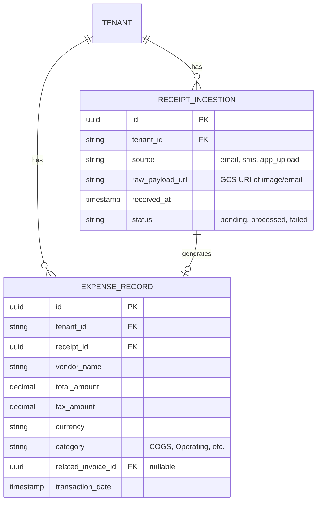

# Architecture Design: Autonomous AI Zero-Touch Receipt and Expense Intelligence Engine

## 1. Executive Summary
Small business owners (SMBs) consistently struggle with the administrative burden of tracking receipts, logging expenses, and maintaining financial records. The "Automation Expectation" trend highlights that anything that can be automated, must be. This document designs the "Autonomous AI Zero-Touch Receipt and Expense Intelligence Engine" for OneHumanCorp (OHC), addressing this critical gap by automatically ingesting, processing, and categorizing receipts through omnichannel inputs without requiring manual intervention from the business owner.

## 2. Business Persona Journeys
### Maya (The Home Baker)
- **Problem**: Maya buys baking ingredients physically at wholesale markets and receives paper receipts or digital receipts via email. She forgets to log them, leading to inaccurate margin tracking.
- **Journey**:
  1. Maya buys ingredients at a supplier.
  2. She simply takes a photo of the receipt using her phone's native camera or OHC mobile app, or forwards an email receipt to `receipts@maya-bakes.ohc.io`.
  3. The **Zero-Touch Receipt Engine** immediately extracts the data (vendor, items, tax, total), categorizes the expense as "Cost of Goods Sold (COGS)", and associates it with her ingredient inventory if applicable.
  4. At the end of the week, the Finance agent provides a summary of COGS versus Sales without Maya doing any manual data entry.

### Carlos (The Freelance Handyman)
- **Problem**: Carlos buys parts at hardware stores for specific customer jobs. Reconciling which receipt goes to which customer invoice is tedious and often missed, costing him money.
- **Journey**:
  1. Carlos purchases a plumbing fixture for a specific job.
  2. He snaps a photo of the receipt and sends it via SMS/WhatsApp to his OHC AI assistant, mentioning "For the Smith plumbing job."
  3. The engine parses the receipt, identifies the items, and automatically creates a line item on the draft invoice for "The Smith plumbing job," applying Carlos's standard markup.
  4. Carlos gets an instant notification: "Added Home Depot receipt ($45.00) to Smith invoice as $54.00 (20% markup)."

## 3. System Architecture Design

### 3.1 AI Department Coordination
- **Finance & Payments ("The Accountant")**: The primary owner. Responsible for categorizing the expense, tracking tax implications, and updating the general ledger.
- **Operations ("The Manager")**: Interfaces with the engine to update inventory levels if physical goods are detected on the receipt.
- **Customer Success ("The Ambassador")**: If the receipt is tied to a customer job (like Carlos's flow), the Ambassador ensures the expense is correctly associated with the customer's profile and upcoming invoice.

### 3.2 Data Model & Multi-Tenant Isolation
Every record must be strictly isolated using the `tenant_id` field.

### 3.3 Mobile-First (375px) UX Principles
- **One-Tap Action**: The OHC mobile app dashboard features a persistent, floating "Scan Receipt" button.
- **Optimistic UI**: When a user uploads a receipt, it immediately appears in the feed as "Processing..." while the backend job queue handles the AI extraction.
- **Conversational Fallback**: Instead of complex forms to correct miscategorizations, the user can just text the agent: "That Home Depot receipt was actually for the Johnson job, not general supplies," and the AI updates the ledger automatically.

## 4. Performance & Reliability Targets
- **Processing Latency**: Receipt parsing and expense categorization must complete within 5 seconds for typical images.
- **Queue Resilience**: All ingestion events are processed via a robust PostgreSQL-backed background queue (`SKIP LOCKED` pattern). Failed extractions retry with exponential backoff and eventually route to a human-in-the-loop review queue for the business owner if the AI confidence is below 85%.
