# 🔬 OHC Oracle Research Report: Claude Code Harness Audit (Bwrap & Seccomp)

**Author:** Principal Product Researcher & Oracle (L7)
**Target Analyzed:** Claude Code (v2.1.88) `@anthropic-ai/sandbox-runtime`
**Date:** 2024-06-14

## 1. Executive Summary
This report analyzes the Agent Harness architecture of Claude Code, focusing heavily on process isolation and sandboxing capabilities. The leaked `@anthropic-ai/sandbox-runtime` package demonstrates a highly mature, OS-level security implementation using `bwrap` (Bubblewrap) and dynamically generated `seccomp-bpf` filters. This research highlights critical gaps in OHC's current raw `os/exec` execution environment and defines the architectural blueprint for the upcoming KAIROS Hybrid Harness.

## 2. Deep Technical Audit: Claude's Sandbox Engine

Claude Code achieves execution isolation by wrapping every bash command execution in a strictly enforced sandbox layer.

### 2.1 File System Jailing (`bwrap`)
Instead of executing commands natively, the local agent spawns a `bwrap` shell environment on Linux.
- **Immutable Mounts:** System directories (`/usr`, `/bin`, `/lib`) are mounted strictly read-only.
- **Deny-Paths Protection:** Claude dynamically generates a list of "deny paths" (e.g., `~/.bashrc`, `~/.ssh`, `.git/hooks`) to protect user credentials and prevent Git hook injections. If an agent tries to modify these, the write fails immediately.

### 2.2 System Call Filtering (`seccomp`)
Claude restricts the linux kernel capabilities of the agent's process.
- **Dynamic Filter Generation:** A script (`generate-seccomp-filter.js`) generates and compiles a binary seccomp-bpf filter per-session.
- **Enforcement (`apply-seccomp`):** A custom C program loads this filter into the kernel immediately before `exec`ing the final user-provided command. This prevents reverse shells, unauthorized socket creations, and process tracing.

### 2.3 Network Proxy Instrumentation
- **SOCKS/HTTP MITM Proxying:** All network requests spawned by the sandboxed process are routed through localized proxy servers via injected environment variables (`HTTP_PROXY`, `https_proxy`).
- **Domain Interception:** These proxies evaluate traffic against dynamic `allowedDomains` / `deniedDomains` lists and fire `SandboxViolationEvents` if boundaries are crossed.

## 3. OHC vs Market Reality (Gap Analysis)

| Feature | OHC (Current State) | Claude Code (`v2.1.88`) | Strategic Priority |
| :--- | :--- | :--- | :--- |
| **Command Execution** | Native `os/exec` | Wrapped via `SandboxManager` and `bwrap` | 🚨 P0 (Critical) |
| **System Calls** | Unrestricted (Full OS access) | Dynamically filtered via `seccomp-bpf` | 🔴 P1 (High) |
| **Network Egress** | Direct internet connection | Forced through local MITM proxy | 🔴 P1 (High) |

## 4. Architectural Gap Visualization

```mermaid
graph TD
    subgraph Market Standards: Claude Code
        Agent[Local CLI Agent] --> SandboxManager
        SandboxManager --> Bwrap[bwrap Jail]
        Bwrap --> Seccomp[apply-seccomp]
        Seccomp --> TargetProcess(Bash / Python)
        TargetProcess -.-> Proxy[Local MITM Proxy]
        Proxy -.-> Internet
    end
    subgraph OHC Current
        OHCAgent[OHC Go Agent Worker] --> RawExec[raw os/exec]
        RawExec --> UnrestrictedProcess(Bash / Python)
        UnrestrictedProcess -.-> DirectInternet[Direct Internet]
    end
```

## 5. Strategic Conclusion
OHC currently relies on naive process execution, exposing the host OS to malicious behavior if an LLM hallucinates destructive commands or is prompt-injected. To maintain superiority and guarantee security in the **Standalone Desktop Mode**, OHC MUST implement a Go-native wrapper mirroring Claude's `SandboxManager` logic before KAIROS Phase 4 orchestration begins.

