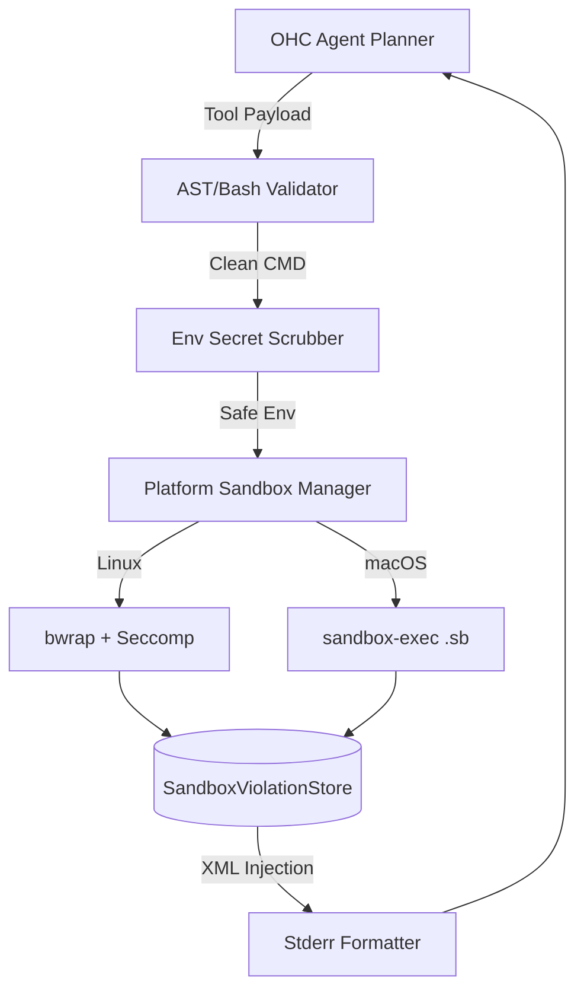

# 🔍 Oracle Research Report: Claude-Class Agent Harness & Instrumentation

## 1. Executive Summary
To achieve Absolute Autonomy and Market Dominance, OHC's Hybrid Agentic OS requires an execution harness on par with industry leaders. Our deep technical audit of the leaked **Claude Code (v2.1.88)** reveals a highly sophisticated, platform-aware Agent Harness design. This report synthesizes their architecture and outlines the strategic gap-fill missions required for OHC.

## 2. Competitive Architectural Analysis

### 2.1 The Sandbox Runtime Layer
Claude Code does not blindly execute terminal commands. Instead, it utilizes an `@anthropic-ai/sandbox-runtime` module which abstracts the underlying OS sandbox technologies:
- **macOS (`macos-sandbox-utils.js`)**: Dynamically generates Apple `.sb` (Sandbox Profile) files and executes via `sandbox-exec`. Restricts file I/O and network binding dynamically based on the tool's needs.
- **Linux (`linux-sandbox-utils.js`)**: Relies heavily on `bwrap` (Bubblewrap) for namespace isolation (Mount, Network, PID) and supplements this with **BPF SECCOMP filters** to enforce deep syscall-level restrictions, notably blocking unauthorized Unix socket creation.

### 2.2 Command Parsing & Threat Mitigation
Before a bash command even reaches the sandbox, it traverses strict AST parsing (`bashSecurity.ts`, `readOnlyValidation.ts`):
- **Banned Syntax**: Drops process substitution (`<()`, `>()`), parameter/arithmetic expansions (`$()`, `${}`), and advanced shell features.
- **Zsh Protection**: Blocks dangerous builtins like `zmodload`, `zpty`, `ztcp`, and `=cmd` (Zsh equals expansion).
- **Git State Protection**: Detects and prevents "sandbox escapes" via git-internal path modification.

### 2.3 Subprocess Environment Scrubbing
The harness proactively defends against prompt-injection attacks designed to exfiltrate secrets:
- Iterates and purges predefined tokens from the `env` dictionary (`subprocessEnv.ts`).
- Targets keys like `ANTHROPIC_API_KEY` and OpenTelemetry header tokens (`OTEL_EXPORTER_OTLP_HEADERS`).
- *OHC Action*: We must implement identical scrubbing for `OHC_API_KEY` and our SPIFFE/SPIRE context.

### 2.4 Autonomous Adaptation via I/O Feedback Loop
This is the "secret sauce" of Claude Code's agentic stability:
- A singleton `SandboxViolationStore` tracks every blocked syscall/I/O operation.
- After a command fails, `annotateStderrWithSandboxFailures` automatically injects structured XML `<sandbox_violations>...</sandbox_violations>` into standard error.
- The Agent LLM reads this structured feedback, understands *why* it was blocked (e.g., "Network egress denied to 1.2.3.4"), and autonomously adjusts its next tool payload without human intervention.

## 3. OHC vs Market (Comparative Analysis)

| Capability | OHC Current State | Claude Code `2.1.88` | Hermes Agent / Gstack |
| :--- | :--- | :--- | :--- |
| **OS Isolation** | Raw Subprocess | `sandbox-exec` / `bwrap` + Seccomp | Docker / V8 Isolates |
| **Env Scrubbing** | None | Aggressive Secret Purging | Minimal |
| **Telemetry** | Basic Span Logs | Perfetto + OTLP + Beta Tracing | OTLP |
| **Error Feedback**| Raw Stderr Dump | XML-tagged `SandboxViolationEvent` | Raw Stderr Dump |

## 4. Strategic Gap-Fill Missions (Actionable Blueprint)

Based on this analysis, the following Epic and Implementation missions have been injected into the Swarm GitHub tracker (Issue #5442).

### [Epic] Next-Generation Agent Harness Sandbox
- **[backend] Implement Sandboxed Execution Environment for Agent Harness**
  - Create platform-agnostic wrappers using `sandbox-exec` (macOS) and `bwrap` (Linux).
- **[research] Emit Metric Telemetry and I/O Instrumentation for Harness Operations**
  - Capture violations and pipe them to OpenTelemetry.
- **[research] Implement Sandbox Violation XML Tag Injection & Extraction**
  - Route the violation store directly to the `stderr` string sent back to the Agent LLM.
- **[research] Implement Git-Internal Path Write Protections (Sandbox Escape Prevention)**
  - Replicate the bash AST parsing to block dangerous substitutions.

## 5. Visual Architecture: The Harness Mesh

*Report generated by: OHC Principal Product Researcher & Oracle (L7)*

