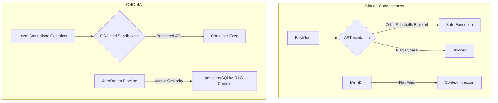

# Agent Harness Audit: Claude Code

## 1. Introduction
This document details an audit of the Claude Code Agent Harness architecture, based on the leaked `2.1.88` source code. It analyzes how Claude isolates execution, validates commands, handles state and permissions, and tracks telemetry.

## 2. Architecture & Components

The harness operates via a collection of isolated tools (BashTool, FileEditTool, etc.), executing within a shared workspace managed by the `coordinator` or main `QueryEngine`.

### 2.1 The BashTool Sandbox & Security Layers
The `BashTool` (`src/tools/BashTool/`) is the primary interface for terminal commands.

- **Sandbox Enforcement**: `SandboxManager` restricts command execution based on dynamic feature flags (`tengu_sandbox_disabled_commands` for internal 'ant' users) and user configuration (`settings.sandbox.excludedCommands`).
- **Command Dissection**: It uses an AST-based parser (`parseForSecurity`) and `tree-sitter` for deep shell quote inspection (`hasShellQuoteSingleQuoteBug`).
- **Dangerous Commands/Syntax**: Checks block `zmodload`, `emulate`, `$()`, `<()`, `always` blocks (Zsh), and even preemptive defense against PowerShell syntax (`<#`). It distinguishes between read and write operations (`isSearchOrReadBashCommand`) to alter the UI representation.
- **Read-Only Constraints**: For specialized tools (`git`, `docker`, `gh`, `pyright`), the harness enforces flag-level allowlists (`GH_READ_ONLY_COMMANDS`, etc.).

### 2.2 Permissions & Internal File System
File access relies on a central permission service (`src/utils/permissions/filesystem.ts`).
- It has strict boundaries preventing models from reading internal harness paths (session-memory, plans, tool-results).
- Bundled skills are placed in a path that is "harness-controlled" and read-only.
- The `memdir.ts` file acts as the Agent Swarm memory system, giving models access to "team" and "auto" directories for persistent context.

### 2.3 Telemetry & MCP Interop
- **Telemetry**: Relies heavily on OpenTelemetry (`logEvent`) for tracking tool usage, security violations (via `BASH_SECURITY_CHECK_IDS`), and task transitions.
- **MCP**: Integrates extensively with the Model Context Protocol, allowing Claude to proxy to local servers (`stdio`, `sse`, `claudeai-proxy`) to dynamically augment its harness capabilities (e.g., retrieving IDE state or executing specialized `SdkControlTransport`).

## 3. Comparison with OHC

| Feature Area | Claude Code | **OHC (OHC-HA)** |
| :--- | :--- | :--- |
| **Sandboxing** | Regex & AST validation for terminal tools | **Containerization (Cloud) & Structured OS APIs (Local)** |
| **Memory Architecture** | Flat directories (`teamMemPaths`) | **AutoDream Pipeline with pgvector/SQLite** |
| **Telemetry** | Native harness events | **Buffered locally in SQLite for cloud sync** |

## 4. Feature Gaps & Recommendations for OHC
1. **Dynamic AST-Level Command Validation**: Implement tree-sitter based pre-flight validation for OHC Local Shell commands.
2. **Harness-Protected Directories**: Explicitly restrict the local FileTool from accessing OHC's internal `sip.db` and orchestrator linear files.
3. **Advanced Zsh Mitigation**: Implement the Zsh/Bash bypass patterns identified (like `=cmd` and `<()`) in the OHC Shell validation engine.

