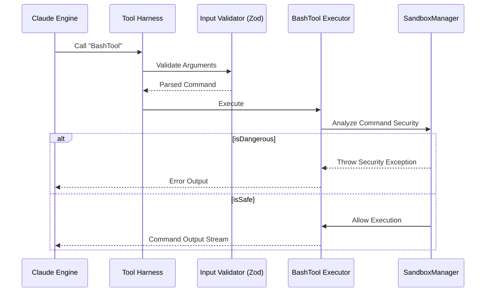

# Analysis of Claude Code (2.1.88) Architecture

## 1. Executive Summary
The Hybrid Agentic OS requires superior execution harnessing and viral growth loops. Claude Code is a key market leader, and understanding its internal architecture for Agent Harnessing and Tool Execution is critical for achieving and maintaining feature parity. This report deeply analyzes the Claude Code source architecture under `/src/tools` and `/src/services`.

## 2. Agent Harness Layer Overview
The Agent Harness Layer in Claude Code relies on explicit `Tools` derived from a unified `buildTool` framework. Inputs and outputs are strictly typed via Zod schemas, providing automated structural validation and dynamic descriptions injected directly into the LLM context.

### 2.1 Core Execution Flow

## 3. BashTool Execution Isolation
The `BashTool` isolates and evaluates commands using token-level static analysis before actual OS-level execution. This is fundamentally different from a simple `exec(cmd)` wrapper.

- **Token Analysis (`bashSecurity.ts`)**: Commands are parsed with tools mapping subshells `()`, and process substitutions (`<()`, `>()`, `=()`).
- **ZSH Security Context**: Explicit rules block ZSH builtin module manipulation functions. `zmodload`, `emulate`, and `zpty` are mapped and explicitly rejected to prevent deep shell evasion tactics.
- **Read-Only Context (`readOnlyValidation.ts`)**: Known binaries have explicit argument schemas. E.g., `FD_SAFE_FLAGS` only allows benign reads, stripping execution (`-x`/`--exec`) commands from `fd`.

## 4. MCP Integration Subsystem
The Model Context Protocol (MCP) tool serves as a passthrough for dynamic integrations defined externally.

- Defined in `services/mcp/client.ts`
- Uses `Model Context Protocol` to fetch configurations and proxies responses as standardized JSON.

## 5. Comparative Table (OHC vs Claude Code)

| Feature | One Human Corp (OHC) | Claude Code (2.1.88) | Gap / Status |
| :--- | :--- | :--- | :--- |
| **Tool Input Validation** | Basic / Structural | Zod-based typed schemas | OHC needs deeper parsing |
| **Terminal Sandbox** | Standard `os/exec` wrappers | AST / Token-level shell verification | **Critical Gap** |
| **Read-Only Profiles** | User-level RBAC | Per-binary explicit safe flag dictionaries | OHC is vulnerable to `-x` escapes |
| **Extensibility Protocol** | Custom Agent Plugins | Model Context Protocol (MCP) | OHC should adopt MCP natively |

## 6. Actionable Implementation Directives
Based on this research, we have spawned actionable missions via the GitHub Tracking Protocol.
**Mission Created:** Issue #5172: [harness] Implement Token-Level Command Validation for Terminal Execution.
This mission requires OHC implementers to construct a `CommandValidator` interface and flag whitelisting similar to the mechanisms analyzed above.

