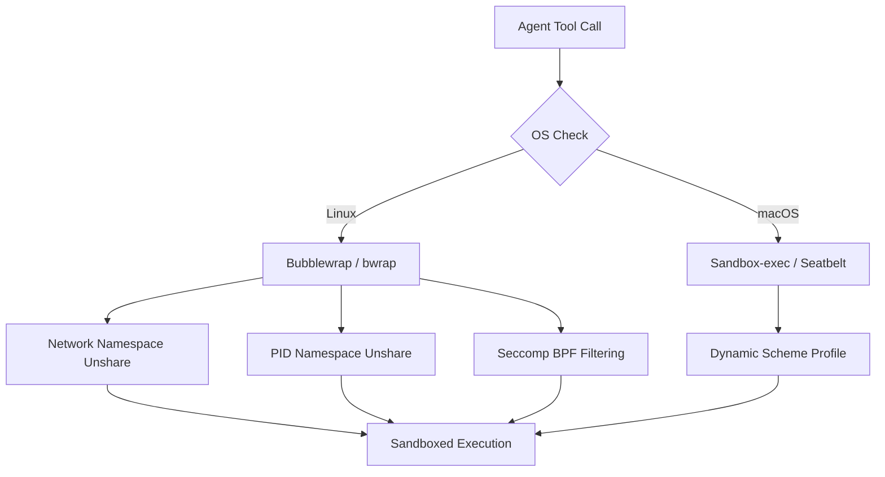

# OHC Market Intelligence: Analysis of "Claude Code" Harness Architecture

## Overview
This report provides a deep-dive analysis into the agent harness architecture of Anthropic's "Claude Code", based on an evaluation of extracted source code artifacts. It focuses heavily on how Claude Code isolates execution, manages state, handles security, and runs terminal commands within an automated context.

## Agent Harness Design Details

### Sandbox Execution Strategy

Claude Code employs robust OS-level isolation for executing bash commands, leveraging different mechanisms depending on the host operating system. This is primarily implemented in `@anthropic-ai/sandbox-runtime` which is wrapped by a CLI-specific adapter layer.

1.  **Linux (`bwrap`) Isolation:**
    *   **Core Mechanism:** Relies heavily on `bwrap` (Bubblewrap) for creating unprivileged containers.
    *   **Namespaces:** Unshares the network (`--unshare-net`) and PID (`--unshare-pid`) namespaces to ensure process and network isolation.
    *   **Filesystem Constraints:** Dynamically builds allowed/denied path arguments using `--ro-bind`, `--dir`, and `--bind`. Dangerous directories are explicitly blocked (e.g. by binding `/dev/null` over them).
    *   **Seccomp Filtering:** Uses a custom `apply-seccomp` binary and BPF filters to block the creation of new Unix sockets `socket(AF_UNIX, ...)`, while allowing specific infrastructure network bridges.
    *   **Network Bridging:** Injects network access into the unshared namespace by binding specific HTTP/SOCKS Unix sockets (connected to host proxies) and using `socat` within the container to bridge traffic from standard ports (like 3128) back to those sockets.

2.  **macOS (`sandbox-exec`) Isolation:**
    *   **Core Mechanism:** Uses Apple's native `sandbox-exec` utility (Seatbelt) to enforce restrictions.
    *   **Profile Generation:** Dynamically generates Scheme-like `seatbelt` profiles specifying allowed paths, network domains, and system calls.
    *   **File Path Matching:** Leverages native glob/regex matching within `sandbox-exec` profiles.

### Tool Architecture and Validation

*   **Modular Tool Defintions:** Tools like `BashTool`, `FileEditTool`, `GlobTool` are well-structured components extending a common `Tool` base class.
*   **Security Parsing:** The `BashTool` employs static analysis and Abstract Syntax Tree (AST) parsing (`treeSitterAnalysis`, `shellQuote`) *before* execution to catch malformed tokens or dangerous command patterns (e.g. `$()`, `<()`, `~[...]`).
*   **Permissions and Rules:** Permissions are highly granular, checking commands against wildcard patterns, and resolving specific rules (e.g., allow `npm run test` but block arbitrary `npm` scripts).
*   **Data Masking:** Secrets within file edits or shell outputs are checked via `checkTeamMemSecrets` or similar guardrails.

### Telemetry and Observability
*   **Diagnostic Tracking:** Integration with an `LSPDiagnosticRegistry` allows it to tie command executions or file edits directly to resulting compiler/linter warnings.
*   **Granular Logging:** Captures rich context like file modification times, line changes (`countLinesChanged`), and precise command semantics.
*   **Event Reporting:** A centralized `AnalyticsMetadata` pipeline tracks usage, while verifying payload cleanliness.

## Feature Gap Synthesis (OHC vs Market)

Currently, OHC operates Agents in environments that lack this depth of containerized local execution. We rely on standard process launching, which introduces significant host vulnerability during Standalone Desktop Mode or when running unvetted implementer prompts.

| Feature | Claude Code | OHC Hybrid (Current) | Gap |
| :--- | :--- | :--- | :--- |
| **Local OS Isolation** | `bwrap` (Linux) / `sandbox-exec` (macOS) | None (Host privileges) | **Critical** |
| **Command AST Analysis** | Yes (TreeSitter pre-execution checks) | Regex/Basic validation only | High |
| **Network Egress** | Tunneled via Unix sockets & Proxy | Unrestricted | High |
| **Granular Filesystem Config**| `--ro-bind` per-command execution | Shared user filesystem | High |

## Actionable Recommendations for OHC

To close the gap and assert dominance, we must implement a true "Agent Harness" for OHC Standalone Mode, inspired by these findings but optimized for our Hybrid architecture.

1.  **Implement `bwrap` Containerization:** Adapt our local task runner (`srcs/server/standalone_ohc.sh` / Go processes) to wrap shell commands in Bubblewrap.
2.  **Build a Pre-Execution Command Auditor:** Implement AST-based parsing for shell commands to catch dangerous substitutions.
3.  **Introduce Network Egress Proxies:** Force agent network calls through an internal proxy to monitor and restrict domains.

