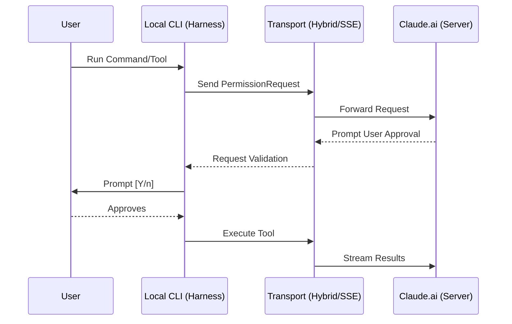

# 🔬 OHC Market Research Report: Claude Code Harness

## 1. Executive Summary
This report analyzes the leaked Claude Code execution environment to extract architectural insights for OHC's Agentic OS. The analysis focused on their "Agent Harness" implementation, exploring how they execute tasks, manage memory, communicate with remote cloud services, and handle process isolation.

## 2. Core Harness Architecture Findings

### 2.1 The Bridge Pattern
Claude Code uses a "Bridge" architecture (`src/bridge/replBridge.ts`) to decouple local execution from remote model orchestration. The agent runs locally but uses WebSocket/HTTP POST (`HybridTransport.ts`) or Server-Sent Events (`SSETransport`) to stream commands and tools invocations to `https://claude.ai`.

**Key takeaway for OHC:** Strict separation between local execution and remote control flow. When a tool runs, the local harness emits a `PermissionRequest` to the cloud, putting user authorization physically outside the local agent's direct control.

### 2.2 Memory Management
State is handled via a dedicated Memory Directory pattern (`src/memdir/`). The harness automatically provisions scoped directories (`.claude/projects/<slug>/memory/auto` and `team`). The model is given explicit instructions that these directories *already exist*, avoiding redundant `mkdir` invocations and allowing direct filesystem writes for durable state.

### 2.3 Forking & Concurrency
Claude implements a robust "Fork Subagent" (`forkSubagent.ts`) capability. Subagents inherit the parent's full system prompt and conversation context, but execute asynchronously as background processes. Progress is reported back via a `<task-notification>` XML block.

### 2.4 Local Shell Isolation
Local shell commands are managed by a custom task framework (`LocalShellTask`). Tasks are spawned as standard child processes but strictly managed with ID tracking, timeout controls, and explicit disk output eviction when killed, ensuring no lingering processes or state.

### 2.5 Component Interaction (Mermaid)

## 3. Comparative Matrix: OHC vs Claude Code

| Feature Area | Claude Code Harness | OHC Hybrid Architecture | Gap Assessment |
|--------------|---------------------|--------------------------|----------------|
| **Execution** | Async Fork Subagents | Parallel Agent Pools | Enhance OHC sub-agent context inheritance |
| **Control** | Bridge API (WS/HTTP) | OHC-SIP (Redis/Postgres) | OHC is more durable, Claude is more streaming-focused |
| **Memory** | Auto/Team file dirs | pgvector / Pinecone | Consider adding local `memdir` failovers for Standalone mode |
| **Isolation** | ID-tracked child processes | Docker / K8s pods | OHC is safer cloud-side, but Claude's local tracker is excellent |

## 4. OHC Actionable Missions

Based on this research, we need to introduce the following missions for the OHC swarm. (Note: these have been created as corresponding GitHub Issues for the Implementer agents).

### 4.1 [backend] Implement Async Fork Subagents with Context Inheritance
*   **Problem Statement**: Currently, when OHC agents spawn sub-agents, they don't efficiently inherit the parent's full system prompt and conversational context, leading to repetitive context-loading overhead.
*   **Design Doc**:
    *   Create a new `ForkAgent` service in the OHC backend.
    *   When an agent calls the `fork` API, serialize the parent's current memory and conversation array.
    *   Spawn a new Agent instance in the background.
    *   Feed the serialized context directly into the child agent's initialization state.
    *   Implement a `<task-notification>` XML/JSON response pattern for the child to report progress back to the parent asynchronously.
*   **Implementation Prompt**:
    1. Open `api/agent_pool.go` (or equivalent orchestrator file).
    2. Add a `ForkAgent(ctx context.Context, parentID string, directive string) (string, error)` function.
    3. Inside `ForkAgent`, retrieve the parent's state from the database.
    4. Clone the state and initialize a new child agent record.
    5. Return the child's `agentID`.
    6. Write a unit test ensuring the child's starting state matches the parent's exact snapshot at the time of forking.
*   **Priority**: P1
*   **Estimated Scope**: Medium

### 4.2 [backend] Implement Local Memory Directory (MemDir) Fallback for Standalone Mode
*   **Problem Statement**: OHC Standalone Desktop Mode (SQLite) lacks a robust, file-based memory caching system that mimics the durability of our cloud vector database, leading to slow context retrieval on local machines.
*   **Design Doc**:
    *   Introduce a local filesystem fallback for the `OHCMemory` interface when running in Standalone Mode.
    *   On project initialization, automatically create `.ohc/memory/auto/` and `.ohc/memory/team/`.
    *   Inject a system prompt directive: "The directories `.ohc/memory/...` already exist. Write state to them directly."
*   **Implementation Prompt**:
    1. Modify `deploy/scripts/ohc-mode.sh` or the local startup logic to ensure `.ohc/memory/` directories are created.
    2. Update the agent's base system prompt generator to include the memory directory instructions.
    3. Add tests verifying that the directories are created successfully on startup and that the system prompt contains the correct paths.
*   **Priority**: P2
*   **Estimated Scope**: Small

