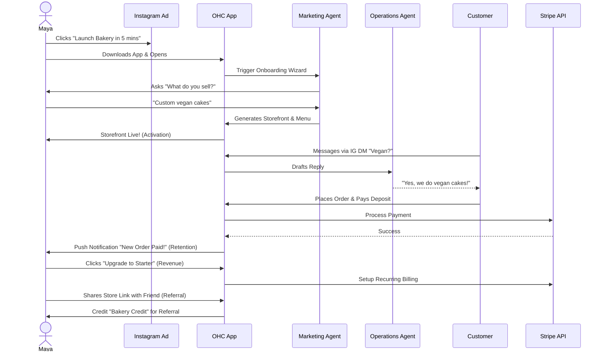
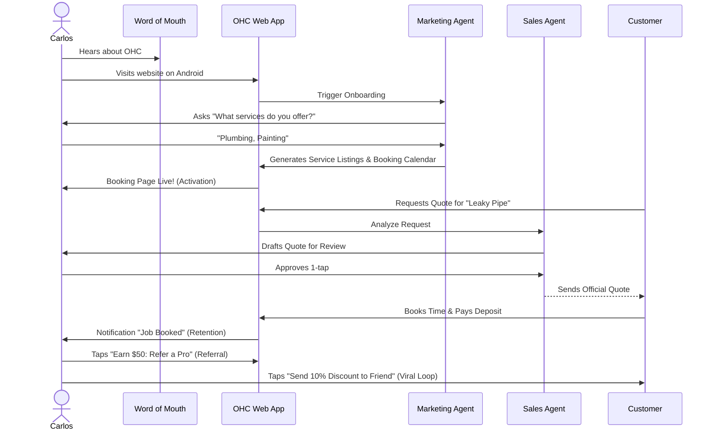
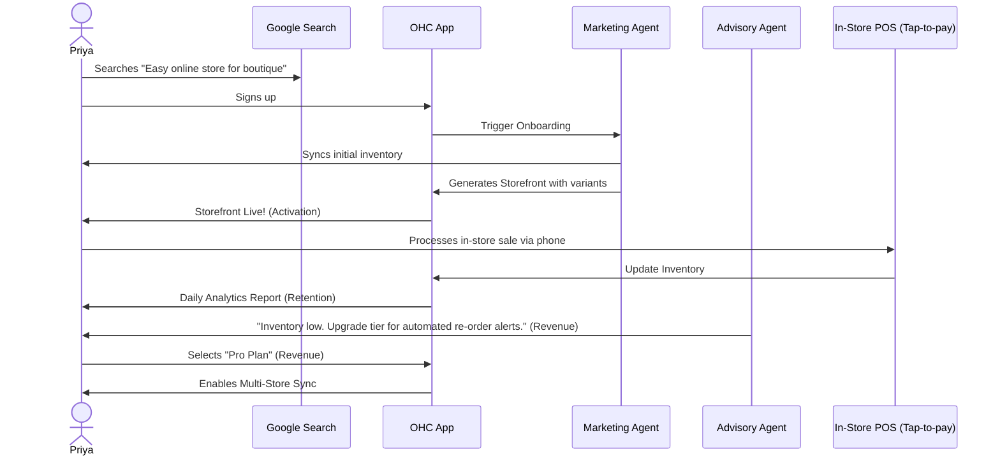
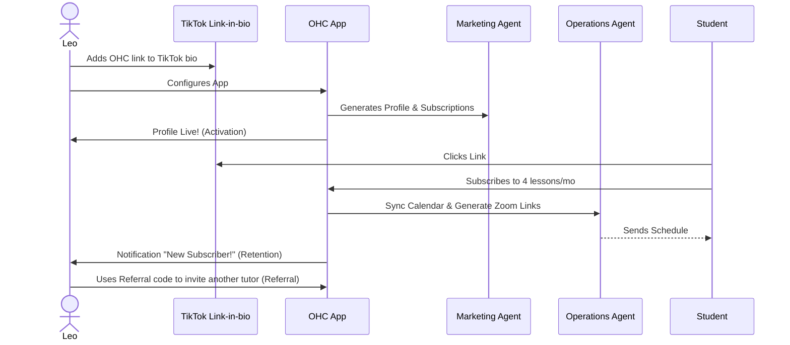
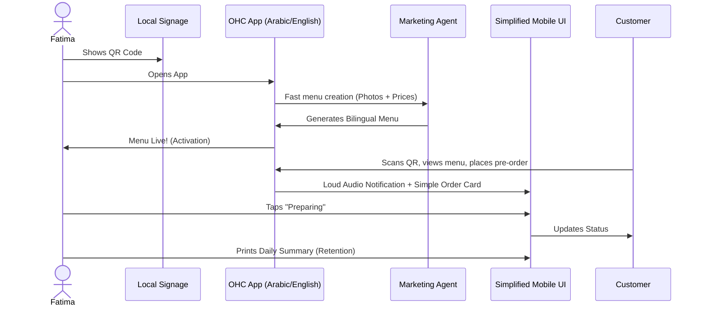
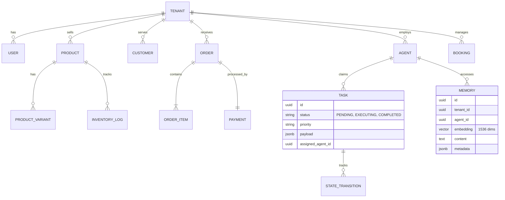
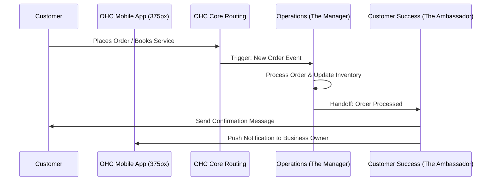
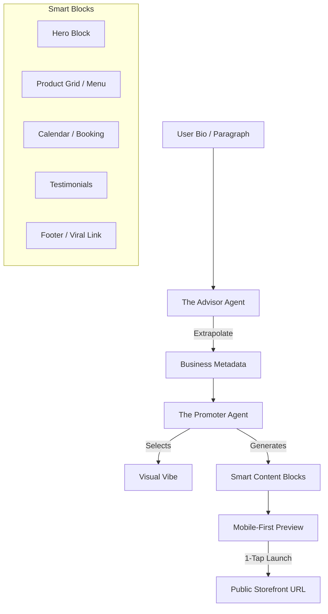
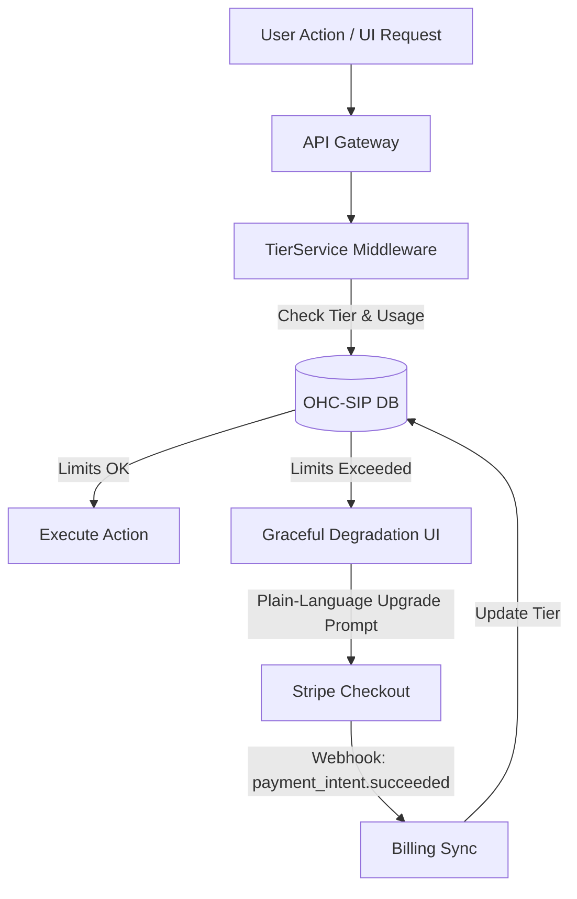

# Consolidated Research Report

## Table of Contents

1. [Architectural Mapping of the End-to-End Business Journey for OHC Personas](#architectural-mapping-of-the-end-to-end-business-journey-for-ohc-personas)
2. [OHC Data Model: Entity-Relationship & Multi-Tenancy Architecture](#ohc-data-model-entity-relationship--multi-tenancy-architecture)
3. [AI Agent Department Architecture](#ai-agent-department-architecture)
4. [OHC "Smart Builder": AI-Driven 30-Second Storefront Architecture](#ohc-smart-builder-ai-driven-30-second-storefront-architecture)
5. [OHC Mobile-First Contract: Performance, Resilience, and "Grandmother Test" Audit](#ohc-mobile-first-contract-performance-resilience-and-grandmother-test-audit)
6. [OHC Multi-Tenant SaaS Tiers: Tier Enforcement and Upsell Logic](#ohc-multi-tenant-saas-tiers-tier-enforcement-and-upsell-logic)

---

## Architectural Mapping of the End-to-End Business Journey for OHC Personas

### Title
Architectural Mapping of the End-to-End Business Journey for OHC Personas

## Problem Statement
The OHC platform must serve a diverse set of real-world small business owners (e.g., Maya the Baker, Carlos the Handyman, Priya the Boutique Owner, Leo the Music Tutor, and Fatima the Food Cart Operator) who share a common goal: launching and growing their business entirely from a mobile device without technical expertise. Currently, the overarching business journeys—from initial acquisition to sustainable revenue generation and referral loops—are fragmented. We need a unified architectural map of the end-to-end user journeys for these personas to ensure that the system naturally supports their progression through Acquisition, Onboarding, Activation, Retention, Revenue generation, and Referral, while identifying critical friction points where non-technical users might abandon the platform.

## Research Report
### Context and Personas
The business journey is evaluated against the following core personas:
1.  **Maya (Home Baker, 28)**: Needs a mobile-first storefront, Instagram integration, order management with deposit payments, and AI handling direct messages.
2.  **Carlos (Handyman, 42)**: Requires clean service listings, a robust booking system with deposits, a unified customer inbox, and an AI quote generator.
3.  **Priya (Boutique Owner, 35)**: Wants omnichannel support (in-store/online), POS integration (tap-to-pay), inventory sync, and actionable daily analytics.
4.  **Leo (Music Tutor, 22)**: Needs subscription-based packages, schedule syncing, automated meeting links, and a strong public profile (link-in-bio).
5.  **Fatima (Food Cart Operator, 50)**: Prioritizes extreme simplicity, pre-order management, multi-language UI, and fast low-data mobile performance.

### Journey Stages
-   **Acquisition**: The entry point. Organic search, social media ads (Instagram/TikTok), or word-of-mouth. The call-to-action (CTA) must clearly promise a functional business setup in under 10 minutes.
-   **Onboarding**: A highly guided, AI-driven wizard flow. Crucial to minimize initial input; deferring advanced configurations (like custom domains) to a later stage.
-   **Activation**: The "Aha!" moment. A live storefront, the first booking, or the first payment. Must be achieved within Day 1.
-   **Retention**: Kept engaged through actionable notifications (e.g., new order alerts) and AI-generated weekly health reports.
-   **Revenue**: Transitioning from a free tier to a paid plan. Triggered by hitting specific milestones (e.g., reaching product/action limits, needing custom domains).
-   **Referral**: Incentivized sharing. Creating a viral loop through referral discounts and shareable success metrics.

### Identified Friction Points
1.  **Cognitive Overload during Onboarding**: Requesting too much setup information upfront (e.g., complex shipping rules) causes drop-offs.
2.  **Payment Gateway Integration**: Technical jargon during Stripe connection can stall progress.
3.  **Inventory/Calendar Sync**: Difficulties mapping real-world availability to digital systems without intuitive AI assistance.
4.  **Language and Accessibility Barriers**: Interfaces that assume high technical literacy or english fluency (e.g., for Fatima).

## Design Doc
### Key Design Decisions
-   **Progressive Profiling**: The onboarding flow will request the absolute minimum required data to generate a viable starting point. Advanced settings are dynamically suggested by the Business Advisory Agent post-activation.
-   **AI-First Setup**: The Marketing & Advertising Agent acts as the primary onboarding guide, generating the initial website layout and copy based on a single descriptive prompt or a few simple questions.
-   **Mobile-First Constraint**: All journey flows are designed and tested starting at the 375px breakpoint.
-   **Asynchronous Processing**: Non-critical setup tasks are handled asynchronously by background agents, keeping the UI responsive.

### Architecture Diagrams (Mermaid.js)

#### 1. Maya (The Home Baker) Journey

#### 2. Carlos (The Handyman) Journey

#### 3. Priya (The Boutique Owner) Journey

#### 4. Leo (The Music Tutor) Journey

#### 5. Fatima (The Food Cart Operator) Journey

### Mobile UX Flow Notes
-   **375px First**: All onboarding forms utilize native mobile keyboards appropriately (e.g., numeric for prices, email for contacts).
-   **Progress Indicators**: Clear visual indicators during the onboarding wizard.
-   **Optimistic UI**: Immediate feedback on actions (like saving a setting), with background sync handled by the KAIROS Orchestrator.

## Implementation Prompt
**To Implementer Agent:**
Implement the foundational user onboarding flow and dashboard state management that supports the progression from Acquisition to Activation. The system should define the required data models to capture the user's business type and minimal initial configuration. Build the mobile-first (375px) UI wizard that guides a user through the initial setup, ensuring that advanced configurations are deferred. The final step of the wizard should instantly generate a functional "Storefront/Booking Page" view, satisfying the 'Activation' milestone. Ensure that interactions feel premium (Glassmorphism, correct typography) and are resilient to network issues (optimistic updates). Do not prescribe the specific database schema or backend routing; focus on the unified API contract and the user journey transitions. Include E2E test coverage verifying a successful run-through from login to the generated storefront.

issue_id: 9353

---

## OHC Data Model: Entity-Relationship & Multi-Tenancy Architecture

# Architecture Brief: Data Model Evolution

## Title
OHC Data Model: Entity-Relationship & Multi-Tenancy Architecture

## Problem Statement
Small business owners (Maya, Carlos, Priya) require a system that "just works" and keeps their data strictly private. Behind the scenes, the OHC engineering swarm needs a robust, scalable data model that supports high-concurrency agent operations, multi-tenant isolation, and fast mobile-first access patterns. Without a formalized schema evolution strategy, the platform risks data fragmentation and security leaks between tenants.

## Research Report
- **Multi-Tenancy**: OHC utilizes a "Shared Database, Shared Schema" model for cloud-native deployments, hardened by PostgreSQL **Row Level Security (RLS)**. In standalone mode, it uses localized SQLite file isolation.
- **Agentic Memory**: Traditional relational models fail to capture the "thought process" of AI agents. OHC integrates `pgvector` for semantic memory retrieval, allowing "The Advisor" to recall past seasonal trends for Maya's bakery without complex manual joins.
- **Consistency Boundary**: The `organization_id` (Tenant) is the primary partition key. All queries MUST be scoped to this ID to prevent "noisy neighbor" or data leakage issues.

## Design Doc

### Entity-Relationship Diagram (Mermaid.js)

### Key Invariants
1.  **Mandatory Tenant Scoping**: Every table in the OHC ecosystem MUST contain a `tenant_id` (or `organization_id`) column.
2.  **RLS-First Security**: No query shall be executed without an active `SET app.current_tenant = '...'` session variable in PostgreSQL.
3.  **Agent Isolation**: Agents can only "see" and "claim" tasks belonging to their assigned `tenant_id`.
4.  **Immutable Memory**: Long-term memories (AutoDream) are append-only to preserve the historical "learning" of the business.

### Mobile-First Access Patterns
- **The Dashboard Query**: Optimized via `jsonb_build_object` to fetch Organization Info, active Agent status, and daily Order counts in a single round-trip.
- **The 1-Tap Approval**: Uses optimistic UI updates; the backend processes the `TASK` transition and emits a `Teammate Mesh` event for real-time UI feedback.

## Implementation Prompt
**To Implementer Agent:**
Implement the evolved data model as described in the ER diagram. Ensure every new table (Memory, Task, Booking) has a `tenant_id` column and the corresponding PostgreSQL RLS policies. Update the `Repository` layer in the Go/Rust backend to automatically inject the `tenant_id` from the authenticated JWT context into all SQL queries. Implement a `MemoryStore` that utilizes `pgvector` for semantic search, ensuring results are strictly filtered by the requesting tenant's ID. Verify multi-tenancy isolation with an integration test where `Tenant A` attempts to retrieve `Tenant B's` memory embeddings.

## Priority
P0

## Estimated Scope
Large

---

## AI Agent Department Architecture

# Title: AI Agent Department Architecture

## Problem Statement
For a small business owner like Maya (the baker) or Carlos (the handyman), managing a business means wearing too many hats—answering customer inquiries, sending quotes, fulfilling orders, and updating the website. This constant context-switching is overwhelming and steals time from their actual craft. They don't want to configure complex automation rules or learn enterprise software; they just want invisible "employees" (departments) that handle these tasks automatically in the background, exactly how a real business operates.

## Research Report
Small business owners often piece together 5-10 different tools (Shopify for store, Mailchimp for marketing, Calendly for booking, Zendesk for support).
- **Shopify**: Offers some automated workflows via Shopify Flow, but it requires technical configuration and isn't a conversational AI agent acting autonomously.
- **Wix/Squarespace**: Basic auto-responders, but no concept of autonomous "departments" handling complex multi-step workflows.
- **GoDaddy**: Focuses on simple setups but lacks deep AI integration for ongoing business management.
Our approach introduces AI "Departments" (Operations, Marketing, Sales, Customer Success, Finance, Legal, Advisory) that mirror real business roles, providing a unified, autonomous experience without the configuration burden.

## Design Doc

### Architecture Diagram

### UI Wireframes & Screen Flow (375px Mobile-First)
1. **Home Dashboard (375px)**: Ubiquiti UniFi modular dashboard cards with translucent glass materials (Light mode: blur 30px, saturate 210%, 16px rounded corners). Clean typography (Outfit for headings, Inter for body).
2. **Department View**: Tapping on "The Manager" card opens a clean timeline of recent automated actions (e.g., "Updated inventory for 3 cakes", "Approved booking for Carlos").
3. **Action Approval**: A simple Tinder-like swipe card (8px rounded corners) to approve/reject an AI drafted response or action. "Grandmother test" applied: Actions are plain English ("Send 10% discount to Maya?").
4. **Advanced Settings**: All technical jargon (prompt configuration, execution limits) is hidden behind an "Advanced Settings" toggle.

### Mobile UX Flow
- **Step 1**: Owner receives a push notification: "The Salesperson drafted a quote for a wedding cake."
- **Step 2**: Owner taps notification, opening the app to the approval card.
- **Step 3**: Owner taps "Approve" (large, accessible button). The Salesperson sends the quote.

### AI Agent Integration Points
- **Event-Driven Triggers**: Core system events (new order, message received) route to the respective department.
- **Inter-Department Handoffs**: Departments can pass context and trigger each other (e.g., Sales -> Operations).
- **Draft-for-Review vs. Auto-Execute**: Configurable per department based on owner trust levels.
- **Memory & Context Retrieval**: Agents invisibly recall past customer interactions (e.g., "Maya ordered a vegan cake last year") by querying a centralized, secure customer history log before drafting responses.
- **Usage Throttling & Budgeting**: AI actions are implicitly bounded by the user's SaaS tier (e.g., Free vs. Starter). When approaching monthly limits, the system surfaces a clear, non-technical upgrade prompt rather than throwing errors.

### Key Design Decisions and Why
- **Department Metaphor**: Mirroring real business departments instead of technical "agents" or "bots" lowers the cognitive load for non-technical users.
- **Draft-for-Review Default**: Builds trust by allowing the owner to review high-stakes actions (quotes, legal docs) before they are sent.
- **Translucent Glass UI**: Follows the Visual Excellence Mandate, providing a premium, native macOS/iOS feel that enhances perceived value and simplicity.

## Implementation Prompt
**Role**: Implementer Agent
**User-Facing Outcome**: Maya the baker should see a dashboard with cards for her AI Departments (e.g., "The Manager", "The Ambassador"). When a customer messages her on Instagram, "The Ambassador" should draft a reply and present it as a simple approval card on her mobile app.
**CUJ (Critical User Journey)**:
1. System receives a customer inquiry.
2. Core routes the inquiry to "The Ambassador" department.
3. "The Ambassador" drafts a response and creates an approval request.
4. Business owner opens the mobile app, views the drafted response in a visually premium, glassmorphic card, and approves it with one tap.
**Acceptance Criteria**:
- All UI components strictly adhere to the Visual Excellence Mandate (Translucent Glass, Outfit/Inter typography, 8px/16px rounded corners).
- The flow passes the 30-second "grandmother test".
- No technical jargon is visible unless "Advanced Settings" is toggled.
- Departments can communicate and hand off tasks.

## Priority
P0

## Estimated Scope
Large

---

## OHC "Smart Builder": AI-Driven 30-Second Storefront Architecture

# Architecture Brief: Website & Storefront Builder

## Title
OHC "Smart Builder": AI-Driven 30-Second Storefront Architecture

## Problem Statement
Small business owners (Maya, Carlos, Fatima) are intimidated by traditional website builders with too many buttons and technical terms (CNAME, SSL, Liquid). They need a professional storefront that is "born live" with zero setup. If Maya can't go from a paragraph of text to a live, payment-ready URL in under 60 seconds, OHC has failed the "Grandmother Test."

## Research Report
- **Competitive Benchmark**: Durable.co and Wix ADI have set the bar at < 60 seconds for initial generation.
- **Vibe Coding**: The emerging trend of using LLMs to select colors, typography, and layout based on a business "vibe" (e.g., "Cozy, organic bakery" vs. "High-speed, modern plumbing").
- **Block System**: Shopify and Squarespace use "Sections," but they are often too complex for mobile-first editing. OHC needs "Smart Blocks" that auto-configure based on the business type (e.g., a "Menu Block" for Fatima, a "Booking Block" for Carlos).

## Design Doc

### High-Level Architecture (Mermaid.js)

### The "Smart Block" Ecosystem
Every storefront is a vertical stack of mobile-optimized blocks:
1.  **Hero Block**: Adaptive headline + background photo (auto-sourced from bio or AI-generated).
2.  **Product/Menu Block**: Intelligent grid that handles variants (size/color) or "Sold Out" toggles with 1-tap.
3.  **Booking/Calendar Block**: Real-time availability sync for services (Carlos/Leo).
4.  **Contact/Lead Block**: Integrated "The Ambassador" draft-and-approve inbox.
5.  **Viral Footer**: "Built with OneHumanCorp — Launch Your Shop" referral loop.

### visual Excellence & Vibe Coding
- **Design Tokens**: Every site uses OHC Premium tokens (Outfit/Inter fonts, Glassmorphism).
- **Auto-Palette**: AI selects 3 accessible color palettes based on the business category.
- **Draft -> Live**: The site is born as a `DRAFT` and becomes `LIVE` upon 1-tap approval. SSL and Subdomains are provisioned instantly in the background.

## Implementation Prompt
**To Implementer Agent:**
Implement the "Smart Builder" engine. Create a registry of `SmartBlocks` (Hero, Catalog, Booking) that are 100% responsive and usable at 375px. Build the "Vibe Coding" logic where "The Promoter" agent receives business metadata and outputs a JSON configuration for the storefront layout. Implement the publishing lifecycle: when a user clicks "Launch," the system must provision a subdomain (e.g., `maya.ohc.app`) and move the site from `DRAFT` to `LIVE`. Ensure the UI transition from "Bio Input" to "Live Preview" is seamless, with background agents handling the "heavy lifting" (image generation, copy drafting).

## Priority
P0

## Estimated Scope
Large

---

## OHC Mobile-First Contract: Performance, Resilience, and "Grandmother Test" Audit

# Architecture Brief: Mobile-First Review & Performance

## Title
OHC Mobile-First Contract: Performance, Resilience, and "Grandmother Test" Audit

## Problem Statement
Small business owners (Carlos, Fatima, Maya) are mobile-only or mobile-primary. They operate in high-distraction environments (bakeries, repair sites, food carts) and often on low-end Android devices or poor 4G/5G connections. If the OHC dashboard is slow to load or fails when offline, Carlos can't send a quote, and Fatima loses a sale. OHC must be as fast and reliable as a native calculator app.

## Research Report
- **The "Grandmother Test"**: If a user has to wait more than 2 seconds for a screen to load, or more than 1 second for a button to respond, they assume the app is "broken."
- **Payload Bloat**: Traditional SaaS dashboards (Shopify/Wix) often fetch megabytes of JS and JSON, leading to LCP > 3s on 4G networks.
- **Offline Gaps**: Most web-based builders require a constant internet connection. OHC's hybrid nature (Local SQLite/SIPDB) provides a unique opportunity to allow "Offline Drafting."

## Design Doc

### Mobile-First Performance Targets
| Metric | Target | Why? |
| :--- | :--- | :--- |
| **LCP (Largest Contentful Paint)** | < 1.5s (4G) | Essential for "Activation" and perceived speed. |
| **FID (First Input Delay)** | < 100ms | Buttons must feel "native" and responsive. |
| **Bundle Size (Core UI)** | < 500KB | Fast download on low-data plans (Fatima). |
| **Touch Target Size** | ≥ 44x44px | Accessible for all users, especially in active work environments. |

### Architectural Decisions for Mobile Resilience
1.  **Lightweight Dashboard Service**: Implement `GetLightweightDashboard` in gRPC/Proto to return ONLY the critical counts (Orders, Agents, Messages) instead of full resource lists for the initial paint.
2.  **Optimistic UI with "Mesh Sync"**: All user actions (e.g., "Approve Quote") update the local UI state immediately. The KAIROS Orchestrator handles the background sync to the Teammate Mesh.
3.  **Offline-First Drafting**: Users can draft products or messages while offline. These are stored in the local SQLite SIPDB and auto-synced by the `SyncDaemon` once connectivity is restored.
4.  **Adaptive Asset Loading**: AI-generated images for the storefront are served via progressive JPEGs/WebP with mobile-responsive `srcset` variants.

### Mobile UX Flow (375px First)
- **Bottom Navigation**: Primary actions (Home, Orders, Agents, Settings) are reachable with one thumb.
- **Glassmorphism Shimmer**: Use skeleton loading states (shimmer effect) to maintain visual continuity during data retrieval.
- **Jargon-Free UI**: Replace "API Config" with "Helper Settings," "CNAME" with "Website Address."

## Implementation Prompt
**To Implementer Agent:**
Audit the current Slint/Rust frontend against the Mobile-First Performance targets. Implement "Skeleton Loading" (shimmer effect) for the `StatCard` and `AgentFeed` components. Update the `DashboardService` to support a `mobile_optimized: true` flag that returns a lightweight payload for the initial mobile paint. Implement "Optimistic Updates" in the Task List: when a user approves an agent draft, the UI should immediately reflect the "Approved" status and show a non-blocking background sync indicator. Ensure all touch targets in the `WebsiteBuilder` are at least 44x44px and use native mobile keyboards (numeric for prices, etc.).

## Priority
P0

## Estimated Scope
Medium

---

## OHC Multi-Tenant SaaS Tiers: Tier Enforcement and Upsell Logic

# Architecture Brief: Multi-Tenant SaaS Tier Architecture

## Title
OHC Multi-Tenant SaaS Tiers: Tier Enforcement and Upsell Logic

## Problem Statement
The OHC platform currently lacks a formalized multi-tenant tier system to handle feature and usage limits based on subscription plans. Without this, we cannot effectively monetize the platform while providing a robust free tier for non-technical small business owner personas (e.g., Maya, Carlos, Priya). The system needs a transparent, fair, and scalable pricing model. Maya needs a free tier to test the waters with her first cake order. As her business expands, she will hit limits (storage, AI actions, custom domains) that necessitate an upgrade to a paid tier (Starter, Pro, Business). The platform requires a clear architectural definition of these tiers, how limits are enforced, and how the user experience gracefully handles upgrades without technical friction.

## Research Report
- **Competitor Landscape**: Wix and Shopify use aggressive feature-gating. OHC's differentiation is "AI as the upgrade driver."
- **User Psychology**: Non-technical users upgrade when they see direct value (e.g., "The Sales Agent just secured a $500 booking, but your AI limit is reached. Upgrade to keep it running.") rather than abstract metrics like "Storage."
- **Tier Structure**:
  - **Free:** $0/mo. 10 Products, 1 AI Department (Ops), 100 AI actions/mo, 500MB Storage, OHC Subdomain.
  - **Starter:** $9/mo. 100 Products, 3 AI Departments, 1,000 AI actions/mo, 5GB Storage, Custom Domain.
  - **Pro:** $29/mo. Unlimited Products, 10 AI Departments, Unlimited AI actions, 50GB Storage, Custom Domain + SSL.
  - **Business:** $79/mo. Unlimited everything, 500GB Storage, Multi-domain.
- **Enforcement Mechanisms**: Limits must be enforced at the orchestration layer, not just the UI, to prevent abuse.

## Design Doc

### Key Design Decisions
1.  **Usage Metering**: All AI agent actions (invocations, drafted emails, generated quotes) must emit a telemetry event to a central metering service.
2.  **Soft Limits & Grace Periods**: When a user hits 90% of their limit, the Business Advisory Agent sends a proactive, friendly notification. Hitting 100% does not break the site; it queues actions and prompts for an upgrade.
3.  **Tier Information API**: The frontend must have a lightweight way to query the current tier and usage stats (e.g., `GET /api/v1/tenant/tier-status`) to render progress bars and upgrade CTAs natively.
4.  **No Technical Jargon**: Upgrade prompts must focus on business value. Instead of "Upgrade for more database storage," use "Upgrade to add more products to your catalog."
5.  **Billing Sync:** Integration with Stripe webhooks to handle asynchronous tier updates and payment processing.

### Architecture Diagram (Mermaid.js)

### AI Agent Integration Points
- AI Agents are strictly subject to tier limits.
- The **"Business Advisory"** agent proactively surfaces tier upgrade recommendations in the dashboard based on usage patterns (e.g., nearing product limit or action limits).

### Mobile UX Flow (375px First)
- **Settings View**: A dedicated "My Plan" section using clean Glassmorphism cards.
- **Progress Bars**: Visual indicators showing "AI Tasks This Month" (e.g., 85/100).
- **The Upgrade Trigger**: When an action is blocked (e.g., trying to add an 11th product on the Free tier), a bottom sheet modal appears with a 1-tap Apple Pay/Google Pay upgrade button.
- **Plain Language:** Instead of a technical error, the UI shows a plain-language prompt (e.g., "You've reached your free product limit. Upgrade to add more!").

## Implementation Prompt
Implement the Multi-Tenant SaaS Tier Architecture. Create the `TierService` middleware, define the tier structures in the database, integrate with Stripe webhooks for billing sync, and update frontend components to handle graceful degradation and upgrade prompts. On the frontend, implement the mobile-first "My Plan" view using the visual excellence tokens (Glassmorphism, Outfit font) to display usage progress. Ensure that when a limit is reached, the UI elegantly presents a friendly upgrade prompt rather than a technical error. Do NOT prescribe specific database schemas.

## Priority
P0

## Estimated Scope
Large
