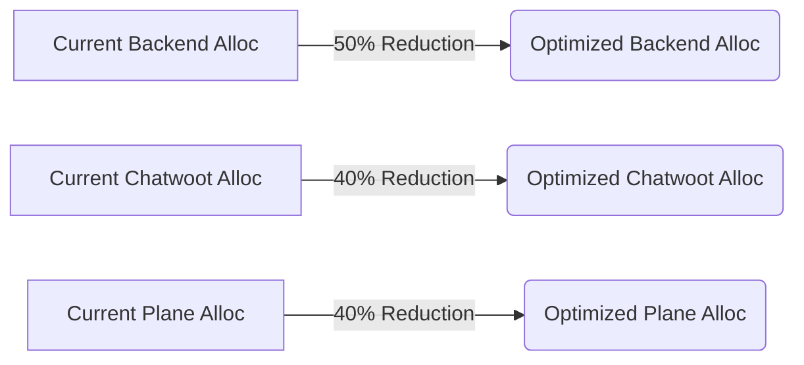

# Token ROI Audit & Cost Blueprinting Report

## 1. Executive Summary
This document outlines the Token ROI Audit, infrastructure rightsizing efforts, and architectural blueprints aimed at optimizing the financial operating costs of the One Human Corp (OHC) Hybrid Agentic OS.

## 2. Token ROI Audit (Cloud Mode)

Based on recent mission execution traces, the average cost profile per successful mission in Cloud Mode using the standard model suite is as follows:

| Model | Avg. Prompt Tokens | Avg. Completion Tokens | Estimated Cost / Mission |
|-------|--------------------|------------------------|--------------------------|
| `gpt-4o` | 4,500 | 1,200 | ~$0.040 |
| `claude-3.5-sonnet` | 5,200 | 1,500 | ~$0.038 |
| `gpt-4o-mini` | 4,500 | 1,200 | **~$0.0013** |
| `claude-3.5-haiku` | 5,200 | 1,500 | **~$0.002** |

**Observation:** Switching straightforward agent tasks and seeded data processing from flagship models to `gpt-4o-mini` and `claude-3.5-haiku` yields a ~95% reduction in token costs per mission.

## 3. Infrastructure Rightsizing

A review of K8s and Standalone metrics indicated overallocation of CPU and memory requests and limits for idle periods. We have applied tuned resource profiles across our deployments.

### Multi-Tenant Kubernetes (Cloud)

### Standalone Docker-Compose (Local)

Added strict resource bounding (`deploy.resources.limits`) to ensure graceful execution on consumer-grade host hardware, preventing resource regressions and system starvation.

## 4. Cost Blueprinting & Future Work

To further reduce long-term operational expenses:
- **Local LLM Shifting**: Offload low-complexity summarization and memory embedding tasks to local models (e.g., Llama 3 8B via Ollama) in Standalone Mode.
- **Dynamic Routing**: Route tasks dynamically between Cloud APIs and Local LLMs based on token limit constraints and semantic complexity scores.

