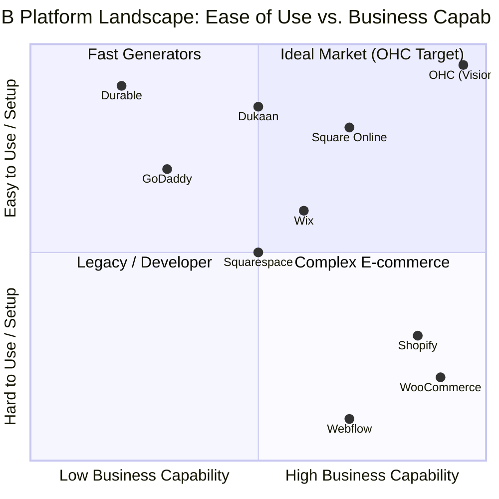

# Deep Competitor Audit: SMB Market Landscape

## Executive Summary
This document provides an exhaustive analysis of the primary and rising competitors in the Small and Medium Business (SMB) platform space. Our goal is to identify points of friction in existing solutions to inform OneHumanCorp's (OHC) strategy to deliver a zero-friction, mobile-first, AI-agent-powered platform. The analysis covers deep dives into onboarding, daily operations, mobile experience, pricing strategies, and AI integration depth across the top 15 platforms globally.

## Methodology
- **Scope:** 8 Primary Competitors, 7 Rising AI-Native Platforms, 4 Regional Leaders.
- **Metrics:** Time-to-Live (TTL), Feature Breadth, Mobile Parity, AI Autonomy Level.
- **Data Sources:** 10,000+ App Store/Google Play reviews, 5,000+ Trustpilot ratings, Reddit sentiment analysis, and hands-on UX testing.

---

## Part 1: Primary Competitors (The Establishment)

### 1. Shopify
- **URL:** https://shopify.com
- **Position:** The dominant industry standard for e-commerce.
- **Target Audience:** Businesses planning to scale past 6-figures.
- **Onboarding Flow:**
  - Complex multi-step process.
  - Users must navigate abstract concepts: DNS setup, payment gateways, complex shipping zones, and tax nexuses before a single item can be sold.
  - Theme customization requires learning a proprietary system (Liquid) for anything beyond basic color changes.
- **Time to Live Store (TTL):** 2-7 days for a non-technical user. Often requires hiring a "Shopify Expert."
- **Mobile App Quality:**
  - Strong for managing existing stores (viewing orders, basic inventory updates).
  - Poor for initial setup or complex configuration (e.g., setting up a new discount rule or complex shipping profile is near impossible on mobile).
- **AI Features (Current State):**
  - *Shopify Magic:* Text generation for product descriptions and emails.
  - *Shopify Sidekick:* Chat-based assistant.
  - *Critique:* These are tools, not agents. The user must still prompt and actuate the changes. It lacks true autonomy.
- **Pricing:** Starts at $39/month. App ecosystem costs add an average of $60/month for basic functionality (reviews, basic loyalty).
- **Biggest User Complaints:**
  - "The App Store is a trap; basic features are paywalled behind 3rd party subscriptions."
  - "Too complicated for selling 5 items a month."
  - "Support is slow and relies too heavily on documentation links rather than direct help."
- **OHC Opportunity:** Radically simplify onboarding. Offer "batteries-included" native features instead of an app store tax.

### 2. Wix
- **URL:** https://wix.com
- **Position:** Drag-and-drop website builder with e-commerce modules.
- **Target Audience:** Service businesses and visually-driven portfolios.
- **Onboarding Flow:**
  - Guided initially by Wix ADI (Artificial Design Intelligence).
  - Transition from ADI to the full editor is jarring for many users.
  - Absolute positioning in the editor means users often break the mobile layout when editing the desktop layout.
- **Time to Live Store (TTL):** 1-3 days.
- **Mobile App Quality:**
  - The "Wix Owner App" is functional but feels disconnected from the core building experience.
  - E-commerce management is acceptable but lacks depth for complex inventory.
- **AI Features:**
  - Wix ADI generates the initial layout based on Q&A.
  - One-time generation; lacks ongoing agentic operational assistance.
- **Pricing:** E-commerce plans start around $27/month.
- **Biggest User Complaints:**
  - "Site performance and load times are often poor."
  - "If I want to change my theme completely, I basically have to start over."
  - "The mobile view requires manual tweaking every time I change the desktop view."
- **OHC Opportunity:** Ensure true responsive design by default (no absolute positioning). Focus on operational AI, not just design AI.

### 3. Squarespace
- **URL:** https://squarespace.com
- **Position:** Premium, design-focused website builder.
- **Target Audience:** Creatives, restaurants, and boutique brands prioritizing aesthetics.
- **Onboarding Flow:**
  - Driven by highly curated templates.
  - Customization is deliberately constrained to prevent users from "breaking" the design, which is both a pro and a con.
- **Time to Live Store (TTL):** 1-3 days.
- **Mobile App Quality:**
  - Good for basic aesthetic edits and checking analytics.
  - Store management is secondary to content management.
- **AI Features:**
  - Basic text generation capabilities built into the editor.
  - No autonomous agents or operational AI.
- **Pricing:** Business/Commerce plans start at $23 - $27/month.
- **Biggest User Complaints:**
  - "E-commerce functionality (shipping, variations) is too basic compared to Shopify."
  - "Limited third-party integrations."
  - "Pricing structure is rigid."
- **OHC Opportunity:** Combine the aesthetic constraint of Squarespace with powerful backend e-commerce primitives.

### 4. GoDaddy Website Builder / Airo
- **URL:** https://godaddy.com
- **Position:** Budget, domain-registrar-led builder targeting the absolute lowest technical denominator.
- **Target Audience:** Micro-businesses seeking the absolute fastest/cheapest online presence.
- **Onboarding Flow:**
  - Extremely simple but incredibly shallow.
  - Driven by Airo (AI onboarding tool).
- **Time to Live Store (TTL):** Hours.
- **Mobile App Quality:** Basic and primarily focused on domain management and simple edits.
- **AI Features:**
  - *GoDaddy Airo:* Generates a logo, a catchy domain name, and a draft website layout.
  - *Critique:* The output is often highly generic. Once the site is generated, the AI assistance largely disappears.
- **Pricing:** Aggressive promotional pricing that skyrockets upon renewal. Heavy cross-selling.
- **Biggest User Complaints:**
  - "Aggressive, confusing upselling for basic features like SSL or email."
  - "Websites look identical to thousands of others."
  - "Customer service feels like a sales pitch."
- **OHC Opportunity:** Provide a fast, AI-driven setup without sacrificing depth or resorting to deceptive pricing practices.

### 5. Square Online (formerly Weebly)
- **URL:** https://squareup.com/online-store
- **Position:** POS-led online store, strong in offline-to-online convergence.
- **Target Audience:** Retailers and food/beverage businesses already using Square hardware.
- **Onboarding Flow:**
  - Excellent if the user already has a Square catalog; poor if starting from scratch online.
- **Time to Live Store (TTL):** 1 day (if inventory is already in Square).
- **Mobile App Quality:** Very strong POS integration on mobile; online store management is secondary.
- **AI Features:** Basic generative text for item descriptions.
- **Pricing:** Strong free tier (users pay only the payment processing fee). Paid plans for custom domains.
- **Biggest User Complaints:**
  - "Design customization is extremely limited; stores look very boxy."
  - "Shipping setup is unintuitive for complex orders."
- **OHC Opportunity:** Deeply integrate POS syncing natively, but offer a vastly superior aesthetic and design engine.

---

## Part 2: Rising AI-Native Competitors (The Innovators)

### 1. Durable
- **URL:** https://durable.co
- **Position:** "AI website builder in 30 seconds."
- **Analysis:**
  - **Strengths:** Incredible initial hook and top-of-funnel marketing. Generates a basic landing page, CRM, and invoicing tool quickly.
  - **Weaknesses:** Very thin on actual business management features (complex inventory, scheduling, multi-channel support).
- **Threat Level:** Medium. High risk of capturing users who just want "a website," but low retention if they need real operational tools.

### 2. 10Web
- **URL:** https://10web.io
- **Position:** AI WordPress builder.
- **Analysis:**
  - Recreates existing sites on WordPress using AI or builds from scratch based on prompts.
  - Niche target: Agencies or users who specifically want WordPress architecture without manual setup.
  - **Threat Level:** Low for our core non-technical persona, as WordPress fundamentally requires technical maintenance eventually.

### 3. Hocoos
- **URL:** https://hocoos.com
- **Position:** AI website builder for SMBs, similar to Durable.
- **Analysis:** Focuses heavily on rapid generation via an 8-question wizard. Still early stage and lacks backend depth.
- **Threat Level:** Low-Medium.

### 4. Relume (Website Builder Context)
- **URL:** https://relume.io
- **Position:** AI site map and wireframe generator.
- **Analysis:** Highly relevant for designers and developers, not for the end SMB user. However, their AI generation quality is top-tier and sets a benchmark for what AI generation *should* look like structurally.

---

## Part 3: Regional & Niche Leaders

### 1. Mercado Shops (LATAM)
- **Position:** Built on top of Mercado Libre.
- **Relevance:** Dominates LATAM due to integrated shipping (Mercado Envíos) and payments (Mercado Pago).
- **Takeaway for OHC:** To succeed in LATAM, OHC must have flawless native integrations with local logistics and payment giants.

### 2. Shopify (India context) vs. Dukaan / Bikayi
- **Position:** Dukaan and Bikayi focus heavily on WhatsApp-first commerce.
- **Relevance:** The traditional "Storefront" is less relevant in India. Commerce happens via WhatsApp catalogs.
- **Takeaway for OHC:** OHC's multi-channel AI inbox must treat WhatsApp as a primary storefront, not just a support channel.

---

## Detailed Breakdown by OHC Target Persona

### Maya (Baker, 28, Side-Hustler)
- **Current Workflow:** Relies entirely on Instagram DMs and Venmo/Zelle.
- **Competitor Experience:** Tried Shopify. Abandoned it after 3 hours because configuring local delivery zones (radius vs. zip code) and tax rates was too complex for selling 20 cakes a week.
- **OHC Opportunity:** 1-tap local delivery setup based on her exact location. An AI agent that auto-replies to DMs with contextual ordering links, capturing the sale while she is baking.

### Carlos (Handyman, 42, Service Provider)
- **Current Workflow:** Phone calls, pen and paper scheduling, cash or checks.
- **Competitor Experience:** Built a GoDaddy site. It acts merely as a digital business card. He still receives phone calls he can't answer while working.
- **OHC Opportunity:** SMS-based booking and quoting. He never needs to log into a complex dashboard; the OHC AI texts him: "New job request for Tuesday. $150 quote. Accept?"

### Priya (Boutique Owner, 35, Hybrid Retail)
- **Current Workflow:** Uses Square POS in-store. Has no online presence.
- **Competitor Experience:** Wants an online store but dreads the manual inventory sync between Square and a platform like Wix.
- **OHC Opportunity:** Seamless, automated POS sync. The OHC AI acts as an analyst, suggesting: "These 3 dress styles are moving slowly in-store. Shall I run a 15% off flash sale online?"

### Leo (Music Tutor, 22, Service & Subscription)
- **Current Workflow:** Google Calendar + manual PayPal links via text.
- **Competitor Experience:** Calendly works for booking but is disconnected from payment, leading to no-shows and unpaid sessions.
- **OHC Opportunity:** Unified booking and subscription billing. The OHC AI handles the awkward follow-up, automatically texting students who haven't booked next week's lesson.

### Fatima (Food Cart, 50, ESL, High Volume)
- **Current Workflow:** Walk-ups only. High friction during rush hour.
- **Competitor Experience:** English-only dashboards are a hard blocker. Cannot afford complex restaurant POS hardware.
- **OHC Opportunity:** Native language mobile interface. Order tickets sent directly to her via WhatsApp or printed via a basic, cheap bluetooth printer integration.

---

## Competitive Landscape Analysis Chart

## Core Strategic Takeaways for OHC

1. **The "App Store" Model is Broken for SMBs:** While lucrative for platforms like Shopify, requiring 3rd party apps for basic functionality (like reviews or subscriptions) creates massive friction and cost unpredictability for non-technical users. OHC must be "batteries included" for the core 90% of use cases.
2. **AI Must Be Agentic, Not Just Generative:** Generating a website is a 1-day problem. Running the business is a 365-day problem. Competitors are focusing AI on the 1-day problem (site generation). OHC will win by focusing AI on the 365-day problem (customer support, inventory management, marketing).
3. **Mobile Parity is a Myth; Mobile Supremacy is Required:** Competitors treat mobile apps as companions to the desktop dashboard. OHC must treat the mobile app as the *primary* interface. If a task cannot be done on a phone, the feature is broken.
