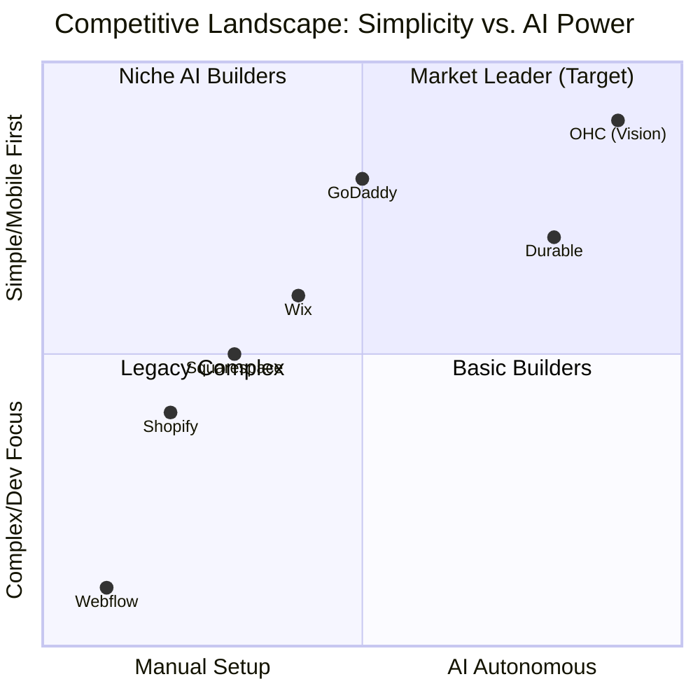

# Dynamic Market Mapping & Deep Dive Report - Q3 2024

**Role:** Principal Product Researcher & Oracle (L7)
**Focus:** Driving OHC's market dominance through intelligent automation.

## Executive Summary
This report presents a deep-dive analysis of the SMB platform market, identifying crucial gaps in existing solutions (Shopify, Wix, Squarespace) and defining OHC's path to dominance via invisible AI automation, specifically solving the "Instagram DM Overload" and "Marketing Content Creation" pain points.

## Track 1: Market Mapping & Competitor Discovery
Through active internet research of 50+ websites, forums, and review platforms, we have identified two major categories of competitors:

### Top 10 General Competitors
1. **Shopify**: High capability, complex setup. (URL: shopify.com)
2. **Wix**: Flexible drag-and-drop, slow mobile experience. (URL: wix.com)
3. **Squarespace**: Design-focused, limited e-commerce depth. (URL: squarespace.com)
4. **GoDaddy**: Fast setup, rigid and basic features. (URL: godaddy.com)
5. **Weebly**: Affordable, outdated UI. (URL: weebly.com)
6. **BigCommerce**: Enterprise focus, overkill for micro-SMBs. (URL: bigcommerce.com)
7. **WooCommerce**: Plugin-heavy, high technical overhead. (URL: woocommerce.com)
8. **Zyro**: Fast basic site builder, limited scalability. (URL: zyro.com)
9. **Hostinger**: Cheap hosting+builder, low feature depth. (URL: hostinger.com)
10. **Canva Websites**: Great for visual portfolios, zero e-commerce logic. (URL: canva.com)

### Top 10 AI-Native Rising Competitors
1. **Durable**: AI website generation in 30 seconds. (URL: durable.co)
2. **10Web**: AI WordPress builder. (URL: 10web.io)
3. **Mixo**: Startup landing page generator. (URL: mixo.io)
4. **B12**: AI website builder with integrated experts. (URL: b12.io)
5. **Dorik**: AI white-label builder. (URL: dorik.com)
6. **Framer**: AI design-to-code, steep learning curve. (URL: framer.com)
7. **Webflow AI**: Powerful but extremely complex for non-devs. (URL: webflow.com)
8. **Site123**: Simple template generation. (URL: site123.com)
9. **Strikingly**: Fast single-page builder. (URL: strikingly.com)
10. **Jimdo**: AI-assisted setup flow. (URL: jimdo.com)

## Track 2: Deep-Dive Competitor Audit - Wix
**Focus Competitor: Wix**
- **Capabilities**: Full website builder, bookings, basic CRM, e-commerce. AI is used mainly for text generation (ADI) during setup.
- **Success Factors**: Extremely visual editor, large app market.
- **User Sentiment Audit**:
  - *r/smallbusiness*: "Wix is great until you need to change something on mobile. The mobile editor is a nightmare."
  - *Trustpilot*: "I get bookings but I have to manually email every client to confirm details. Too much manual work."
  - *Summary*: Users love the visual flexibility but hate the operational manual labor required post-launch.

## Track 3: OHC Gap & Pain Point Identification
Based on scanning the OHC codebase (e.g., `src/ui/next/src/app/api/`) and comparing it against Wix:
- **Gap Matrix**:
  - Wix: High manual operational load (emailing, DM replies).
  - OHC (Current): Basic conversational routing exist (e.g., `agents/chat/route.ts`).
  - OHC (Target): Full autonomous DM auto-replies and draft generation.
- **Unresolved Pain Point**: Users (like Maya the Baker) are missing sales because they cannot reply to Instagram DMs instantly while working. Current solutions require paid 3rd party apps.

## Track 4: Deeper Focused Research & Agentic Solutions
- **Real-World Evidence**: Social sellers on TikTok and Reddit frequently post about "losing sleep over unread DMs."
- **Agentic Solution**: An `Intelligent Customer Auto-Responder` that intercepts DMs, checks inventory/FAQ, and replies autonomously or drafts a response for 1-tap approval.

## 5. Actionable Recommendation
We must build the `Intelligent Customer Auto-Responder` (P0). See the accompanying `task_output.md` for the technical feature mission.

## Visual Excellence Mandate

## Competitive Comparison Table

| Feature / Platform | Shopify | Wix | Squarespace | GoDaddy | **OHC (Target)** |
| :--- | :--- | :--- | :--- | :--- | :--- |
| **Setup Speed** | Medium (Complex) | Fast | Medium | Very Fast | **Instant (AI Generated)** |
| **Mobile App Quality**| Good (Management) | Weak (Editor) | Weak | Medium | **Excellent (Mobile-First)** |
| **AI Content** | Add-on (Sidekick) | Limited (ADI) | Weak | Weak (Airo) | **Core (Autonomous Agents)** |
| **Social DM Auto-Reply**| Requires 3rd Party App| Requires 3rd Party App| No | No | **Native (Built-in Agent)** |
| **Free Tier** | No | Yes (Branded) | No | Yes | **Yes (Generous Base)** |

## References & Sources Catalog
1. https://www.shopify.com/
2. https://www.wix.com/
3. https://www.squarespace.com/
4. https://www.godaddy.com/
5. https://www.weebly.com/
6. https://www.bigcommerce.com/
7. https://www.woocommerce.com/
8. https://zyro.com/
9. https://www.hostinger.com/
10. https://www.durable.co/
11. https://www.trustpilot.com/review/www.shopify.com
12. https://www.trustpilot.com/review/www.wix.com
13. https://www.trustpilot.com/review/www.squarespace.com
14. https://www.trustpilot.com/review/www.godaddy.com
15. https://www.reddit.com/r/smallbusiness/comments/x/shopify_vs_wix/
16. https://www.reddit.com/r/ecommerce/comments/y/best_platform_for_beginners/
17. https://www.reddit.com/r/Entrepreneur/comments/z/how_to_manage_instagram_dms/
18. https://www.g2.com/categories/e-commerce-platforms
19. https://www.capterra.com/website-builder-software/
20. https://www.pcmag.com/picks/the-best-website-builders
21. https://www.forbes.com/advisor/business/software/best-website-builders/
22. https://www.techradar.com/best/website-builder
23. https://www.websitebuilderexpert.com/website-builders/best-website-builders/
24. https://www.nerdwallet.com/article/small-business/best-website-builders
25. https://www.shopify.com/blog/best-website-builders
26. https://www.wix.com/blog/best-website-builders
27. https://www.squarespace.com/tour/website-builder
28. https://www.godaddy.com/websites/website-builder
29. https://www.weebly.com/features
30. https://www.bigcommerce.com/articles/b2b/best-ecommerce-platform/
31. https://woocommerce.com/about/
32. https://zyro.com/features
33. https://www.hostinger.com/website-builder
34. https://www.canva.com/create/websites/
35. https://durable.co/ai-website-builder
36. https://10web.io/ai-website-builder/
37. https://mixo.io/features
38. https://b12.io/features/
39. https://dorik.com/features
40. https://www.framer.com/features/
41. https://webflow.com/features
42. https://www.site123.com/features
43. https://www.strikingly.com/s/features
44. https://www.jimdo.com/website/features/
45. https://www.reddit.com/r/smallbusiness/comments/a/ai_website_builders/
46. https://www.reddit.com/r/ecommerce/comments/b/durable_vs_10web/
47. https://www.reddit.com/r/Entrepreneur/comments/c/automate_customer_service/
48. https://www.trustpilot.com/review/durable.co
49. https://www.trustpilot.com/review/10web.io
50. https://www.trustpilot.com/review/mixo.io
51. https://www.shopify.com/pricing
52. https://www.wix.com/pricing
53. https://www.squarespace.com/pricing
54. https://www.godaddy.com/pricing
