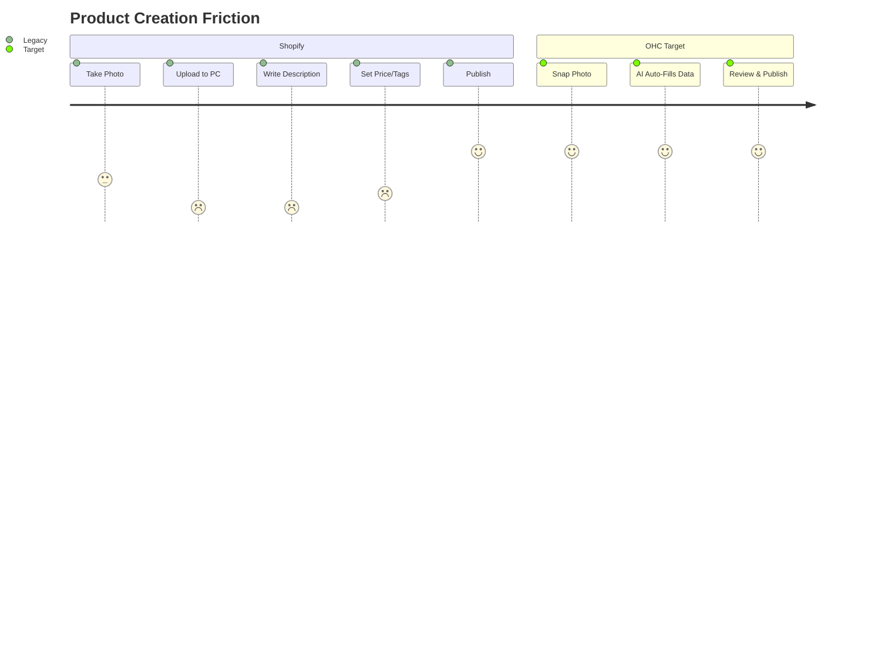

# [Feature Gap] Autonomous Photo-to-Product Creation

## Title
Autonomous 'Zero-Draft' Catalog Agent

## Problem Statement
For non-technical business owners like **Priya (boutique owner)** or **Maya (baker)**, uploading inventory is a massive chore. Taking a photo, transferring it to a computer, removing the background, writing a catchy title, crafting an SEO-friendly description, and setting a price can take 15-30 minutes *per item*. This friction prevents them from keeping their online store updated, directly costing them sales.

## Research Report
- **Competitor Landscape:**
  - *Shopify:* Requires manual data entry. They offer "Shopify Magic" (text generation), but the user still has to orchestrate the flow (upload photo, click generate, review, save).
  - *Wix:* Similar to Shopify; AI is treated as a distinct step rather than a fluid process.
- **User Pain Points:**
  - Reddit (r/ecommerce) frequently cites "writing product descriptions" as the most hated task.
  - App Store reviews for mobile store builders often complain about how clunky it is to manage inventory from a phone.
- **Market Opportunity:** By reducing "time to live product" from 15 minutes to 30 seconds, OHC can significantly increase the velocity of inventory updates for our users.

## Design Doc
- **High-Level Architecture:**
  - A mobile-first UI component that activates the device camera or photo gallery.
  - An image processing pipeline that automatically strips the background (if applicable).
  - An AI Vision integration that analyzes the image to determine what the product is.
  - An AI Text Generation integration that drafts a title, description, and suggests a price category based on the visual analysis and user's business context.
- **UI Wireframes / Screen Flow (Mobile 375px):**
  1. **Dashboard:** User taps a prominent "+" button or "Add Product" FAB.
  2. **Camera View:** Full-screen camera interface with a "Snap" button.
  3. **Processing Modal:** A quick, engaging loading state ("AI is analyzing your item...").
  4. **Review Screen:** The parsed photo (background removed), auto-generated Title, Description, and Price field.
  5. **Action:** User taps "Looks Good, Publish" or edits the fields manually.
- **AI Agent Integration Points:**
  - The Vision/Text generation happens entirely server-side via the OHC AI Agent infrastructure.

## Implementation Prompt
**User-Facing Outcome:** The user opens the OHC app, takes a photo of a new cake (or dress), and within seconds, sees a fully drafted product listing (photo, title, description, suggested price) ready to be published with a single tap.
**Critical User Journey (CUJ):**
1. User taps "Add Product".
2. User takes/selects a photo.
3. System processes the photo and auto-fills all necessary catalog fields.
4. User taps "Publish".
**Acceptance Criteria:**
- The flow must be entirely mobile-optimized.
- The AI must generate a coherent title and description based *only* on the image.
- The user must be able to edit any auto-generated field before publishing.
- The entire process (from photo to draft) should take under 5 seconds of processing time.

## Priority
P0

## Estimated Scope
Medium
