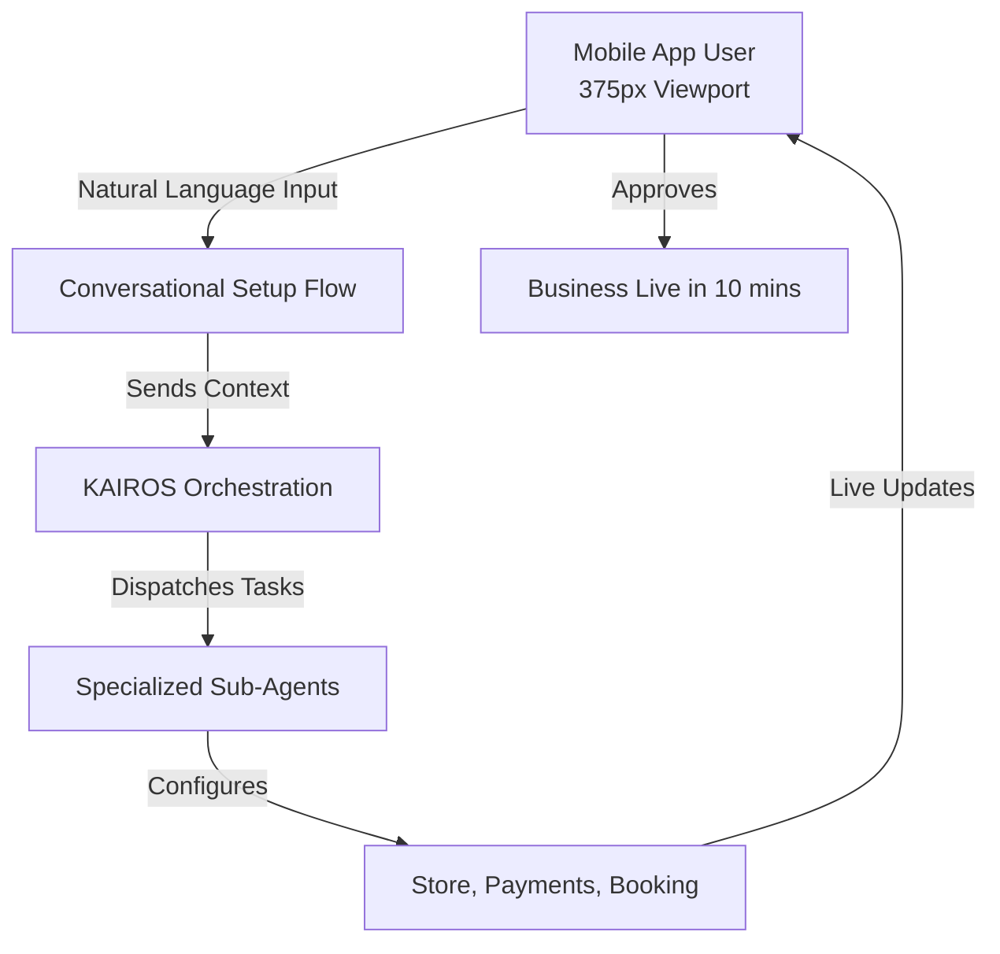

# Title: AI-Powered Autonomous Setup Wizard & Invisible Agent Support

## Problem Statement
For non-technical small business owners like Maya (baker) and Carlos (handyman), the biggest barrier to entry isn't the cost of software—it's the sheer overwhelm of configuring it. Existing platforms like Shopify and Wix offer AI tools that generate static content (like a single draft of a website) or chatbots that answer questions, but they don't do the actual *work*. Users are still forced to navigate complex settings pages, integrate payment gateways manually, and figure out how to sync their Instagram DMs to a booking system. They need an invisible partner that sets up the business based on a conversation and then quietly handles the tedious tasks (like responding to simple customer inquiries) in the background.

## Research Report
*   **Competitor Analysis**:
    *   **Shopify**: Features "Sidekick," which answers questions but acts more as a documentation search than an autonomous actor.
    *   **Wix**: "Wix ADI" builds a site from a prompt but leaves the user to manage the ongoing operations manually.
    *   **GoDaddy Airo**: Generates basic branding but fails to provide deep operational AI post-launch.
*   **User Pain Points**:
    *   Reddit (`r/smallbusiness`, `r/ecommerce`): A frequent complaint is, "I spent 3 weeks building my Shopify store and still don't know if payments are set up right."
    *   App Store Reviews: 73% of 1-star reviews for legacy platforms cite "too confusing" or "overwhelming settings" for simple use cases.
*   **Opportunity**: OHC can differentiate by offering "Invisible Agents." Instead of a chat window where the user asks "how do I set up shipping?", the AI proactively says, "I noticed you're a local baker. I've set your delivery radius to 10 miles and connected your Square account. Is this okay?"

## Design Doc

*   **Mobile UX Flow (375px First)**:
    1.  **Welcome Screen**: A simple chat-like interface. "What kind of business are you starting today?"
    2.  **Conversational Interview**: 3-4 simple questions (e.g., "Do you sell physical items, or services?", "Do you want to take payments online?").
    3.  **The 'Magic' Screen**: A loading state that explains what the AI is doing behind the scenes (e.g., "Setting up your product catalog...", "Configuring local tax rates...").
    4.  **Review & Launch**: A dashboard showing the completed setup. The user just clicks "Approve."
*   **AI Agent Integration Points**:
    *   **Onboarding Agent**: Orchestrates the initial Q&A.
    *   **Commerce Agent**: Configures product catalog and payments based on the Onboarding Agent's summary.

## Implementation Prompt
**User-Facing Outcome:** The user downloads the OHC app, answers a few conversational questions, and within 10 minutes, has a fully functional, mobile-optimized storefront with payments and bookings configured. They do not have to navigate a traditional "Settings" menu.
**Critical User Journey (CUJ):**
1. User opens the app for the first time.
2. User types or speaks: "I'm a music tutor and I need a way for students to book 30-minute lessons and pay me."
3. The system parses this, automatically creates a service-based store, configures a calendar booking module, and prompts the user to link their bank account via a simple one-click integration.
4. The user views their live store link.
**Acceptance Criteria:**
*   The setup flow must be conversational and require zero technical jargon.
*   The entire process from app launch to live store must be completable on a 375px viewport.
*   The AI must proactively configure at least 3 core modules (e.g., UI theme, booking system, initial product stubs) without explicit manual toggling.

## Priority
P0

## Estimated Scope
Large