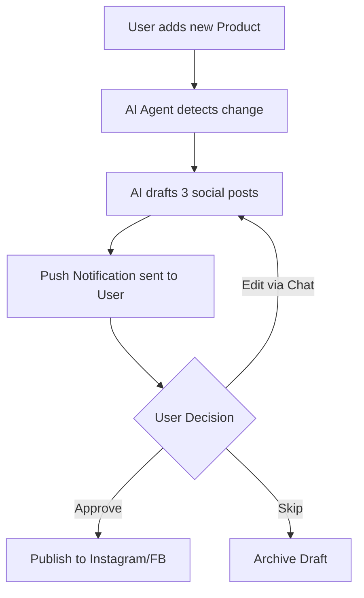

# [Growth] AI-Driven Social Marketing Automation

## Title
**Growth: Invisible AI Social Media Manager for Effortless SMB Marketing**

## Problem Statement
Small business owners, like Priya (boutique owner) and Maya (baker), know that social media is crucial for sales. However, creating engaging content, writing captions, scheduling posts, and analyzing performance takes hours they don't have. Many resort to sporadic posting or nothing at all. They find existing social media management tools (like Hootsuite or Buffer) too complex and disconnected from their inventory and store data. The pain point is: "I have products to sell, but I don't have the time or expertise to be a full-time social media marketer."

## Research Report
*   **User Context:** 68% of small businesses struggle with consistency on social media due to time constraints (Source: Sprout Social SMB Survey). Reddit threads in r/smallbusiness frequently mention marketing as the top stressor.
*   **Competitor Landscape:**
    *   *Shopify:* Offers integrations with Meta and TikTok, but requires manual ad campaign creation. No native "invisible" auto-posting based on new inventory.
    *   *Wix:* Has basic social post templates, but users still have to write copy and manually post.
    *   *GoDaddy Airo:* Generates initial branding but lacks ongoing, context-aware social content generation.
*   **The Opportunity:** OHC can leapfrog by making marketing *invisible*. When an owner adds a new product or runs a sale, the OHC AI should automatically draft, schedule, and publish posts to linked accounts (Instagram, Facebook, TikTok) without requiring the user to switch apps or write copy.

## Design Doc

### Key Entities
*   `SocialCampaign`: Represents an auto-generated marketing effort (e.g., "New Product Launch", "Weekend Sale").
*   `SocialPost`: Individual post contents (image/video, caption, hashtags) tied to a campaign.
*   `SocialChannel`: Connected platform (Instagram, Facebook).

### AI Integration Points
*   **Content Generation:** An agent observes the `products` table. When a new product is added, it generates 3 varied social media posts (caption + suggested visual from the product images) tailored to different platforms.
*   **Engagement Tracking:** An agent monitors likes/comments and generates a weekly "Wins" summary.

### Mobile UX Flow (375px first)
1.  **Notification:** User receives a push notification: "✨ Magic Post: We drafted a post for your new 'Vegan Chocolate Cake'. Want to publish it?"
2.  **Review Screen:** User sees a preview of the Instagram post.
    *   *Visuals:* Glassmorphic card displaying the image and caption.
    *   *Actions:* "Approve & Post Now", "Edit", "Skip".
3.  **Edit Mode (Optional):** Chat interface to say "Make it funnier" or "Add a discount code."
4.  **Success:** Confetti animation and a confirmation that the post is live.

## Implementation Prompt
**Outcome:** A small business owner can maintain an active, engaging social media presence without writing a single caption manually. OHC proactively suggests posts based on real business activities.
**Critical User Journey (CUJ):**
1. User connects their Instagram account during onboarding.
2. User adds a new product to their OHC store.
3. Within 5 minutes, OHC sends a notification with a ready-to-publish social post.
4. User clicks "Approve" from their phone.
5. The post is published, and engagement metrics are tracked.

**Acceptance Criteria:**
*   AI agent automatically triggers when a new product is created.
*   Drafted posts must include a relevant image, AI-written caption, and 3-5 hashtags.
*   UI must provide a 1-tap approval workflow optimized for a 375px mobile screen.
*   No complex scheduling calendars; just immediate "approve" or "reject" queues.

## Priority
P1

## Estimated Scope
Medium
