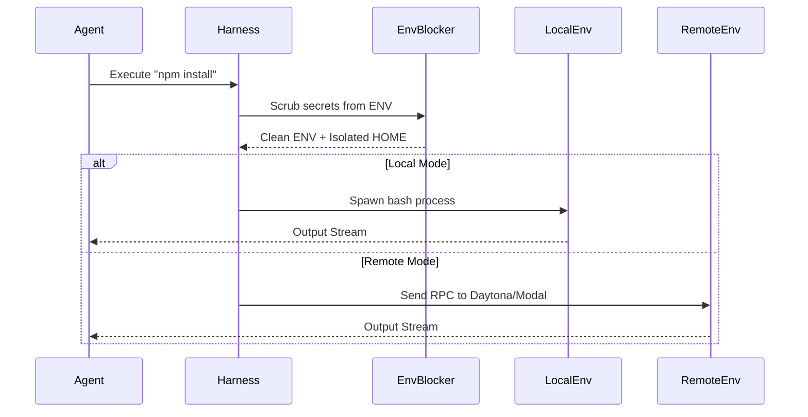

# 🔬 OHC Market Research Report: Hermes Agent Harness

## 1. Executive Summary
This report analyzes the open-source Hermes Agent execution environment to extract architectural insights for OHC's Agentic OS. The analysis focused on their "Agent Harness" implementation, specifically exploring how they handle multiple execution environments, local state mapping, and environment variable scrubbing.

## 2. Core Harness Architecture Findings

### 2.1 Pluggable Execution Environments
Hermes Agent uses an environment abstraction (`BaseEnvironment`) to decouple tool execution from the host operating system. It supports running commands directly on the host machine (`LocalEnvironment`), inside Docker containers (`DockerEnvironment`), or on remote serverless platforms like Daytona and Modal.

**Key takeaway for OHC:** OHC currently relies heavily on a static local sandbox. Implementing a pluggable environment interface (`ExecutionEnvironment`) would allow OHC to scale from secure local K8s pods to remote cloud instances seamlessly.

### 2.2 Environment Scrubbing
To prevent prompt injection or rogue agents from exfiltrating secrets, Hermes implements a strict blocklist `_HERMES_PROVIDER_ENV_BLOCKLIST`. Before spawning a subprocess, the `LocalEnvironment` explicitly scrubs sensitive credentials (e.g., `ANTHROPIC_API_KEY`, `OPENAI_API_KEY`, `GH_TOKEN`) from the environment via `_sanitize_subprocess_env`.

### 2.3 HOME Directory Isolation
For background processes, Hermes redirects system tool configs (git, ssh, npm) into a specific profile directory (`{HERMES_HOME}/home/`). The subprocess sees this override while the Python host process keeps the real `HOME`, allowing complete isolation of dotfiles without full virtualization.

### 2.4 Component Interaction (Mermaid)

## 3. Comparative Matrix: OHC vs Hermes Agent

| Feature Area | Hermes Agent | OHC Hybrid Architecture | Gap Assessment |
|--------------|---------------------|--------------------------|----------------|
| **Execution** | Pluggable (Local, Docker, Modal) | Static Bash Sandbox | Introduce `ExecutionEnvironment` interface in OHC |
| **Secrets** | Explicit Blocklist | Generic process spawn | OHC needs aggressive env var scrubbing |
| **Isolation** | Profile `$HOME` Override | Full Docker/K8s | Implement `$HOME` override for OHC Standalone Mode |

