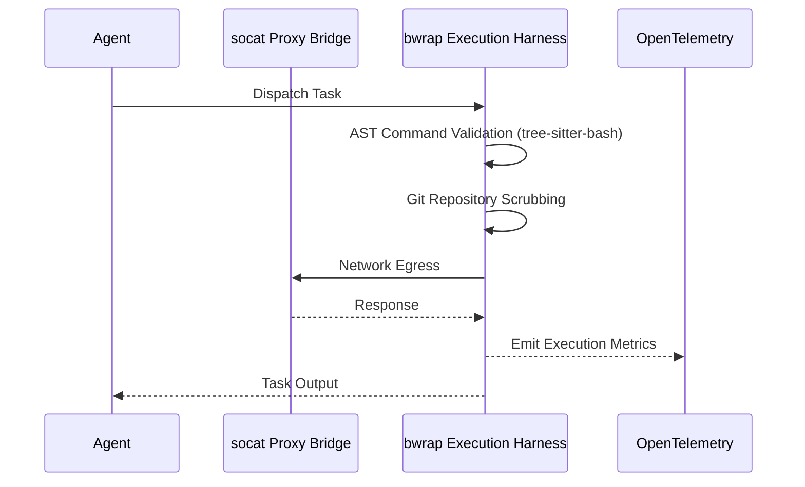

# 🔮 Oracle: Architecture Research for Hybrid Agentic OS Target Harness

## Problem Statement
The OHC Hybrid Architecture needs a formal, published research report detailing its competitive edge against market leaders (AI coding assistant, OpenClaw, Hermes) specifically regarding the Agent Harness execution environment. This provides the blueprint for Implementer agents to build our enterprise-grade bwrap sandbox and proxy bridge.

## Research Report & Core Findings
Our synthesis of the market reveals that robust, production-ready local agents rely on specific isolation and instrumentation primitives:

1. **Deep OS-level isolation**: Utilization of `bwrap --unshare-net` to establish constrained execution environments.
2. **Controlled network egress**: Implementation of `socat` proxy bridging for strict network traffic management.
3. **Sandbox escape prevention**: Pre/post-execution Git repository scrubbing to prevent attacks via filesystem hooks.
4. **Subshell evasion mitigation**: Token-level AST command validation (e.g., `tree-sitter-bash`) prior to execution.
5. **Full-Spectrum Observability**: Deep OpenTelemetry instrumentation across the execution lifecycle.

### Component Interaction (Mermaid)

## Comparative Matrix: OHC vs Market

| Feature Area | AI Coding Assistant | OpenClaw | Hermes | OHC Target Harness | Gap Assessment |
|--------------|---------------------|----------|--------|--------------------|----------------|
| **Isolation** | `bwrap` OS sandboxes | Docker | Varied | `bwrap --unshare-net` | Must implement strict OS boundaries |
| **Network** | Bridge API | Native | Native | `socat` Proxy Bridging | Critical for controlled egress |
| **Security** | AST parsing | Container bounds | Exec loop | AST + Pre/post Git scrub | Must add Git hook scrubbing |
| **Telemetry** | Custom/Basic | Logs | Traces | Full OpenTelemetry | Integrate OTel across lifecycle |

