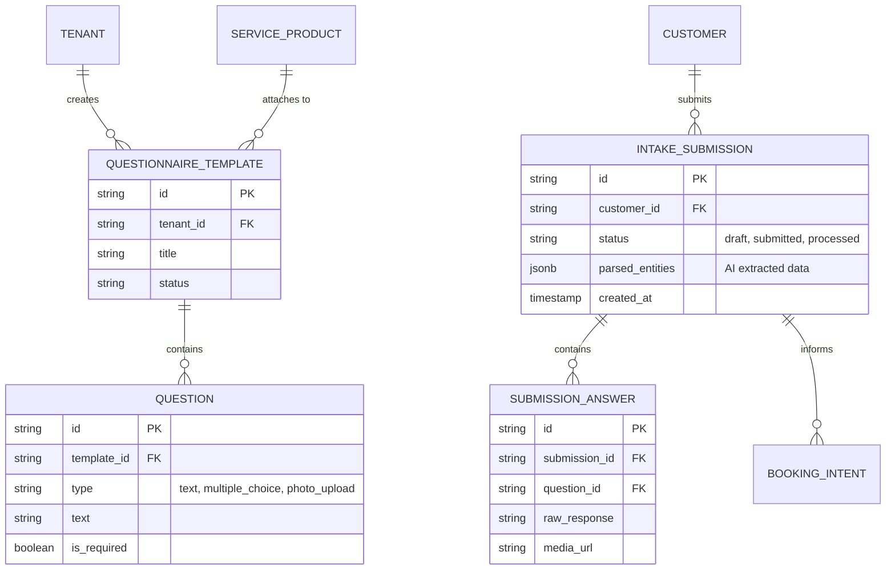

# OHC Autonomous Client Intake Questionnaire Engine: End-to-End Architecture

## 1. Executive Summary
This document details the architectural design for the **Autonomous Client Intake Questionnaire Engine**. For service-oriented small business owners (like Carlos the Handyman or Leo the Music Tutor), capturing client requirements accurately before generating a quote is a high-friction process. Currently, owners rely on external tools (Typeform, Google Forms) or disjointed back-and-forth messaging. This engine natively integrates AI-generated, mobile-first intake forms into the OHC booking and quoting journey, allowing the AI Sales Agent to autonomously parse responses and draft accurate quotes without manual data entry.

## 2. Business Journey Mapping (End-to-End)

The integration of the Intake Engine spans across several stages of the merchant's business lifecycle:

- **Acquisition / Onboarding:**
  When a merchant (e.g., Carlos) creates a new service (e.g., "Custom Flooring Install"), the *Operations Agent* detects the need for specific inputs (dimensions, material preferences) and suggests a generated intake form.
- **Activation (Customer Booking Flow):**
  A customer looking to book the service on the OHC Storefront is intercepted by the Intake Engine. They answer a set of progressive, mobile-optimized questions (including photo uploads) instead of a static contact form.
- **Retention / Revenue:**
  The submitted intake data is not just stored; it is actively parsed by the *Sales Agent*. The agent cross-references the customer's answers with the merchant's historical pricing and catalog to generate a draft quote.
- **Referral / CRM:**
  The structured data extracted from the intake (e.g., customer preferences) is injected into the `Customer360` profile, enhancing future personalized marketing efforts by the *Customer Success Agent*.

## 3. Data Model & Invariants

The data model enforces strict multi-tenant isolation and leverages PostgreSQL JSONB for flexible entity extraction.

### 3.1 Strict Isolation Rules
- **Row-Level Security (RLS):** All tables (`QUESTIONNAIRE_TEMPLATE`, `QUESTION`, `INTAKE_SUBMISSION`, `SUBMISSION_ANSWER`) must implement PostgreSQL RLS policies tied to the `tenant_id` context parameter (`app.current_tenant`).
- **Zero-Trust Access:** No cross-tenant reads or writes are permitted.

## 4. Mobile-First UX Flow & Visual Excellence

The engine must adhere strictly to the OHC Mobile Parity and Premium Token mandates.

- **Viewport:** Designed for 375px width (iPhone SE/Mini baseline).
- **Styling:** Adopts macOS-style Translucent Glass materials (`backdrop-filter: blur(20px) saturate(200%)`), leveraging the Outfit and Inter fonts.
- **Interactions (Customer):**
  - Progressive disclosure (one question per screen).
  - Large, 44x44px minimum touch targets for multiple-choice buttons.
  - Native file picker integration for seamless photo uploads.
- **Interactions (Merchant):**
  - Instant push notification upon submission.
  - A clean, glassmorphic "Review Card" displaying the AI-summarized requirements and the AI-drafted quote.
  - A single, prominent "Approve & Send Quote" button.

## 5. AI Department Coordination

- **Operations Agent ("The Manager"):** Generates the initial `QUESTIONNAIRE_TEMPLATE` based on the context of the service being created by the merchant.
- **Sales & Acquisition Agent ("The Salesperson"):** Triggered upon `INTAKE_SUBMISSION` completion. It processes `jsonb parsed_entities`, matches them against pricing logic, and outputs a draft quote.
- **Customer Success Agent ("The Ambassador"):** Updates the customer's CRM profile with any new preferences or context gathered from the intake form, making it available for future omnichannel interactions.

## 6. Performance & Security Integrity

- **Offline Capability:** The customer-facing form must support optimistic UI updates and local caching (via PWA service workers/Flutter Isolate) to handle spotty connections during photo uploads.
- **Latency Targets:** The transition between questions should be <100ms. AI parsing and quote generation should happen asynchronously in the background via the high-performance job queue (`ohc_job_queue`).
- **Data Protection:** Uploaded images/media must be stored securely (e.g., GCS/MinIO) with pre-signed URLs scoped only to the specific tenant and customer session.
