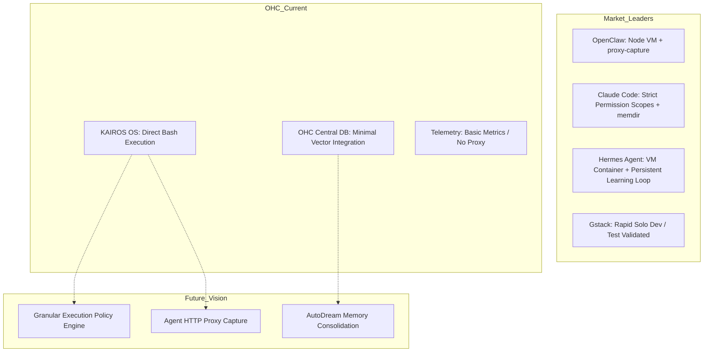

# AutoDream Architectural Consolidation: Agent Harness Environments

## Overview
This report investigates the Agent Harness environments and architectural features of industry-leading AI agents: OpenClaw, Hermes Agent, Claude Code, and Gstack. The goal is to synthesize their successful patterns and identify feature gaps in OHC's current infrastructure to elevate KAIROS Swarm Intelligence to the state-of-the-art.

## 1. Competitive Analysis: Agent Harnesses

### 1.1 OpenClaw
*   **Harness Paradigm:** Extension-heavy, highly integrated terminal & background daemon hybrid.
*   **Execution Isolation:** Utilizes a plugin sandbox (`plugin-sdk`, `acp`) with strict policy configurations (`exec-policy-cli.ts`). Employs Node VM and robust proxy layers (`proxy-capture`) to monitor I/O.
*   **State & Memory:** Relies heavily on external service integrations (MCP, Redis) but maintains global context via a structured daemon (`daemon-cli`).
*   **Telemetry:** Built-in network proxy capture, robust multi-level logging (`logs-cli`), and granular process metrics.

### 1.2 Claude Code (Leaked v2.1.88)
*   **Harness Paradigm:** Native Typescript REPL & CLI tightly integrated with system tools (`main.tsx`, `QueryEngine.ts`).
*   **Execution Isolation:** Sandboxes tools via strict permission scopes (`Tool.ts`). High reliance on an internal `bridge` and `coordinator` to manage sub-agents.
*   **State & Memory:** Uses an advanced embedded memory directory (`memdir`) and a structured task hierarchy (`Task.ts`, `history.ts`).
*   **Telemetry:** Extensive interactive tracking, cost tracking (`cost-tracker.ts`), and real-time terminal output styling via Ink.

### 1.3 Hermes Agent (Nous Research)
*   **Harness Paradigm:** Cloud-native VM & Serverless focused. Built for persistent background learning.
*   **Execution Isolation:** Heavily uses containerization (Docker/K8s primitives implicitly via cloud-native design). Processes are gatewayed through diverse platforms (Telegram, Discord, Slack) to a single secure runner.
*   **State & Memory:** Emphasizes persistent vector-based memory for cross-session continuity. Built-in learning loop to create skills from experience.
*   **Telemetry:** Assumed high-level metrics via cloud providers, with specific focus on learning loop efficiency.

### 1.4 Gstack
*   **Harness Paradigm:** Hyper-velocity solo-developer scaffolding. Focus on massive multi-agent parallel execution.
*   **Execution Isolation:** Less focused on strict sandboxing; more focused on rapid code iteration and automated test validation (e.g., heavily reliant on `pytest` or `vitest` feedback loops).
*   **State & Memory:** Ephemeral per-project memory. Relies on the user (Garry Tan) as the primary orchestrator, with agents acting as rapid executor nodes.
*   **Telemetry:** Focuses on commit velocity, test pass rates, and LOC generated.

## 2. Architectural Comparison

## 3. OHC Feature Gaps vs Market State

| Feature Area | OHC (Current) | Market Leaders (OpenClaw, Claude Code) | Gap Actionable |
| :--- | :--- | :--- | :--- |
| **I/O Capture Proxy** | Direct execution | Advanced proxy capture (`proxy-capture`, network interceptors) | **High**: Need a secure network proxy layer for agents to monitor outbound calls. |
| **Agent Skill Synthesis** | Pre-programmed tools | Self-improving learning loops (Hermes) | **Medium**: Implement a skill-caching mechanism based on successful terminal sessions. |
| **Cost Tracking Engine** | Basic / Miser | Real-time CLI & DB integration (`cost-tracker.ts`) | **High**: Needs a dedicated real-time cost-tracking engine injected into KAIROS. |
| **Interactive Terminal UI** | Backend-heavy | Advanced Ink-based TUI (`main.tsx` in CC) | **Low**: Thin Client Mode handles this, but backend TUI support is lacking. |
| **Execution Policy Enforcer**| Basic Linux perms | Granular executable approval/policy (`exec-policy-cli.ts`) | **Critical**: Need a dedicated execution policy engine to restrict specific commands. |

## 4. Recommended Architectural Evolutions

Based on the research, OHC needs to implement a **Granular Execution Policy Engine** and an **Agent HTTP Proxy Capture** mechanism.

---

## Mission Briefs

Missions have been drafted and injected into GitHub Issues for the Implementer swarm:
1. **[backend] Implement Granular Execution Policy Engine for KAIROS** (Priority P0)
2. **[backend] Implement Agent HTTP Proxy Capture for KAIROS Telemetry** (Priority P1)

