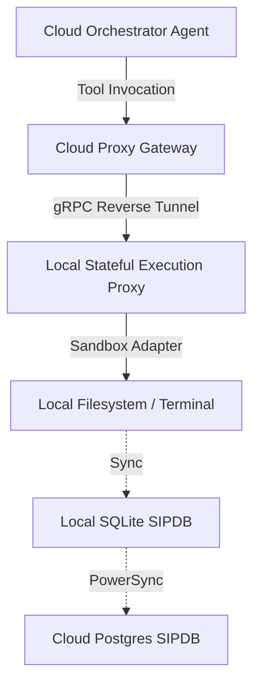

# Research Report: Local Stateful Execution Proxy

**Author**: Principal Integrations Engineer (L7)
**Date**: 2024-06-14

## Executive Summary
This document proposes the creation of a `LocalStatefulExecutionProxy` to enable OHC's cloud-based swarm agents to delegate complex, file-system-heavy tasks (like compilation) to a user's secure local machine. This leverages OHC's unique Hybrid Architecture, providing a capability not found in competitors like Claude Code or Replit Agent.

## The Problem
Cloud agents lack the ability to directly interact with a user's local filesystem in a secure and stateful manner. While Claude Code excels locally, it cannot burst workloads. Replit is strictly cloud-bound. We need a bridge that allows a cloud agent to utilize the user's local compute via an MCP tool.

## Proposed Solution: Local Stateful Execution Proxy
The `LocalStatefulExecutionProxy` establishes a secure reverse-tunnel from the user's Standalone Desktop to the OHC Cloud Orchestrator.

1. **Proxy Server (Local)**: Runs on the desktop, exposing local shell/filesystem capabilities via an MCP interface.
2. **Gateway (Cloud)**: Receives proxy connections and exposes them to the cloud swarm as remote tools.
3. **SPIFFE/SPIRE**: Mutual TLS and identity propagation ensure strict security.

## Competitive Advantage
| Feature | Claude Code | OpenClaw | Replit Agent | **OHC Hybrid** |
| :--- | :--- | :--- | :--- | :--- |
| **Local Filesystem Access from Cloud** | None | Low | None | **High (Native via Proxy)** |
| **Stateful Sandboxing** | Local Only | None | Containerized | **Advanced (Local + Cloud Sync)** |

## Architecture Blueprint

