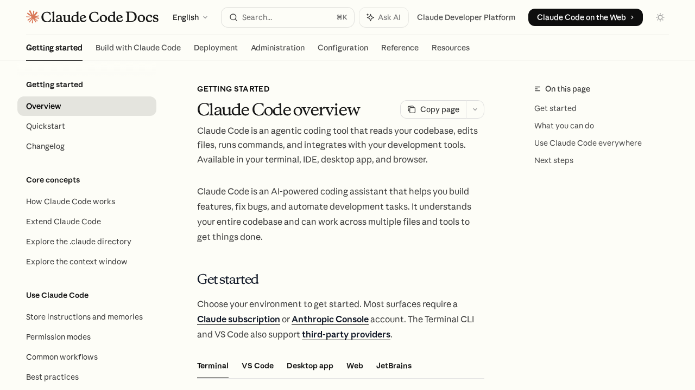
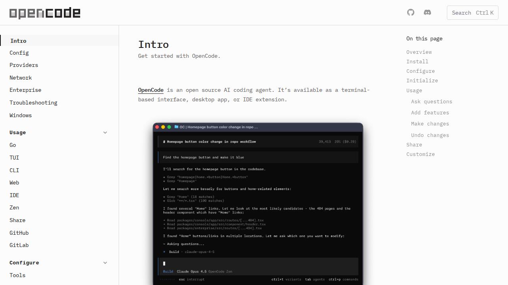
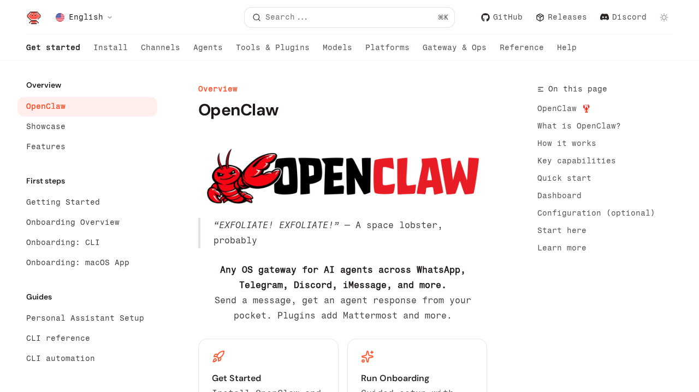
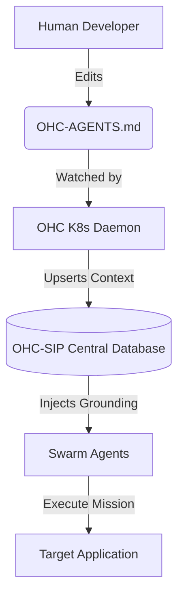

# OHC Market Audit: Swarm Evolution 2024

## Executive Summary

One Human Corp (OHC) aims to empower a single human to orchestrate a vast swarm of AI agents. To maintain our "Unfair Advantage", we continuously study leading agent platforms (OpenClaw, Claude Code, and OpenCode). Our latest market audit reveals a critical architectural gap in OHC: the absence of **Project-Level Contextual Grounding**.

While OHC excels in Database-Driven Orchestration (OHC-SIP) and K8s Native architecture, leading platforms provide localized context injection (`CLAUDE.md`, `AGENTS.md`) directly within the repository.

**Mission Proposal:** The integration of `OHC-AGENTS.md` (Local Context Root) directly synchronized into the OHC-SIP Swarm Memory database.

---

## Market Landscape Audit

### 1. Claude Code
**Focus**: Sub-agent orchestration, auto-memory, and localized constraints.
*   **Key Advantage**: Introduces `CLAUDE.md` to persist project-specific coding standards, architectural decisions, and review checklists directly in the repository root.
*   **Feature Link**: Auto-memory tracks debugging insights across sessions without user input.

### 2. OpenCode
**Focus**: Project-level grounding and terminal-based interfaces.
*   **Key Advantage**: The initialization phase `/init` creates an `AGENTS.md` file that teaches the agent how to navigate the codebase, standardizing the agent's interaction model locally per repository.

### 3. OpenClaw
**Focus**: Multi-channel routing and session persistence.
*   **Key Advantage**: A single Gateway serves WhatsApp, Telegram, Discord, and iMessage simultaneously, mapping external chat interfaces directly into agent sessions.

## Visual Evidence

| Claude Code | OpenCode | OpenClaw |
|:---:|:---:|:---:|
|  |  |  |

---

## Architectural Delta: OHC vs Market

| Feature | OHC (Current) | Claude Code | OpenCode | OpenClaw |
|:---:|:---:|:---:|:---:|:---:|
| **K8s Native / Bazel** | Yes | No | No | No |
| **Swarm Memory (SIP)** | Yes | No | No | No |
| **MCP Integration** | Yes | Yes | Yes | No |
| **Local Project Grounding**| **No** | Yes (`CLAUDE.md`) | Yes (`AGENTS.md`) | No |
| **Omni-Channel Routing** | Partial | No | No | Yes |

---

## The OHC Evolution: "Contextual Grounding Synchronization"

**The Proposed System (`OHC-AGENTS.md`):**
To bridge the gap, OHC must introduce an `OHC-AGENTS.md` or `.ohc/memory.md` specification within project roots.

Instead of operating as a simple flat file, `product_architecture` will design a daemon that reads this local file and synchronizes it directly into the SQLite `swarm_memory` database. This maintains our Database-Driven Orchestration while giving agents localized context directly from the git repository.

### System Flow (Mermaid)

