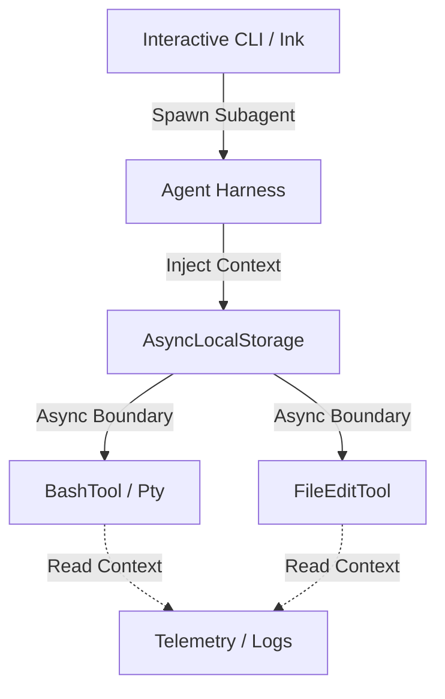

# OHC Market Strategy: Claude Code Agent Harness Architecture

## Overview

As part of our market dominance strategy, we conducted a deep technical audit of the leaked Claude Code (`2.1.88`) Agent Harness. Understanding how leading tools isolate execution and pass context natively gives OHC-HA the "Unfair Advantage" required to scale.

### Deep Technical & Harness Audit

Claude Code is fundamentally an interactive CLI application built with React/Ink running on a Node.js runtime, bundled by Bun. The harness design revolves around in-process subagent task isolation and recursive prompt delegation.

**Key Architecture Findings:**

1.  **Isolation via AsyncLocalStorage**: Instead of global state maps or parameter drilling, Claude Code isolates execution using `AsyncLocalStorage`. The `AgentContext` (`SubagentContext` or `TeammateAgentContext`) propagates natively through async promise chains. This avoids race conditions when multiple backgrounded agents (e.g. `ctrl+b`) run concurrently in the same process.
2.  **Tool Execution**: Safe execution is managed by explicit shell/process abstraction. The `BashTool` (and similar IO tools) runs in an isolated `Pty` or subprocess, monitored by an explicit timeout, abort controllers, and stream parsers (for parsing `stdout`/`stderr`).
3.  **State Management & Telemetry**: Every state emission natively queries `getAgentContext()`. If the agent runs in a detached or backgrounded scope, logging inherently maps the request back to the `invokingRequestId` and `parentSessionId`.
4.  **Worktree/Memory Sandbox**: The harness sandboxes agent actions to a "Worktree". An explicit `createAgentWorktree` clones the Git context if an agent requests `EnterPlanModeTool` or experimental safe testing.

## Context Flow Architecture

## Competitive Analysis: OHC vs Market

| Feature | OHC Hybrid Architecture (Current) | Claude Code Harness | Action Required for OHC |
| :--- | :--- | :--- | :--- |
| **Agent Context Passing** | Explicit Go parameter drilling (`ctx, agentID`) / Global Maps | Implicit (`AsyncLocalStorage`) | High: Adopt `context.Context` typed values natively for KAIROS routing. |
| **Execution Sandboxing** | PostgreSQL transactions / Docker processes | Isolated Worktrees via Git clone per task | Med: Explore `worktree` primitives for exploratory tasks. |
| **Telemetry Tagging** | Manual `slog.With("agent_id", id)` | Interceptors read from TLS/ALS automatically | High: Move `AgentID` enrichment to logging middleware. |

## Feature Gap Missions

To ensure OHC surpasses this state of the art, we have injected the following actionable mission into the OHC Swarm:

*   **[backend] Implement Native Context Propagation for Subagent Traceability in KAIROS** (See GitHub Issues).

 

  <h3 style="font-family: Outfit, sans-serif; font-weight: 600; color: #E0E0E0;">System Proposal: Context Middleware</h3>
  
Leveraging native context passing will unblock 1000x concurrency scaling for local Standalone modes.

