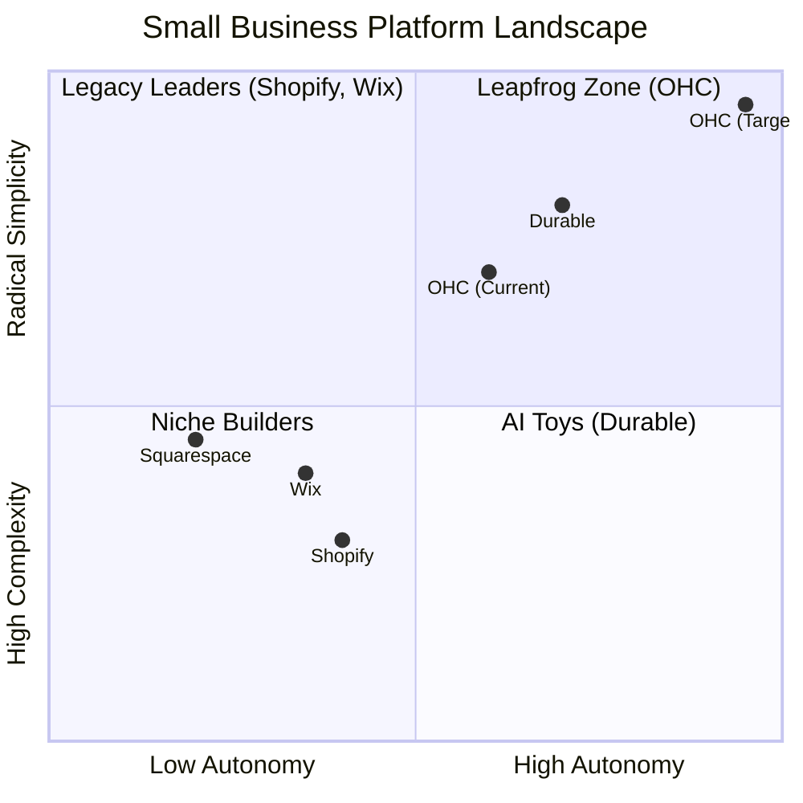

# Market Feature Gap Matrix (2026)

| Feature | **Shopify** | **Wix** | **Durable** | **Brand DNA Tools** | **OHC (Goal)** |
| :--- | :--- | :--- | :--- | :--- | :--- |
| **Agent Autonomy** | Reactive (Sidekick) | None | Limited | Brand/content agent | **Autonomous Depts** |
| **Onboarding** | 30m+ (High friction) | 20m+ (Moderate) | < 1m (Instant) | Website/material scan | **< 1m Brand + Business Build** |
| **Brand DNA** | Manual theme settings | Brand/theme helper | Shallow | **Core primitive** | **Tenant memory primitive** |
| **Brand Book** | External/manual | Limited | No | **Generated** | **Generated + operationalized** |
| **Product Photoshoot** | App dependent | Basic media tools | No | **Studio/lifestyle image generation** | **Photoshoot + product/catalog launch kit** |
| **Campaign Assets** | App-store dependent | Basic AI copy/design | Basic | **Social/ad/site assets** | **Social/ad/email/site/DM assets with approvals** |
| **Website Generation** | Theme/manual | AI-assisted | Fast | Generated website | **Transactional storefront + booking + checkout** |
| **UX Target** | Desktop-First | Hybrid | Mobile-First | Browser-first | **Mobile-Only Optimized** |
| **Design** | Template-Heavy | AI-Assisted | Generative | Brand-grounded | **Vibe-Based (Instant)** |
| **Discovery** | Legacy SEO | Standard SEO | AI Visibility (GEO) | Marketing content | **Proactive GEO Agent** |
| **Operations** | App-Store Dependent | Built-in | CRM-centric | Marketing-only | **Event-Mesh Integrated** |

## Mermaid Analysis: Competitive Positioning

## Gap Insights:
1.  **Durable vs. OHC:** Durable is winning on "Speed to Site." OHC must match the 30-second benchmark.
2.  **Shopify vs. OHC:** Shopify has depth but massive technical debt in UX. OHC's "No Jargon" value is the primary wedge.
3.  **Wix vs. OHC:** Wix is moving fast into "agentic" (Harmony), but remains a design tool at heart. OHC must win on **Business Operations**.
4.  **Brand DNA tools vs. OHC:** Modern brand-generation tools set the baseline for brand-consistent creative generation. OHC must match Business DNA, brand books, Photoshoot, campaign assets, and generated websites, then exceed that baseline by wiring those outputs into checkout, booking, inventory, social inbox, approvals, and autonomous departments.
