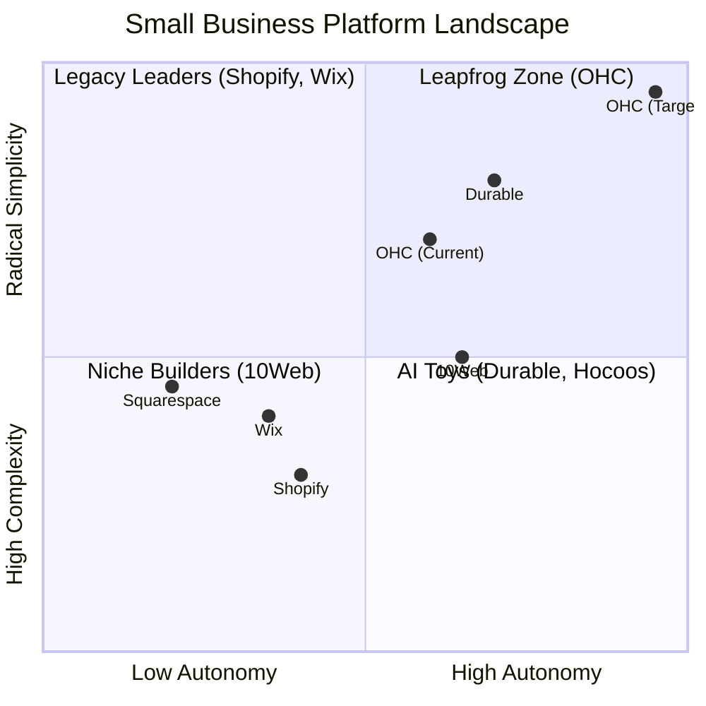

# Market Feature Gap Matrix (2024-2025)

| Feature | **Shopify** | **Wix** | **Durable** | **10Web** | **OHC (Goal)** |
| :--- | :--- | :--- | :--- | :--- | :--- |
| **Agent Autonomy** | Reactive (Sidekick) | None | Limited | Agentic Roadmap | **Autonomous Depts** |
| **Onboarding** | 30m+ (High friction) | 20m+ (Moderate) | < 30s (Instant) | Agent-led setup | **< 1m (Instant Build)** |
| **UX Target** | Desktop-First | Hybrid | Mobile-First | Desktop/Hybrid | **Mobile-Only Optimized** |
| **Design** | Template-Heavy | AI-Assisted | Generative | Vibe Coding | **Vibe-Based (Instant)** |
| **Discovery** | Legacy SEO | Standard SEO | AI Visibility (GEO) | AI SEO Agent | **Proactive GEO Agent** |
| **Operations** | App-Store Dependent | Built-in | CRM-centric | WP Plugin Ecosystem | **Event-Mesh Integrated** |

## Mermaid Analysis: Competitive Positioning

## Gap Insights:
1.  **Durable vs. OHC:** Durable is winning on "Speed to Site" with a 30-second benchmark. OHC must match this while providing deeper operational autonomy.
2.  **Shopify vs. OHC:** Shopify has depth but massive technical debt in UX. The "Grandma Test" (Shopify Blog 2024) remains their biggest hurdle.
3.  **10Web/Hocoos vs. OHC:** New entrants are using "Agentic" branding. OHC must move beyond "AI Chat" to "Invisible Execution" to maintain its lead.
4.  **GEO Gap:** Only Durable explicitly mentions "AI Search/ChatGPT Discovery." OHC must prioritize its AI Discovery Agent to win high-intent traffic.
