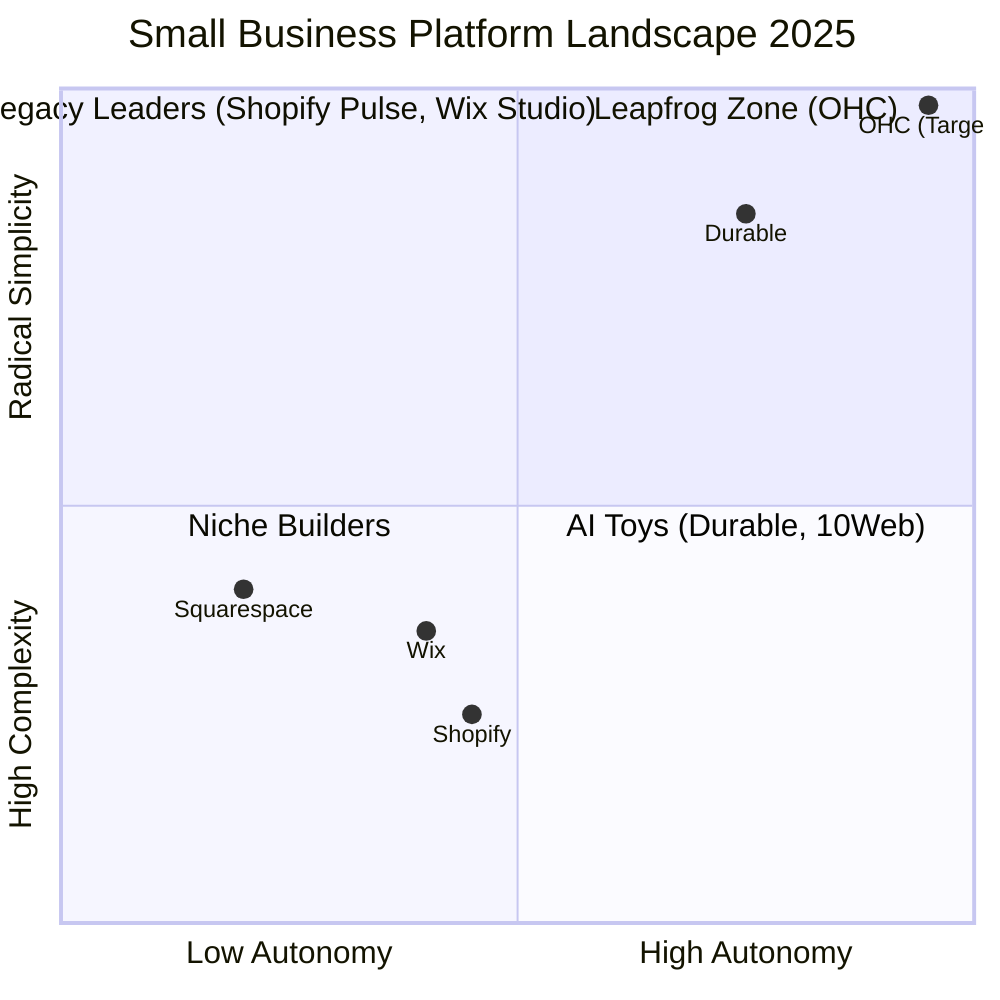

# Market Feature Gap Matrix (2025 Edition)

| Feature | **Shopify** | **Wix** | **Durable** | **OHC (Goal)** |
| :--- | :--- | :--- | :--- | :--- |
| **Agent Autonomy** | Reactive (Sidekick Pulse) | Interactive (Harmony) | Basic Generation | **Autonomous Depts (Invisible)** |
| **Onboarding** | 30m+ (Setup Wizards) | 20m+ (Wix ADI) | < 30s (Instant) | **< 30s (Instant Vibe-Build)** |
| **UX Target** | Desktop-Heavy | Hybrid | Mobile-First | **Mobile-Only Optimized (375px)** |
| **Design** | Template-Locked | Drag-and-Drop | Generative | **Vibe-Based Generative (No Edit)** |
| **Discovery** | SEO + Shopify Audiences | Standard SEO | AI Visibility Score | **Proactive GEO Agent (LLM SEO)** |
| **Operations** | App Marketplace | Integrated | CRM-centric | **Event-Mesh Swarm (No Apps)** |

## Mermaid Analysis: Competitive Positioning 2025

## Gap Insights:
1.  **Autonomous Operations:** While Shopify added "Pulse" for proactive notifications, it still requires manual app installs for most logic. OHC's "Agent Departments" are built-in infrastructure.
2.  **Mobile Mastery:** Shopify's mobile app is for "monitoring," not "building." OHC wins by being the first "Full-Stack Phone Business."
3.  **No-Edit Philosophy:** Competitors force users into "Editor UI." OHC uses "Vibe-Tuning" to eliminate the need for a mouse-and-keyboard editor.
