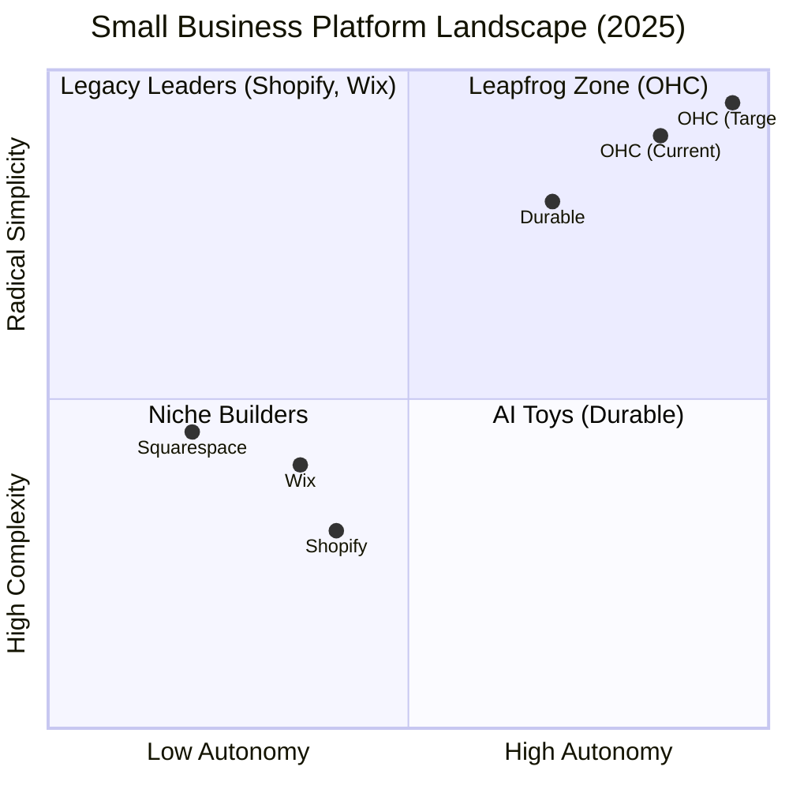

# Market Feature Gap Matrix (2025 Audit)

| Feature | **Shopify** | **Wix** | **Durable** | **OHC (Current)** | **OHC (Gap/Advantage)** |
| :--- | :--- | :--- | :--- | :--- | :--- |
| **Agent Autonomy** | Reactive (Sidekick) | None | Limited | **Implemented** | **Proactive/Autonomous Agents** |
| **Onboarding** | 30m+ (High friction) | 20m+ (Conversational) | 30s (Instant) | **Implemented** | **Instant Vibe-Based Setup** |
| **UX Target** | Desktop-First | Hybrid | Mobile-First | **Mobile-Native** | **100% Mobile Optimized** |
| **Design** | Template-Heavy | AI-Assisted | Generative | **Implemented** | **Generative Vibe-Based Design** |
| **Discovery** | Legacy SEO | Standard SEO | AI Visibility (GEO) | **Partial** | **Proactive GEO Agent** |
| **Booking** | App-Store Req | Built-in | Built-in | **Implemented** | **Seamless Teammate-Led Booking** |
| **Operations** | Complex (Apps) | Built-in | CRM-centric | **Implemented** | **Event-Mesh Operations** |
| **Billing/Invoicing** | Built-in | Built-in | Built-in | **Implemented** | **Transparent/Built-in** |

## Mermaid Analysis: Competitive Positioning

## Gap Insights:
1.  **Durable vs. OHC:** Durable owns the "30-second" hook. OHC's current onboarding is fast, but must emphasize "Business in 10 minutes" as a complete operational launch, not just a website.
2.  **Shopify vs. OHC:** Shopify's Sidekick is a chat bot. OHC's agents are event-driven teammates. This is the primary wedge for "Operational Fatigue."
3.  **Wix vs. OHC:** Wix has deep feature sets but remains a "builder" tool. OHC is a "management" platform where the work happens autonomously.
4.  **Discovery (GEO):** OHC has a significant opportunity to leapfrog by being the first platform to bake "Generative Engine Optimization" directly into the agentic workflow.
