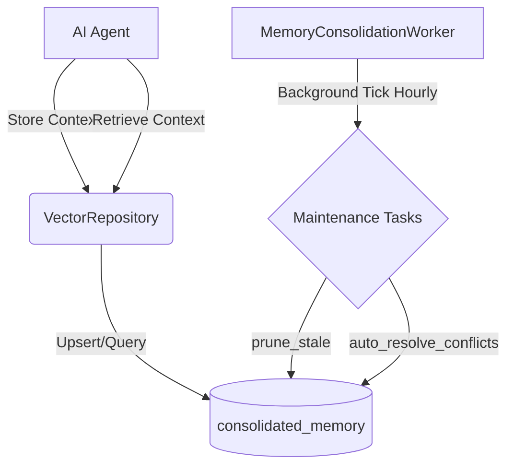

# OHC AI Agent Context Consolidation System

## 1. Overview
The Memory Consolidation Layer enables AI departments to retain knowledge across sessions. It supports the storage, semantic search, conflict resolution, and pruning of business context. The system is designed to work seamlessly in both Cloud (PostgreSQL with `pgvector`) and Standalone (SQLite with vector extensions) environments, with strict tenant-isolation applied.

## 2. Architecture Components

### 2.1 Persistent Memory Layer (`VectorRepository`)
The `VectorRepository` acts as the primary interface for memory operations, interacting with the `consolidated_memory` table.
- **Storage Strategy:** Stores agent contexts as vector embeddings (1536 dimensions) along with metadata like `tenant_id`, `agent_id`, `source_type`, and timestamps.
- **Semantic Search:** Facilitates cross-department context sharing. A query embedding is generated and compared against stored embeddings using cosine distance (`<=>` in Postgres, `vec_distance_cosine` in SQLite) scoped strictly by `tenant_id`.

### 2.2 Conflict Resolution (`auto_resolve_conflicts`)
Conflicts occur when the same semantic fact is stored with varying details (identified when cosine distance < 0.05).
- **Rules Engine:**
  1. `owner_override`: Explicit user overrides take precedence.
  2. `reliability_score`: Higher confidence sources win.
  3. Recency: Newer entries overwrite older ones.
- **Merging:** The "winning" record absorbs the reference counts of the "losing" record to signify its strengthened validity, while the loser is deleted.

### 2.3 Stale Context Pruning (`prune_stale`)
To prevent unbounded memory growth, background pruning processes remove outdated context.
- **Conservative Approach:** Only deletes records older than 180 days (`last_referenced_at`), where `owner_override = FALSE`, and `reference_count < 5`. This ensures valuable, actively referenced business history is retained.

### 2.4 Asynchronous Background Worker (`MemoryConsolidationWorker`)
The `MemoryConsolidationWorker` is a `tokio::spawn` background task that prevents memory operations from blocking the main AI request path. It polls every hour (3600s) to run the `prune_stale` and `auto_resolve_conflicts` pipelines.

