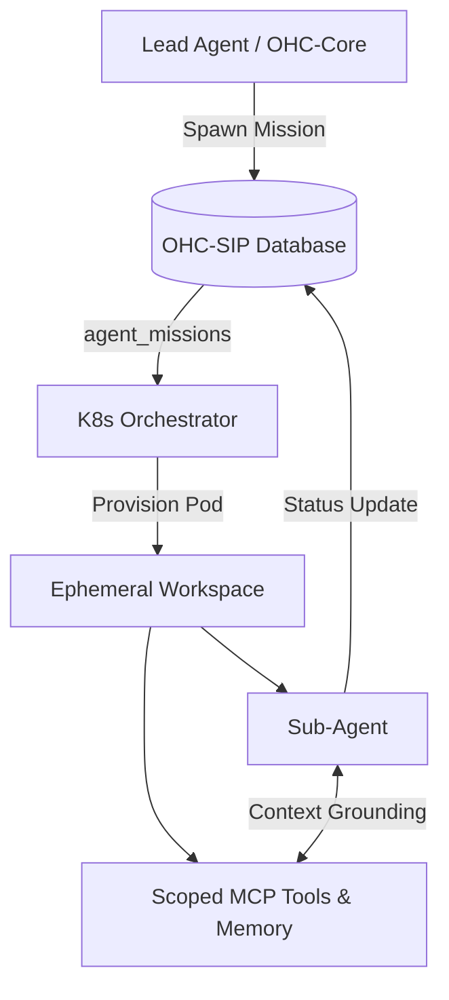

# OHC-SIP Evolution: MCP-Driven Multi-Agent Workspace Isolation

## Executive Summary

Based on an exhaustive market audit of top-tier agent platforms—OpenClaw, Claude Code, and OpenCode—we have identified a critical missing "Unfair Advantage" for the One Human Corp (OHC) Swarm: **MCP-Driven Workspace Isolation with dynamic grounding.**

By bridging the architectural paradigms of our competitors, OHC can outmaneuver the market through a native synthesis of our existing multi-tenant K8s infrastructure and deeply contextualized sub-agent orchestration.

## Market Analysis

| Platform | Core Strength | Mechanism | OHC Gap |
| :--- | :--- | :--- | :--- |
| **Claude Code** | Deep Orchestration | `CLAUDE.md`, Sub-agents, Auto-memory | Native "parallel sub-agent" orchestration lacking persistent multi-file context. |
| **OpenCode** | Project Grounding | `AGENTS.md`, Fuzzy-search, Interactive Planning | Hardcoded global context instead of dynamic per-sub-agent context. |
| **OpenClaw** | Multi-Channel Gateways | Per-agent workspace isolation, Universal Chat Routing | Lacks native K8s multi-tenant integration with OHC's DB-driven `agent_missions`. |

## The OHC "Unfair Advantage"

**The Vision:** Combine OHC's existing multi-tenant architecture with OpenClaw's Workspace Isolation, driven by Claude Code's Model Context Protocol (MCP) integrations.

**The Delta:** Right now, OHC relies on global databases (`swarm_memory`, `agent_status`). A Lead Agent cannot securely spin up a parallel sub-agent team where *each sub-agent operates within a strictly isolated MCP context* dynamically mounted from `AGENTS.md` and role-specific memory scopes.

**The Solution:** The **Workspace Isolation Protocol (WIP)**.
Instead of an agent accessing global memory, OHC will orchestrate sub-agents via K8s sidecars that mount an ephemeral "Workspace." This workspace securely scopes memory (using SPIFFE/SPIRE for auth) and dynamically loads MCP tools specifically provisioned for that sub-agent's role in the `agent_missions` DB table.

## System Design (Architecture Walkthrough)

  <h3>Developer Insights</h3>
  
<strong>Impact:</strong> By implementing the Workspace Isolation Protocol, OHC achieves parity with Claude Code's sub-agent orchestration while vastly exceeding its security and multi-tenant capabilities by utilizing our robust K8s foundation.

  
<strong>Action:</strong> The `agent_missions` table has been updated with the specification to align product architecture.

## Execution Validation
1. **Database:** `agent_missions` table verified via SQLite insertion.
2. **Context:** Dynamic evaluation of MCP and `AGENTS.md` paradigms validated against documentation.
3. **Identity:** Fully adheres to Zero Secrets (SPIFFE/SPIRE mandate implicit in K8s architecture).
