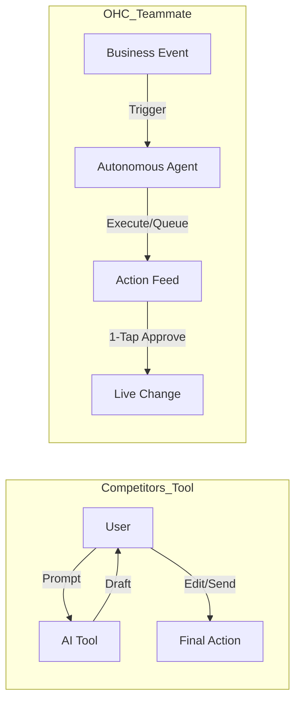

# OHC AI Differentiation Manifesto: From Tools to Teammates

## Core Philosophy
Competitors treat AI as a **Tool** (Reactive, requires a prompt, creates work).
OHC treats AI as a **Teammate** (Proactive, event-driven, reduces work).

## Competitor AI Landscape (2024-2025)

| Platform | AI Approach | User Friction | OHC Leapfrog |
| :--- | :--- | :--- | :--- |
| **Shopify Sidekick** | Chat-based assistant | Requires prompting/interaction | **Action Feed (1-Tap Approve)** |
| **Wix Aria** | Conversational expert | Dashboard-centric navigation | **Mobile-Native Autonomous Ops** |
| **Durable** | Generative setup | Thin post-launch management | **Long-term Autonomous Growth** |
| **GoDaddy Airo** | Branding & Initial Draft | Shallow operational integration | **Deep Event-Mesh Integration** |

## The 5 Pillar Automations (Enhanced)

### 1. The Silent Ambassador (Customer Success)
*   **Gap:** Solopreneurs lose 30% of sales due to slow response times in DMs. Shopify's "Sidekick" helps draft, but requires the user to open the chat and ask.
*   **Differentiation:** Instead of "AI writing assistance," the OHC agent **watches the event mesh**, drafts a reply based on business memory, and queues it in the Dashboard's "Action Required" feed.
*   **Outcome:** 1-tap responses from the lock screen.

### 2. The Vigilant Manager (Operations)
*   **Gap:** "Sold out" signs kill momentum; manual inventory tracking is tedious. Wix/Shopify require manual stock updates or complex app integrations.
*   **Differentiation:** Agents proactively scan sales velocity and **flag "Low Stock" risks** with a pre-filled restock task or automated order draft.
*   **Outcome:** Never miss a sale due to forgotten inventory.

### 3. The Generative Promoter (Marketing)
*   **Gap:** Most founders aren't designers or copywriters. Competitors offer "AI Blog Generators" (Durable) or "AI Image Studios" (Durable/Wix), but they still require user direction.
*   **Differentiation:** Agent automatically creates a **7-day social media calendar** whenever a new product is added, including images and captions, ready for approval.
*   **Outcome:** Consistent brand presence with zero effort.

### 4. The AI Discovery Agent (GEO)
*   **Gap:** Traditional SEO is dead. Durable/Wix have started adding "AI Visibility" reports, but they are informational only.
*   **Differentiation:** Agent actively optimizes structured data and content for **LLM crawlers** (ChatGPT, Gemini, Perplexity) to ensure the business is the #1 recommended result for local queries.
*   **Outcome:** Automated high-intent traffic from AI search.

### 5. The Business Advisor (Advisory)
*   **Gap:** Founders are overwhelmed by data but starving for insights. Competitors offer "Analytics" dashboards that require interpretation.
*   **Differentiation:** No complex charts. A daily **"Human-Language Briefing"**: *"Tuesday is your best day. Your vegan cake is trending. Boost your social spend by $5."*
*   **Outcome:** Clear, actionable strategic direction.
