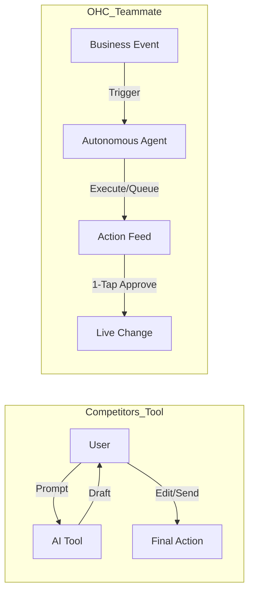

# OHC AI Differentiation Manifesto: From Tools to Teammates

## Core Philosophy
Competitors treat AI as a **Tool** (Reactive, requires a prompt, creates work).
OHC treats AI as a **Teammate** (Proactive, event-driven, reduces work).

## The 5 Pillar Automations

### 1. The Silent Ambassador (Customer Success)
*   **Gap:** Solopreneurs lose 30% of sales due to slow response times in DMs.
*   **Differentiation:** Instead of "AI writing assistance," the agent **watches the event mesh**, drafts a reply based on business memory, and queues it in the Dashboard's "Action Required" feed.
*   **Outcome:** 1-tap responses from the lock screen.

### 2. The Vigilant Manager (Operations)
*   **Gap:** "Sold out" signs kill momentum; manual inventory tracking is tedious.
*   **Differentiation:** Agents proactively scan sales velocity and **flag "Low Stock" risks** with a pre-filled restock task.
*   **Outcome:** Never miss a sale due to forgotten inventory.

### 3. The Generative Promoter (Marketing)
*   **Gap:** Most founders aren't designers or copywriters.
*   **Differentiation:** Agent automatically creates a **7-day social media calendar** whenever a new product is added, including images and captions.
*   **Outcome:** Consistent brand presence with zero effort.

### 4. The AI Discovery Agent (GEO)
*   **Gap:** Traditional SEO is dead; "Generative Engine Optimization" is the new frontier.
*   **Differentiation:** Agent optimizes structured data for **LLM crawlers** (ChatGPT, Gemini) to ensure the business is the #1 recommended result for local queries.
*   **Outcome:** Automated high-intent traffic from AI search.

### 5. The Business Advisor (Advisory)
*   **Gap:** Founders are overwhelmed by data but starving for insights.
*   **Differentiation:** No complex charts. A daily **"Human-Language Briefing"**: *"Tuesday is your best day. Your vegan cake is trending. Boost your social spend by $5."*
*   **Outcome:** Clear, actionable strategic direction.

## Cross-Agent Collaboration Patterns

### 4. The "Handoff" Protocol
No single agent can do everything. OHC requires a seamless "Handoff" protocol between agents. If The Ambassador is chatting with a customer who wants a bulk order discount, The Ambassador cannot unilaterally approve it. It must initiate a Handoff to The Accountant agent, passing the entire conversational context. The Accountant evaluates the margins, approves the discount, and hands the context back to The Ambassador to complete the interaction.

### 5. Swarm Consensus for High-Risk Actions
For actions that significantly impact the business's finances or reputation (e.g., initiating a $1000 ad campaign, issuing a mass refund), a single agent's recommendation is insufficient. OHC must implement a "Swarm Consensus" mechanism. The Generative Promoter might propose the ad campaign, but The Accountant must independently verify the available budget, and The Vigilant Manager must verify that inventory exists to support the potential spike in demand, before the Action Card is presented to the user.

### 6. Graceful Degradation of Autonomy
The level of autonomy granted to the swarm is not static; it is a sliding scale based on the business owner's trust. A new user might start with "Level 1" autonomy (agents only draft proposals, every action requires 1-tap approval). Over time, as trust builds, the user can elevate specific agents to "Level 2" (agents execute routine actions automatically but log them for review) or "Level 3" (full autonomy within strict financial boundaries). The system must allow users to throttle this autonomy up or down at any time.

## The Ethical Framework for Autonomous Agents

As OHC agents gain more autonomy over a user's business, we must establish a rigorous ethical framework to guide their decision-making.

### 1. The "Do No Harm" Principle in E-commerce
An agent must never take an action that could bankrupt the business or cause irreparable reputational damage. While The Generative Promoter can autonomously allocate ad spend, it must operate within strict, non-overrideable daily limits set by the user. If an ad campaign goes viral but is fundamentally flawed, the system must cap the financial exposure.

### 2. Radical Transparency in AI Actions
Every autonomous action taken by an agent must be logged and explainable in plain language. If a user asks, "Why did you offer that customer a 20% discount?", the system must provide a clear audit trail (e.g., "The customer had a lifetime value over $1000, was attempting to churn, and historical data shows a 20% discount retains 85% of users in this segment"). The user must never feel out of control of their own business logic.

### 3. Guardrails Against Manipulative Tactics
OHC agents will not engage in dark patterns. The Ambassador agent will not use aggressive scarcity tactics (e.g., "Only 1 left! Buy now!") if it is factually untrue. Building long-term trust with the consumer is paramount, and our agents must reflect honest, transparent business practices.

### 4. Human Override Supremacy
At any moment, the business owner must be able to hit a "Panic Button" that instantly pauses all autonomous agent activity, reverting the platform to a manual-only mode. This ensures that the human always retains ultimate sovereignty over the business operations.

### 5. Algorithmic Accountability
If an OHC agent makes a demonstrably incorrect decision that results in financial loss (e.g., a bug in The Accountant agent incorrectly calculates sales tax), OHC must have a clear policy for accountability and remediation. This builds the necessary trust for users to hand over the reins of their livelihood to an AI swarm.
