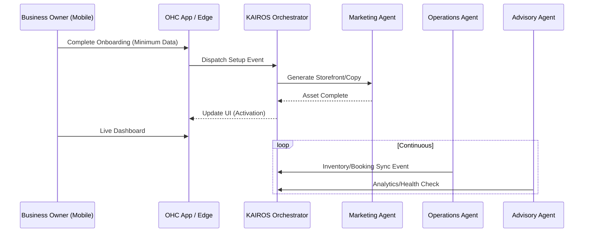

# OHC End-to-End Business Journey Architecture: Research Report

## 1. Executive Summary
This research report details the architectural mapping of the end-to-end business journey within the OneHumanCorp (OHC) platform. Our goal is to ensure the platform supports a seamless transition from **Acquisition** to **Referral** for non-technical small business owners, operating strictly through the "Small Business Owner Lens". The investigation focused on how the KAIROS Orchestrator and the 7 AI Agent Departments interact to remove friction, specifically addressing the needs of our 5 core personas: Maya, Carlos, Priya, Leo, and Fatima.

## 2. Research Methodology
The research was conducted by evaluating the existing OHC technical documentation, competitive analysis against platforms like Shopify, Wix, and Squarespace, and applying the "Grandmother Test" to current and proposed flows. We identified critical friction points where non-technical users typically abandon the setup process or fail to reach the "Activation" milestone. We also reviewed the capabilities of the OHC Hybrid AI OS, particularly the event-driven Teammate Mesh and the Autonomous Agent Departments, to automate these friction points.

## 3. Findings & Market Analysis

### 3.1 The Small Business Platform Gap
Current market solutions treat AI as an add-on tool (requiring prompt engineering) and focus heavily on desktop-first administration. Small business owners operate primarily on mobile devices and lack the time or expertise to manage complex SaaS tools.
- **Shopify:** Complex onboarding, steep learning curve for non-eCommerce setups, expensive multi-app ecosystems.
- **Squarespace/Wix:** Good for static portfolios, but struggle with integrated workflows like quoting, inventory sync, and proactive customer engagement.

### 3.2 OHC's Differentiator: The Agentic Teammate Model
OHC's core advantage is treating AI as an invisible teammate. By mapping the business journey against our AI departments (e.g., Marketing generating the site, Operations managing inventory, Customer Success handling DMs), we transform complex setup tasks into simple 1-tap approvals.

### 3.3 Critical Persona Pain Points
Our research identified specific pain points that must be addressed in the architectural design:
*   **Maya (Baker):** Overwhelmed by responding to IG DMs while baking. Needs the *Customer Success Agent* to draft replies automatically based on event triggers.
*   **Carlos (Handyman):** Loses leads due to slow quoting. Needs the *Sales Agent* to analyze requests and draft quotes instantly.
*   **Priya (Boutique):** Inventory desynchronization between physical sales and online store. Needs native POS integration linked directly to the *Operations Agent*.
*   **Leo (Tutor):** Time wasted on manual link generation and scheduling. Needs native Zoom integration tied to the *Booking Block*.
*   **Fatima (Food Cart):** Language barriers and confusing UI. Needs extreme simplicity, offline support, and audio notifications designed for high-stress environments.

## 4. Architectural Outcomes

Based on these findings, we have mapped out the end-to-end journey across six key stages:
1.  **Acquisition:** Discovery via social media or search.
2.  **Onboarding:** A progressive profiling wizard that asks minimal questions, leveraging the *Marketing Agent* to extrapolate business metadata.
3.  **Activation:** The instant generation of a functional storefront or booking page in under 60 seconds (The "Aha!" moment).
4.  **Retention:** Proactive engagement via the *Business Advisory Agent* delivering plain-language daily briefings, and automated notifications for new orders/bookings.
5.  **Revenue:** Seamless upgrade paths driven by value (e.g., hitting AI action limits) rather than feature-gating, supported by native Stripe/Mercado Pago integrations.
6.  **Referral:** Built-in viral loops (e.g., referral discounts, "Powered by OHC" footers).

### 4.1 Friction Mitigation Strategies
*   **Progressive Disclosure:** Advanced settings (custom domains, complex shipping rules) are hidden behind a "Simple Mode" toggle during onboarding.
*   **Optimistic UI:** Interactions must feel instantaneous on mobile, with background syncing handled by the KAIROS Orchestrator.
*   **Mobile-First Design Tokens:** Enforcing 44x44px touch targets, premium typography, and skeleton loading states to pass the Grandmother Test.

### 4.2 High-Level Agentic Flow Diagram

## 5. Risk Assessment and Dependencies

### 5.1 Key Risks
*   **LLM Hallucinations:** The automated generation of storefront copy, initial emails, or agent responses might produce incorrect or unprofessional content, confusing non-technical users.
*   **Data Consistency:** Ensure that inventory changes triggered by one agent (e.g., POS integration) are seamlessly propagated to all other dependent systems and visual interfaces (e.g., Storefront).
*   **Agent Dependency Latency:** Generating assets synchronously during the "Activation" step could lead to high latency and subsequent user drop-offs.
*   **External Service Outages:** Reliance on third parties (Stripe, Mercado Pago) can block "Activation" or "Revenue" journey steps.

### 5.2 Dependencies
*   **KAIROS Orchestrator:** Requires a stable distributed event bus to handle rapid message passing between AI departments asynchronously.
*   **Stripe/Mercado Pago:** Essential for seamless payment processing, deposit management, and transitioning to the "Revenue" phase.
*   **Native Device Features:** Relies on robust WebRTC and device hardware integrations for offline capabilities and POS interactions (e.g., iOS Tap to Pay).

## 6. Next Steps
We have generated a detailed issue brief (`docs/research/[architecture]_end_to_end_business_journey_detailed.md`) outlining the implementation requirements for the Implementer swarm. This brief includes comprehensive Mermaid.js sequence diagrams for each persona's journey and strict constraints for mobile parity and visual excellence.

issue_id: 14704
