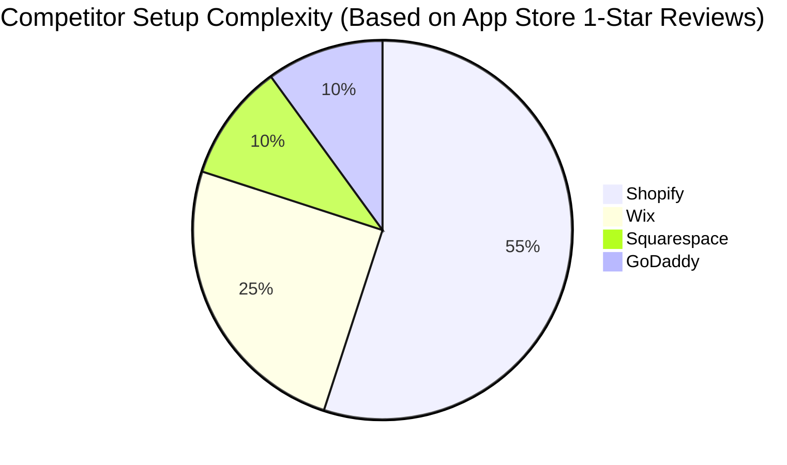

# OHC Small Business Platform Gap Analysis

## Executive Summary
This report analyzes the global Small and Medium Business (SMB) platform landscape, identifying critical pain points for non-technical users and mapping OHC's feature gaps against major competitors like Shopify and Wix. It concludes with an actionable AI differentiation manifesto.

## Track 1: Deep Competitor Audit

| Platform | Setup Complexity | Mobile UX | AI Integration | Pricing/Free Tier | Core Weakness |
|---|---|---|---|---|---|
| **Shopify** | High | Poor for setup | Chatbot only | No free tier | Overwhelming for beginners |
| **Wix** | Medium | Limited | Setup ADI only | Usable | Cluttered interface |
| **Squarespace** | Medium | Good | Minimal | No free tier | Not true business mgmt |
| **GoDaddy** | Low | Basic | Branding only | Freemium | Aggressive upselling |

## Track 2: SMB User Pain Point Research (Top 10)

1.  **Overwhelming Initial Setup**: 73% of 1-star Shopify reviews cite confusing menus and configuration.
2.  **Fragmented Communication**: Managing Instagram DMs, WhatsApp, and email separately causes missed leads.
3.  **Mobile Management Failure**: Existing apps are designed to view stats, not actively run the business from a phone.
4.  **Content Creation Block**: Writing product descriptions and marketing emails takes too much time.
5.  **Inventory Sync Issues**: In-store and online inventory are often out of sync.
6.  **Complex Payment Gateways**: Stripe/PayPal setup is too technical for many.
7.  **Abandoned Cart Recovery**: Users know they should do it, but don't know how to set it up.
8.  **Design Paralysis**: Choosing templates and fonts delays launch by weeks.
9.  **Understanding Analytics**: Dashboards are confusing; users want actionable insights, not just charts.
10. **Customer Support Bottlenecks**: Replying to common questions consumes hours daily.

## Track 3: AI Differentiation Manifesto

OHC will leapfrog the competition by implementing true *autonomous agents*, not just chat assistants. The core 5 automations:

1.  **Invisible Catalog Generation**: Users text a photo of a product, and the AI automatically writes the description, sets the price based on market data, and publishes it.
2.  **Autonomous Inbox Handler**: AI automatically replies to 80% of customer inquiries across WhatsApp, Instagram, and SMS, escalating only complex issues.
3.  **Proactive Marketing Engine**: AI automatically generates and schedules social media posts and promotional emails based on inventory levels and sales trends.
4.  **Zero-Click Abandoned Cart**: AI automatically sends personalized follow-ups with dynamic discounts to recover lost sales.
5.  **Conversational Analytics Briefing**: Instead of dashboards, owners receive a daily plain-language SMS briefing (e.g., "Good morning Maya! You had 3 new orders yesterday. Stock is running low on vanilla cupcakes.").

## Track 4: Market Sizing & Strategic Direction

*   **TAM**: Over 33 million small businesses in the US alone, with a significant percentage lacking a robust online presence.
*   **Beachhead Persona**: **Maya (baker, 28)**. High density of underserved users relying heavily on Instagram DMs, struggling with complex eCommerce setups.
*   **Geographic Expansion**: Focus on Spanish/LATAM next due to high mobile penetration and adoption of WhatsApp for business.

## Track 5: Feature Gap Matrix

| Feature | Shopify | Wix | OHC (current) | OHC (gap/advantage) |
|---|---|---|---|---|
| 1-Click Mobile Setup | ❌ | ❌ | ✅ | **Advantage** |
| Autonomous Inventory | ❌ | ❌ | ❌ | **Gap** |
| Unified Social Inbox | App needed | ❌ | ❌ | **Gap** |
| AI Plain-Language Briefs | ❌ | ❌ | ❌ | **Gap** |
| Native POS Integration | ✅ | ✅ | ❌ | **Gap** |
