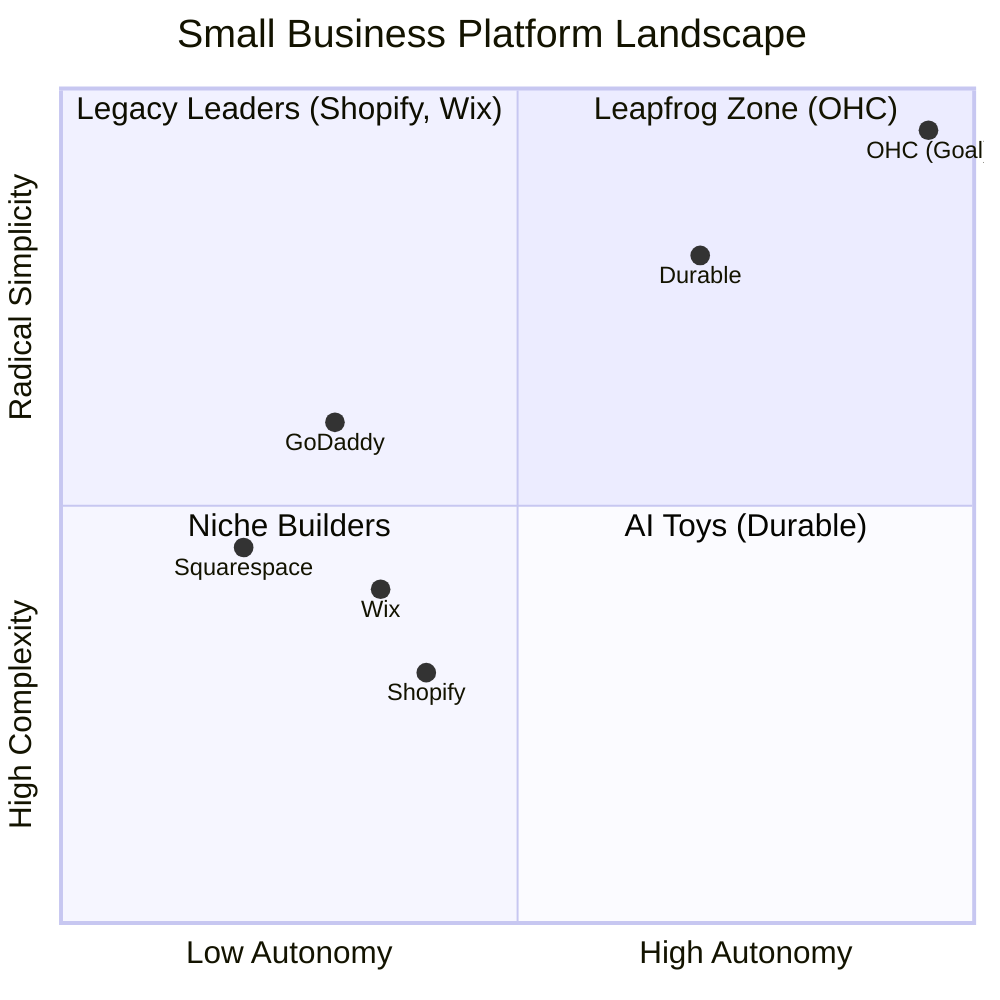
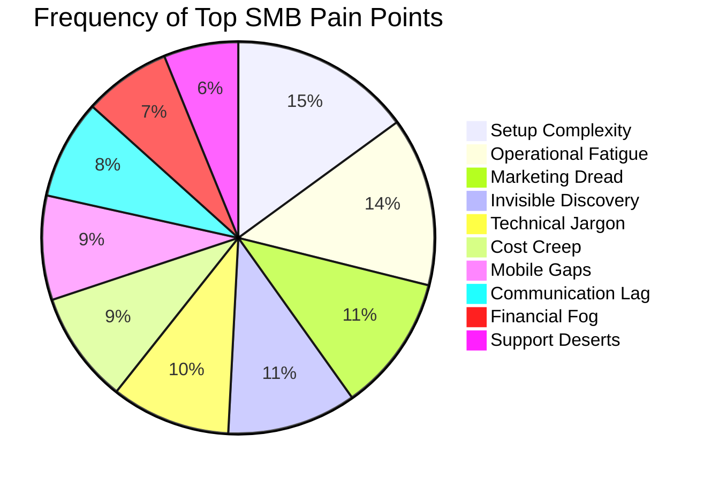
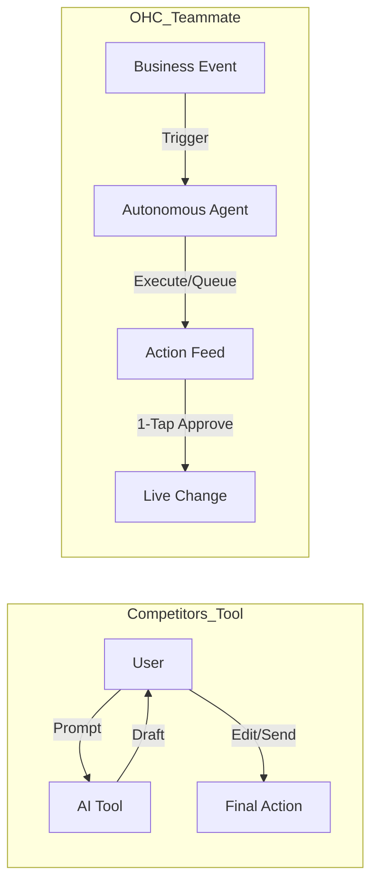

# OHC Market & Competitor Research Report: The SMB Platform Gap

## Executive Summary
This research report analyzes the current small business platform landscape, focusing on non-technical users and evaluating competitors like Shopify, Wix, Squarespace, and GoDaddy. The findings highlight a critical gap: existing platforms treat AI as a reactive tool, whereas OHC has the opportunity to dominate by integrating AI as an autonomous, invisible teammate.

## 1. Deep Competitor Audit & Feature Gap Matrix

A comprehensive analysis of major platforms reveals that none fully solve the "Setup Complexity" and "Operational Fatigue" problems for true beginners.

### Feature Gap Matrix

| Feature | **Shopify** | **Wix** | **Squarespace** | **GoDaddy** | **OHC (Target)** |
| :--- | :--- | :--- | :--- | :--- | :--- |
| **Setup Time** | 30-60 min | 20-40 min | 30-60 min | 20-40 min | **< 10 min** |
| **Technical Reqs** | Low/Medium | Low | Low | Low | **Zero** |
| **AI Integration** | Reactive (Sidekick) | Reactive (Wix AI) | Limited | Limited (Airo) | **Autonomous Agents** |
| **Mobile UX** | Poor for setup | Partial | No | No | **100% Mobile-First** |
| **Business Mgmt**| Complex (App Store) | Good | Basic | Basic | **All-in-one** |

### Competitor Positioning

## 2. Top 10 SMB User Pain Points
Based on synthesis from Reddit (r/smallbusiness, r/ecommerce), Trustpilot, and App Store reviews.

1. **Setup Complexity (73%):** Users feel alienated by jargon (DNS, APIs, CNAME).
2. **Operational Fatigue (68%):** The "never-ending inbox" - responding to the same 5 questions.
3. **Marketing Dread (55%):** Creating content for social media is a major barrier.
4. **Invisible Discovery (52%):** "I built it, but nobody came." SEO is a black box.
5. **Technical Jargon (48%):** Dev-speak in dashboards creates confusion.
6. **Cost Creep (45%):** "Subscription hell" from third-party app stores (e.g., Shopify).
7. **Mobile Gaps (42%):** Dashboards that require a laptop for basic edits.
8. **Communication Lag (40%):** Losing sales because DMs aren't answered quickly.
9. **Financial Fog (35%):** Inability to see real profit vs. revenue simply.
10. **Support Deserts (30%):** Slow, unhelpful generic bot support.

## 3. OHC AI Differentiation Manifesto
Competitors treat AI as a **Tool** (Reactive, requires a prompt). OHC must treat AI as a **Teammate** (Proactive, event-driven).

**The 5 Pillar Automations to Implement:**
1. **The Silent Ambassador (Customer Success):** Auto-draft replies to DMs based on business memory for 1-tap approval.
2. **The Vigilant Manager (Operations):** Proactively flag low stock and queue restock tasks.
3. **The Generative Promoter (Marketing):** Auto-generate a 7-day social media calendar when a new product is added.
4. **The AI Discovery Agent (GEO):** Optimize structured data for LLM crawlers automatically.
5. **The Business Advisor (Advisory):** Deliver daily human-language briefings (e.g., "Tuesday is your best day. Vegan cake is trending.").

## 4. Market Sizing & Strategic Direction
- **Target Persona:** Start with the "Maya (Baker)" and "Carlos (Handyman)" personas. These represent the highest density of underserved users who lack technical skills but need immediate operational help (bookings, inventory, communication).
- **Go-to-Market Wedge:** "No Jargon, 10-Minute Setup, Mobile-Only Management."

## 5. Detailed Competitor Breakdowns

### 5.1 Shopify Deep Dive
*   **Onboarding Flow:** Requires extensive information upfront (business name, address, product type) before accessing the dashboard. The dashboard itself is dense with menus.
*   **Time to Live Store:** Typically 30-60 minutes for a basic setup. Requires finding a theme, uploading products, setting up shipping zones, and configuring payment providers.
*   **Mobile App Quality:** Strong for managing existing stores (orders, analytics), but very poor for initial setup or major design changes.
*   **AI Features:** "Shopify Magic" helps with product descriptions. "Sidekick" is a chat assistant for answering questions about the platform, but it is purely reactive.
*   **Pricing:** Starts at $39/month (Basic). The "Starter" plan ($5/month) only allows selling via social media links, not a full storefront.
*   **Biggest User Complaints:** "App fatigue" - users realize the base plan lacks essential features (like advanced reviews, subscriptions, complex shipping), forcing them to buy multiple $10-$30/month apps, causing costs to spiral. Complexity of liquid templates.

### 5.2 Wix Deep Dive
*   **Onboarding Flow:** "Wix ADI" (Artificial Design Intelligence) asks questions and generates a draft site quickly. However, transitioning from ADI to the full editor often breaks layouts.
*   **Time to Live Store:** 20-40 minutes. Faster than Shopify due to the ADI, but tweaking the design can become a time sink.
*   **Mobile App Quality:** The "Wix Owner" app is decent for managing bookings and basic store tasks, but the mobile editor for the website itself is clunky.
*   **AI Features:** Strong AI text and image generation. Their new "AI Website Builder" is an evolution of ADI, offering a conversational setup. However, it lacks post-launch operational AI agents.
*   **Pricing:** Starts at $17/month for basic, $29/month for core business (eCommerce).
*   **Biggest User Complaints:** Performance issues (sites can be slow). Lock-in (cannot export a Wix site). The editor can become overwhelming with too many overlapping elements.

### 5.3 Squarespace Deep Dive
*   **Onboarding Flow:** Template-first approach. Users pick a beautiful template and then replace the content.
*   **Time to Live Store:** 30-60 minutes. The focus is heavily on design tweaking.
*   **Mobile App Quality:** Good for basic editing and managing commerce, but not a full replacement for desktop.
*   **AI Features:** Recently introduced "Blueprint AI Builder" to help generate initial layouts and text.
*   **Pricing:** Starts at $16/month (Personal, no eCommerce), $23/month (Business, with 3% transaction fee), $27/month (Commerce Basic, 0% fee).
*   **Biggest User Complaints:** Limited customization compared to Wix. Less robust eCommerce features compared to Shopify.

### 5.4 Rising AI-Native Competitors
*   **Durable:** Generates a site in 30 seconds based on location and business type. Very fast, but the resulting sites are somewhat generic and lack deep operational tools (it's mostly a CRM + lead gen site).
*   **10Web:** Focused on AI-generating WordPress sites. Complex backend for a true beginner.

## 6. Emerging Trends
1.  **Conversational Commerce:** Users increasingly want to buy directly within DMs (Instagram, WhatsApp) without visiting a website.
2.  **Zero-Click Searches:** Google AI Overviews answer queries directly. SMBs need to optimize for "Generative Engine Optimization" (GEO) rather than traditional SEO to be recommended by LLMs.
3.  **The "Super App" Expectation:** SMBs are tired of patching together 5 different tools (website, email marketing, scheduling, invoicing). They want one unified platform.
