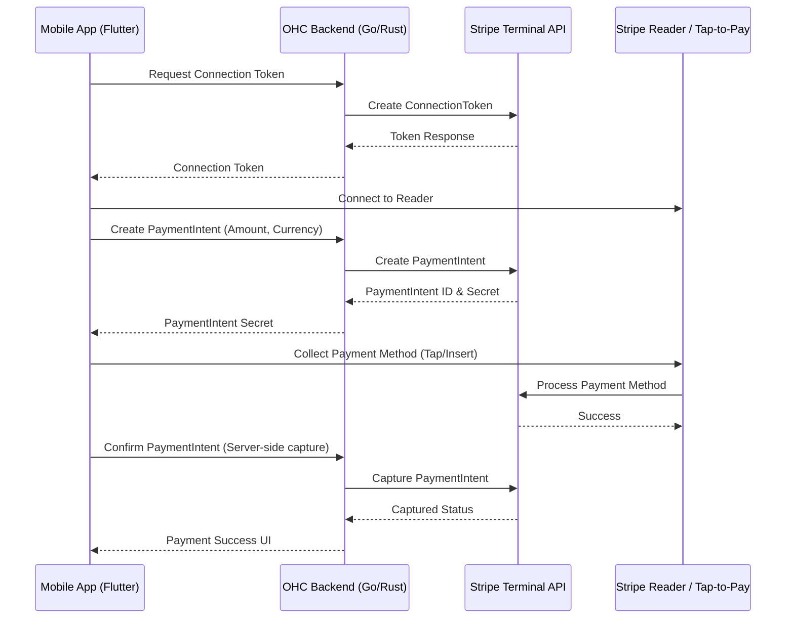

# OHC Stripe Terminal Integration Research Report

## Problem Statement
Small business owners (especially semi-technical or non-technical ones, like Priya the boutique owner) often run an omnichannel business — they sell both online and in-person. Currently, they have to use disparate systems for online checkout and in-person Point of Sale (POS), complicating inventory management and financial tracking.

They need a seamless way to accept in-person tap-to-pay and credit card transactions that syncs instantly with their OHC inventory and revenue tracking. Integrating Stripe Terminal natively into OHC mobile and web platforms will empower business owners to use their smartphones or dedicated Stripe readers to manage physical checkout as easily as online orders.

## Research Report
### Competitor Analysis
*   **Shopify POS:** Offers a mature, tightly integrated POS system with dedicated hardware and tap-to-pay on iPhone. It excels at unified inventory management and omnichannel sales reporting. However, setting it up can be overwhelming for micro-businesses, and pricing tiers can be confusing.
*   **Wix Point of Sale:** Provides hardware integrations and mobile POS apps, tying into their e-commerce backend. It supports omnichannel selling but has struggled with seamless multi-region hardware support.
*   **Square POS:** A leader in accessible POS for micro-merchants, with simple flat-rate pricing. Square is a closed ecosystem, making it harder to integrate with bespoke multi-tenant SaaS platforms like OHC that already leverage Stripe for online payments.
*   **Stripe Terminal:** The preferred solution for OHC. It supports multiple integration patterns (server-driven and client-driven), offers certified hardware, and recently introduced "Tap to Pay on iPhone/Android", eliminating the need for upfront hardware purchases for many of our users.

### Opportunities for OHC
By leveraging Stripe Terminal, OHC can:
1.  Enable "Tap to Pay on iPhone/Android" for instant in-person sales (e.g., Carlos the handyman accepting payment on the spot).
2.  Support dedicated smart readers for heavier in-person volume (e.g., Priya the boutique owner).
3.  Keep all transactions within the existing Stripe Connect framework used for online checkout, ensuring unified financial reporting and payout management in the "Finance & Payments" AI department.

## Design Doc

### Architecture Diagram

### UI / Mobile UX Flow (375px First)
1.  **Dashboard Integration:** A prominent "Accept In-Person Payment" Floating Action Button (FAB) or quick action card on the home dashboard.
2.  **Amount/Cart Screen:** A simple numeric keypad optimized for mobile. Users can either punch in an amount directly (for quick services) or select items from their catalog.
3.  **Payment Method Selection:** Translucent glassmorphism modal showing options: "Tap to Pay on Phone", "Connect Stripe Reader", or "Cash".
4.  **Processing State:** Clean loading animation with clear instructions ("Hold card near the top of the phone").
5.  **Success & Receipt:** A bright, satisfying success screen with options to "Text Receipt" or "Email Receipt", utilizing native mobile keyboards.

### AI Agent Integration Points
*   **Operations ("The Manager"):** Automatically deducts items sold in-person from the global inventory in real-time.
*   **Finance & Payments ("The Accountant"):** Reconciles the Stripe Terminal payout with online sales in the weekly financial report.
*   **Customer Success ("The Ambassador"):** If a customer email/phone is collected for the receipt, the agent associates the sale with their profile and can trigger a "Thank you for visiting!" follow-up.

### Key Design Decisions
*   **Server-Driven Integration (where possible):** To maintain maximum control over the PaymentIntent lifecycle and ensure row-level tenant isolation in our database, creation and capture of PaymentIntents will happen on the OHC backend. The client only handles connection and card collection.
*   **Prioritize Tap-to-Pay:** To minimize onboarding friction (the "grandmother test"), the primary flow will emphasize using the owner's existing smartphone via Stripe's Tap-to-Pay SDK, rather than requiring external hardware.

## Implementation Prompt
**For the Implementer Agent:**

We need to implement the backend foundation for Stripe Terminal support in our SaaS. Your task is to build out the API endpoints and integration logic that will allow our mobile client to accept in-person payments.

**Critical User Journey (CUJ) & Acceptance Criteria:**
1.  **Create Connection Token Endpoint:** Implement a new REST endpoint that the mobile app can call to generate a Stripe Terminal ConnectionToken. This token must be scoped correctly to the tenant's Stripe account.
2.  **Terminal PaymentIntent Flow:** Implement a service layer function (and corresponding endpoint) to create a Stripe `PaymentIntent` specifically configured for Terminal (`capture_method: "manual"`, `payment_method_types: ["card_present", "interac_present"]`).
3.  **Capture Endpoint:** Implement an endpoint to capture the `PaymentIntent` after the mobile app has successfully collected the payment method via the reader.
4.  **Testing:**
    *   Write unit tests for the new Stripe Terminal client methods.
    *   Create a Playwright E2E test or backend integration test that simulates the flow: Requesting a token, creating a PaymentIntent, and capturing it. Since we can't use real hardware in CI, mock the Stripe API responses appropriately.
5.  **Security & Multi-Tenancy:** Ensure all endpoints strictly validate the `tenant_id` and ensure a tenant can only generate tokens and capture payments for their own connected Stripe account.

Do not prescribe specific database schemas—design the data structures as you see fit to satisfy the multi-tenant requirements. Ensure all code adheres to our standard error handling and OpenTelemetry tracing practices.

## Metadata
*   **Priority:** P1 (High)
*   **Estimated Scope:** Medium
