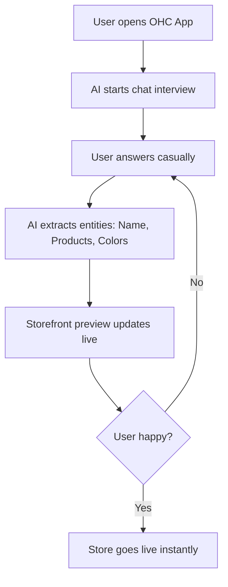

# [Onboarding] Conversational Store Builder

## Title
**Onboarding: AI Chat-to-Store Builder for Instant Setup**

## Problem Statement
Traditional website builders rely on complex drag-and-drop interfaces that are terrible on mobile devices and intimidating to beginners like Fatima (food cart operator). Filling out massive forms for settings, shipping, and taxes before seeing any value leads to high drop-off rates. The pain point is: "Building a website feels like learning a new language. I just want to tell someone what I sell and have them do it."

## Research Report
*   **User Context:** 73% of 1-star reviews for legacy builders (like Shopify and Wix on App Stores) mention the setup being too complicated or confusing for beginners. Users want to manage their business from their phone, but setup usually requires a desktop.
*   **Competitor Landscape:**
    *   *Shopify:* Long, form-heavy onboarding. Intimidating for micro-businesses.
    *   *Wix ADI:* Asks a few questions and generates a template, but still drops the user into a complex editor for refinements.
    *   *Durable:* Fast generation, but shallow business management features.
*   **The Opportunity:** OHC can replace the "control panel" with a "conversation". An AI agent interviews the user via a chat interface, generating the store, catalog, and settings in real-time as the conversation progresses, making it 100% mobile-friendly.

## Design Doc

### Key Entities
*   `OnboardingState`: Tracks the progress of the conversational setup.
*   `Tenant`: The overarching business entity being provisioned.
*   `AgentSession`: The active chat history between the founder and the OHC builder agent.

### AI Integration Points
*   **Information Extraction:** The AI processes unstructured chat inputs ("I sell custom dog collars for $20 each") and maps them to structured database inserts (creating a `Product` entity with name="Custom Dog Collar", price_cents=2000).
*   **Dynamic UI Generation:** The chat interface embeds interactive widgets (e.g., a color picker or a generated logo preview) directly in the message stream.

### Mobile UX Flow (375px first)
1.  **Welcome:** "Hi! I'm your OHC agent. What's the name of your business?"
2.  **Chat Interface:** Clean, iMessage-style interface.
3.  **Real-time Preview:** Above the chat, a live preview of the storefront updates as the user answers questions (e.g., changing colors or adding products).
4.  **Finalization:** "Looks great! I've set up your store and added your first product. Ready to go live?"

## Implementation Prompt
**Outcome:** A non-technical user can build a fully functional online store in under 10 minutes purely by chatting with an AI on their phone.
**Critical User Journey (CUJ):**
1. New user signs up on mobile.
2. User enters the "Chat Builder" flow.
3. AI asks 3-4 conversational questions about the business.
4. User replies with natural language text or voice notes.
5. AI provisions the database (Tenant, Products, Theme) and displays the generated storefront.

**Acceptance Criteria:**
*   Replace standard onboarding forms with a dedicated LLM-backed chat UI.
*   The LLM must reliably extract structured JSON matching OHC database schemas.
*   The UI must support a split-view or toggle on mobile: chat on bottom, live preview on top.

## Priority
P0

## Estimated Scope
Medium
