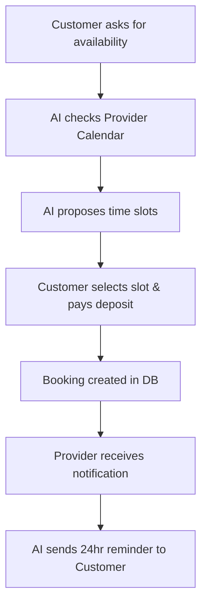

# [Operations] Smart Booking System for Service Providers

## Title
**Operations: Smart AI Booking and Calendar Management for Services**

## Problem Statement
Service providers like Carlos (handyman) and Leo (music tutor) operate differently than traditional e-commerce stores. Their "inventory" is their time. Managing inquiries, coordinating schedules, and collecting payments via text message or email is chaotic and leads to double-bookings or lost revenue. The pain point is: "I lose leads because I'm busy working and can't reply to schedule them, and chasing down payments after a service is awkward."

## Research Report
*   **User Context:** Service-based small businesses often lack dedicated receptionists. According to general SMB feedback on platforms like Trustpilot and Reddit, missed calls and delayed replies cost significant business.
*   **Competitor Landscape:**
    *   *Shopify:* Primarily built for physical goods. Service booking requires complex third-party apps.
    *   *Wix:* Wix Bookings is functional but rigid. It doesn't intelligently handle rescheduling requests via natural language.
    *   *Squarespace:* Acquired Acuity Scheduling. Very powerful, but can be overwhelming to configure for simple use cases.
*   **The Opportunity:** OHC currently has a `bookings` table but limited UI/AI integration. OHC can leapfrog by integrating a conversational AI booking assistant. A customer can text or message "Do you have time next Tuesday?", and the AI checks the calendar, proposes times, and secures a deposit autonomously.

## Design Doc

### Key Entities
*   `Service`: A bookable offering (e.g., "Plumbing Diagnostic", "1hr Piano Lesson").
*   `Availability`: The provider's working hours and synced calendar events.
*   `Booking`: A confirmed appointment tied to a customer and service.

### AI Integration Points
*   **Conversational Scheduling:** An AI agent intercepts inbound queries on the storefront or via connected messaging channels, interpreting intent and proposing available slots based on the `Availability` data.
*   **Smart Reminders:** An agent automatically sends SMS/email reminders 24 hours before the appointment, handling any natural language cancellation or rescheduling requests.

### Mobile UX Flow (375px first)
1.  **Dashboard:** Provider sees a simplified "Today's Schedule" card.
2.  **Add Service:** "Add Offering" form optimized for time (duration, buffer time).
3.  **Booking Notification:** "🔔 New Booking request from John for Tuesday at 2 PM. Accept?"
4.  **Action:** One-tap to accept, triggering an automated confirmation and deposit invoice to the customer.

## Implementation Prompt
**Outcome:** Service providers can offer 24/7 booking capabilities without managing a complex calendar interface, relying on AI to handle the back-and-forth negotiation with clients.
**Critical User Journey (CUJ):**
1. Provider creates a "Guitar Lesson" service (60 mins, $50).
2. Customer visits the OHC-powered storefront and asks the chat widget for an afternoon slot next week.
3. The AI agent references the provider's availability, proposes Thursday at 4 PM, and collects booking details.
4. The provider receives a simple push notification confirming the new appointment.

**Acceptance Criteria:**
*   `bookings` and `services` tables must support duration and provider availability constraints.
*   AI agent can successfully parse natural language date/time requests and map them to available slots.
*   Provider UI must show a clean, mobile-optimized daily agenda view.

## Priority
P1

## Estimated Scope
Large
