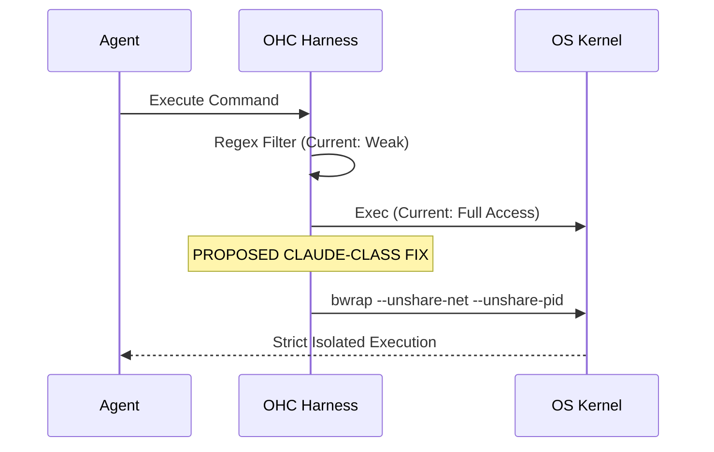

# 🔬 OHC Market Research Report: OS-Level Agent Sandbox

## 1. Executive Summary
This report details an architectural deep dive into Claude Code's sandboxing mechanism (`@anthropic-ai/sandbox-runtime`). Claude Code leverages robust OS-level isolation primitives—`bwrap` (Bubblewrap) on Linux and `sandbox-exec` on macOS. In contrast, OHC currently relies on naive regex filtering in `srcs/server/bash_sandbox/sandbox.go`, representing a critical security gap.

## 2. Core Architecture: Claude Code

### 2.1 Linux Isolation (`bwrap`)
Claude isolates Linux executions using `bwrap` with several key flags:
- **Filesystem Isolation:** Re-binds paths using `--bind` and creates empty files for non-existent deny paths.
- **Network & Process:** Uses `--unshare-net`, `--unshare-pid`, and `--seccomp` filters.
- **Local Socket Proxying:** Spins up an outer `bwrap` sandbox to run `socat`, proxying traffic over Unix sockets (`httpSocketPath` and `socksSocketPath`) before nested execution.

### 2.2 macOS Isolation (`sandbox-exec`)
Utilizes Apple's native `sandbox-exec` utility.

### 2.3 Component Interaction (Mermaid)

## 3. Comparative Matrix: OHC vs Claude Code
| Feature | OHC Current | Claude Code | Gap Assessment |
|---------|-------------|-------------|----------------|
| **Process Isolation** | None (Same process tree) | `--unshare-pid` | Critical Gap |
| **Network Isolation** | None | `--unshare-net` + `socat` | Critical Gap |
| **Filesystem Security**| Regex filtering | `--bind` / mount tracking | Critical Gap |

## 4. OHC Actionable Missions
We are spawning three new implementations. See associated GitHub Issues.

