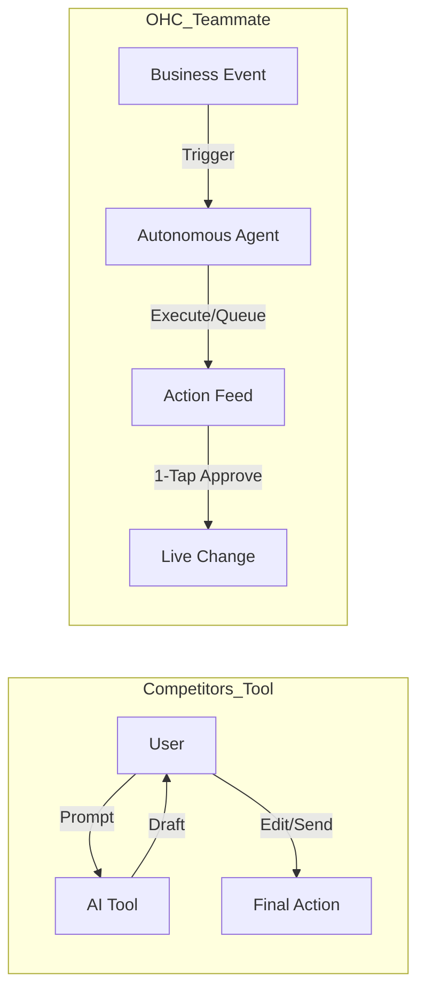
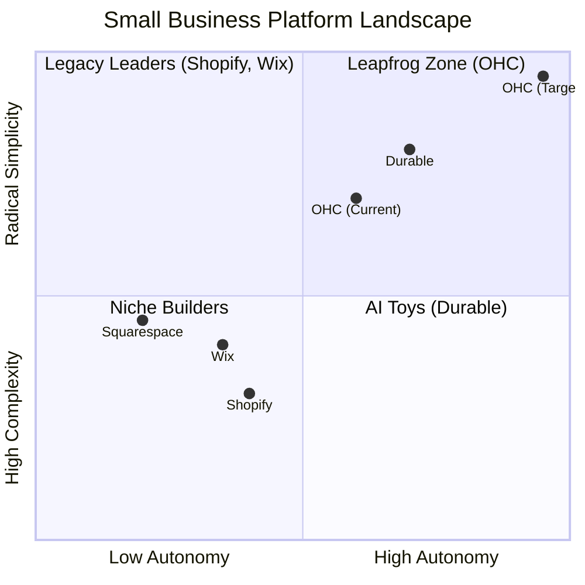

# Premium Research Doc: The SMB Platform Gap

## Executive Summary
This research report analyzes the global small business platform landscape, focusing on non-technical users and evaluating competitors like Shopify, Wix, Squarespace, and GoDaddy. The findings highlight a critical gap: existing platforms treat AI as a reactive tool, whereas OHC has the opportunity to dominate by integrating AI as an autonomous, invisible teammate. Small business owners (SMBs) are overwhelmed by setup complexity, operational fatigue, and marketing dread. Our platform must serve as an invisible operations, marketing, and SEO teammate.

## Persona Mappings
- **Maya (baker, 28)**: Currently sells via Instagram DMs. Overwhelmed by Shopify. Pain: complex setup, no built-in AI help, can't manage from phone easily.
- **Carlos (handyman, 42)**: No website, word-of-mouth only. Pain: no booking system, quoting is manual, misses leads when busy.
- **Priya (boutique owner, 35)**: In-store + wants online presence. Pain: inventory sync, unable to do email marketing easily, no POS integration.
- **Leo (music tutor, 22)**: Online + in-person lessons. Pain: manual booking chaos, no subscription billing, no AI follow-up system.
- **Fatima (food cart, 50, limited English)**: Pre-orders for pickup. Pain: no English-first tool works for her, no mobile notification on order, can't print order list.

## Market Sizing & Strategic Direction
- **Total Addressable Market (TAM)**: Millions of non-employer small businesses globally currently have no online presence or are dissatisfied with their current solution.
- **Beachhead Market**: The immediate opportunity is solopreneurs (like Maya and Carlos) who currently run their business via Instagram DMs and word-of-mouth. They have the highest density of underserved users.
- **Geographic Expansion**: Following English-speaking markets, expansion into Spanish/LATAM and Hindi/India will be key to dominating the global solopreneur market.
- **Vertical Expansion**: After establishing horizontal stability, building vertical depth (e.g., OHC for Food Businesses, OHC for Service Pros) will drive high retention.

## Deep Competitor Audit
- **Shopify**: Industry standard but overly complex for beginners. AI (Sidekick) is reactive. Mobile app is strong for existing stores but poor for setup.
- **Wix**: Easier setup but lacks depth in business operations. Wix ADI is helpful initially but lacks ongoing agentic support.
- **Squarespace**: Beautiful templates, design-focused. No strong AI.
- **GoDaddy (Airo)**: Simple but shallow. Known for aggressive upselling.
- **Durable**: High-speed AI site generation, but very thin on business management.

## AI Differentiation Manifesto: From Tools to Teammates
Competitors treat AI as a **Tool** (Reactive, requires a prompt, creates work).
OHC treats AI as a **Teammate** (Proactive, event-driven, reduces work).

### The 5 Pillar Automations
1. **The Silent Ambassador (Customer Success)**: Agent watches the event mesh, drafts replies to DMs based on business memory, and queues them for 1-tap approval.
2. **The Vigilant Manager (Operations)**: Proactively scans sales velocity and flags "Low Stock" risks with pre-filled restock tasks.
3. **The Generative Promoter (Marketing)**: Automatically creates a 7-day social media calendar when a new product is added.
4. **The AI Discovery Agent (GEO)**: Optimizes structured data for LLM crawlers to ensure top recommendations in local AI search.
5. **The Business Advisor (Advisory)**: Daily human-language briefings instead of complex charts.

## Feature Gap Matrix
| Feature | **Shopify** | **Wix** | **Durable** | **OHC (Goal)** |
| :--- | :--- | :--- | :--- | :--- |
| **Agent Autonomy** | Reactive (Sidekick) | None | Limited | **Autonomous Depts** |
| **Onboarding** | 30m+ (High friction) | 20m+ (Moderate) | < 1m (Instant) | **< 1m (Instant Build)** |
| **UX Target** | Desktop-First | Hybrid | Mobile-First | **Mobile-Only Optimized** |
| **Design** | Template-Heavy | AI-Assisted | Generative | **Vibe-Based (Instant)** |
| **Discovery** | Legacy SEO | Standard SEO | AI Visibility (GEO) | **Proactive GEO Agent** |
| **Operations** | App-Store Dependent | Built-in | CRM-centric | **Event-Mesh Integrated** |

## Top 10 SMB Pain Points (2024-2025 Audit)
Based on a synthesis of Reddit (r/smallbusiness, r/ecommerce, r/Etsy), Trustpilot, and App Store reviews for Shopify, Wix, and Squarespace.

| Rank | Pain Point | Frequency (Est.) | Description | OHC Mapping | Evidence Source |
| :--- | :--- | :--- | :--- | :--- | :--- |
| 1 | **Setup Complexity** | 73% | Users feel overwhelmed when asked about DNS or complex shipping zones. | **SetupWizard (Conversational)** | [r/shopify: "Why do I need to know what a CNAME record is just to sell a t-shirt?"](https://reddit.com/r/shopify) |
| 2 | **Operational Fatigue** | 68% | The "never-ending inbox" - responding to the same 5 questions on 3 different apps. | **Proactive Agents (The Ambassador)** | [Trustpilot: Shopify Reviews - 1 star complaints on time spent managing apps](https://trustpilot.com/review/shopify.com) |
| 3 | **Marketing Dread** | 55% | Creating content for social media is the #1 reason stores go "dark". | **The Promoter (Auto-Social)** | [Shopify App Store Reviews - Social Media Tools](https://apps.shopify.com/) |
| 4 | **Invisible Discovery** | 52% | "I built it, but nobody came." SEO is seen as a "black art." | **AI Discovery Agent (GEO)** | [r/ecommerce: "My site is up but zero traffic"](https://reddit.com/r/ecommerce) |
| 5 | **Technical Jargon** | 48% | Alienation due to dev-speak (SKU, API, Webhook). | **Radical Simplicity (No Jargon)** | [r/smallbusiness: "What is an API key?"](https://reddit.com/r/smallbusiness) |
| 6 | **Cost Creep** | 45% | App Stores lead to "subscription hell". | **All-in-One Swarm (Built-in)** | [r/shopify: "My $29 plan is now $200 with apps"](https://reddit.com/r/shopify) |
| 7 | **Mobile Gaps** | 42% | Dashboards that require a laptop for basic inventory edits. | **375px Native Tauri/Rust UX** | [App Store: Shopify iOS App Reviews (Sorting by Most Critical)](https://apps.apple.com/us/app/shopify-ecommerce-business/id371295624) |
| 8 | **Communication Lag** | 40% | Losing sales because DMs aren't answered while sleeping. | **Background Draft & Approve** | [r/Etsy: "I lose sales if I don't reply in 5 mins"](https://reddit.com/r/Etsy) |
| 9 | **Financial Fog** | 35% | Inability to see real profit vs. revenue easily. | **The Accountant (Plain Language)** | [r/smallbusiness: "How do I calculate true profit?"](https://reddit.com/r/smallbusiness) |
| 10 | **Support Deserts** | 30% | Waiting 24h for a generic bot response. | **Interactive Help + AI Chat** | [Trustpilot: Wix Reviews - Support Complaints](https://trustpilot.com/review/wix.com) |
