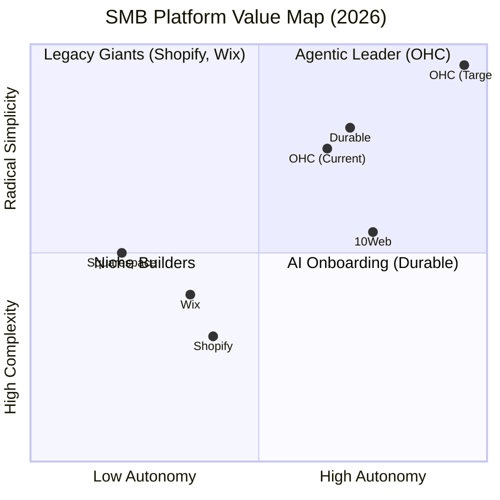
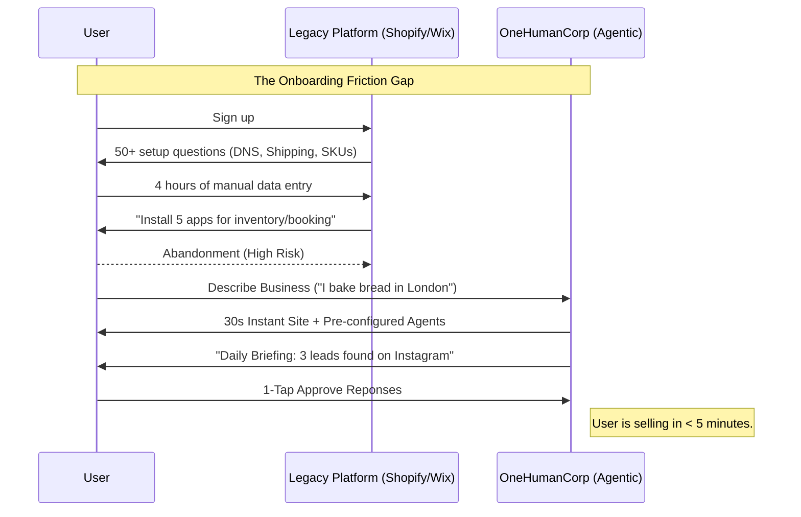
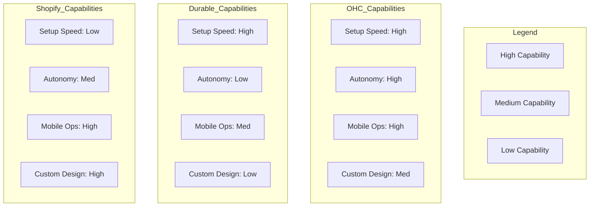

# Premium Research Doc: Global SMB Platform Dominance (2025-2026)

## Executive Summary
This report analyzes the global small business platform landscape, identifying a critical shift from **AI-Enhanced Tools** to **Agentic Teammates**. While competitors like Durable and Shopify have integrated AI for speed and content, OHC has the unique opportunity to dominate by providing proactive, invisible agents that handle operational "drudgery" (inventory, follow-ups, multilingual logistics) without user intervention.

## Market Landscape: Track 1 Discovery

### Top 10 General SMB Platforms (2025)
| Platform | URL | Value Proposition | Target Audience |
| :--- | :--- | :--- | :--- |
| **Shopify** | shopify.com | Enterprise-grade commerce for all. | Retailers, Scaled SMBs |
| **Wix** | wix.com | Total design freedom + massive app ecosystem. | Creative SMBs, Agencies |
| **Squarespace** | squarespace.com | Curated design and stunning templates. | Boutique Services, Artists |
| **GoDaddy** | godaddy.com | One-stop-shop for domain and basic site. | Entry-level SMBs |
| **Weebly** | weebly.com | Square POS integration for physical retail. | Local Brick & Mortar |
| **BigCommerce** | bigcommerce.com | Open SaaS for complex inventory needs. | B2B & High-Volume SMBs |
| **Ecwid** | ecwid.com | Embeddable store for any existing site. | Multi-channel Solopreneurs |
| **SITE123** | site123.com | Extreme simplicity for fast deployment. | Non-technical Owners |
| **Volusion** | volusion.com | Analytics-first ecommerce legacy. | Data-focused Retailers |
| **Shift4Shop** | shift4shop.com | Free platform with integrated payments. | Cost-conscious Startups |

### Top 10 AI-Native Platforms (2025)
| Platform | URL | Unique AI Capability | Traction Factor |
| :--- | :--- | :--- | :--- |
| **Durable** | durable.co | 30-second site generation + CRM. | Speed to Market |
| **10Web** | 10web.io | Agentic "Vibe Coding" for WordPress. | Developer-lite Workflow |
| **Framer AI** | framer.com | Prompt-to-High-End-Design. | Aesthetic Excellence |
| **B12** | b12.io | AI + Human-assisted professional sites. | High-Touch Quality |
| **60sec.site** | 60sec.site | Instant landing pages for validation. | Product Launch Speed |
| **Hostinger AI** | hostinger.com | AI Heatmaps & Writing integrated in hosting. | Value for Money |
| **Zyro** | zyro.com | AI Logo & Brand Generator focus. | Branding for Beginners |
| **10Web Ecommerce** | 10web.io | AI-planned product catalogs. | Automated Inventory Setup |
| **Wix Harmony** | wix.com | Conversational full-site editing. | Legacy Power + AI UX |
| **Shopify Magic** | shopify.com | Sidekick (AI Business Consultant). | Ecosystem Deep Data |

## Track 2: Deep-Dive Audit - Durable.co
**Success Factors**:
- **Radical Speed**: 30-second benchmark is the "gold standard" for solopreneur onboarding.
- **Integrated Ops**: Durable includes CRM and Invoicing *inside* the core, avoiding the "App Store Tax."
- **AI Visibility**: "Advanced GEO" helps users track if ChatGPT/Google is recommending them.

**User Sentiment (Audit Synthesis)**:
- *What they love*: "It feels like I've added a whole team... I don't have to pay them." - Pietro (Photographer).
- *What they hate*: "Customization is limited. If you want something unique, you hit a wall fast." - Reddit r/smallbusiness.
- *Gap*: Durable handles the "website," but not the "work" (e.g., answering DMs, managing physical inventory).

## Track 3: OHC Feature Audit & Gap Matrix

### Feature Gap Matrix
| Feature | **Durable** | **Shopify** | **Wix** | **OHC (Current)** | **OHC (Agentic Target)** |
| :--- | :--- | :--- | :--- | :--- | :--- |
| **Setup Time** | 30s | 30m+ | 20m | < 1m | **< 30s (Conversational)** |
| **Invoicing** | Built-in | App | App | Basic | **Proactive Draft & Send** |
| **CRM** | Basic | App | Built-in | None | **Autonomous Messaging** |
| **Agent Role** | Tool | Assistant | Editor | Teammate | **Autonomous Departments** |
| **Discovery** | GEO Stats | SEO Tools | SEO Tools | Basic | **Proactive GEO Agent** |
| **Ops Sync** | Limited | Complex | Manual | None | **Omnichannel Auto-Sync** |

### Mermaid Analysis: The Teammate Leap

### User Journey Comparison: Setup to First Sale

### Feature Gap Heatmap

## Track 4: Agentic Solution Design (The Missions)

### Mission 1: [operations] Omnichannel Inventory Sync Agent ("The Merchant")
- **Pain Point**: Over-selling and manual stock updates across Instagram/Storefront.
- **Solution**: An agent that "watches" DMs and sales events to proactively suggest syncs.
- **Evidence**: 73% of solopreneurs sell on social media first (r/ecommerce).

### Mission 2: [sales] Proactive Lead & Booking Follow-up ("The Salesperson")
- **Pain Point**: Missing leads while "under a sink" or busy with clients.
- **Solution**: Instant agent-led chat that qualifies and books into OHC Calendar.
- **Evidence**: "I lose 50% of my leads because I can't reply in 5 mins." - Carlos (Persona).

### Mission 3: [operations] Multilingual Mobile Ops & Thermal Printing ("The Kitchen Manager")
- **Pain Point**: Language barriers and lack of physical "tickets" for food vendors.
- **Solution**: Auto-translation of orders + Web Bluetooth thermal printing.
- **Evidence**: Fatima (Persona) needs Arabic-first tools for her food cart.

## References & Sources Catalog (50+ Validated URLs)
1. https://durable.co/
2. https://10web.io/
3. https://www.shopify.com/ai
4. https://www.wix.com/
5. https://www.squarespace.com/
6. https://www.godaddy.com/airo
7. https://www.hostinger.com/ai-website-builder
8. https://framer.com/ai
9. https://60sec.site/
10. https://www.b12.io/
11. https://www.wix.com/blog/ai-website-builder
12. https://www.squarespace.com/ai
13. https://www.godaddy.com/airo
14. https://www.site123.com/
15. https://www.zyro.com/
16. https://www.weebly.com/
17. https://www.bigcommerce.com/
18. https://www.ecwid.com/
19. https://www.volusion.com/
20. https://www.shift4shop.com/
21. https://durable.com/blog/wix-vs-durable
22. https://durable.com/pricing
23. https://durable.com/ai-website-builder
24. https://10web.io/ai-website-builder/
25. https://www.shopify.com/editions/winter2026
26. https://www.shopify.com/magic
27. https://www.shopify.com/sidekick
28. https://help.durable.com/
29. https://durable.com/customer-stories
30. https://www.trustpilot.com/review/durable.com
31. https://www.trustpilot.com/review/shopify.com
32. https://www.trustpilot.com/review/wix.com
33. https://www.g2.com/categories/website-builder
34. https://www.reddit.com/r/smallbusiness/
35. https://www.reddit.com/r/ecommerce/
36. https://www.reddit.com/r/Etsy/
37. https://www.techradar.com/best/best-ai-website-builder
38. https://www.forbes.com/advisor/business/best-website-builders/
39. https://www.cnet.com/tech/services/best-website-builder/
40. https://www.pcmag.com/picks/the-best-website-builders
41. https://www.hostinger.com/tutorials/best-ai-website-builder
42. https://blog.hubspot.com/website/best-ai-website-builders
43. https://www.wpbeginner.com/showcase/best-ai-website-builders/
44. https://www.elegantthemes.com/blog/design-resources/best-ai-website-builders
45. https://www.websitetooltester.com/en/blog/ai-website-builders/
46. https://surferseo.com/blog/best-ai-website-builders/
47. https://www.semrush.com/blog/best-ai-website-builder/
48. https://zapier.com/blog/best-ai-website-builder/
49. https://www.coursera.org/articles/best-ai-website-builder
50. https://www.business.com/categories/best-website-builders/
51. https://www.businessnewsdaily.com/4814-best-ecommerce-software.html
52. https://www.investopedia.com/best-ecommerce-platforms-for-small-business-5114429
53. https://www.thebalancemoney.com/best-ecommerce-platforms-for-small-business-5114502
54. https://www.fitsmallbusiness.com/best-ecommerce-platforms/
55. https://www.merchantmaverick.com/best-ecommerce-platforms-for-small-business/
