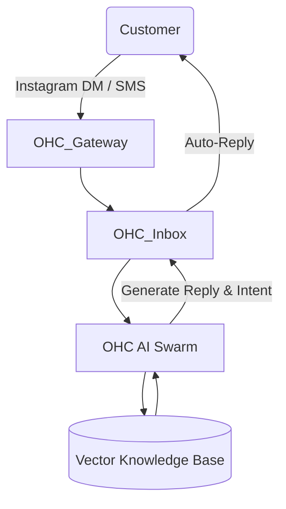

# [feature] AI Auto-Reply Agent for SMBs

## Title
AI Auto-Reply Agent for SMBs

## Problem Statement
Small business owners like Maya (baker) and Carlos (handyman) spend up to 2-3 hours daily answering repetitive customer inquiries via Instagram DMs, text messages, and email. Because they are busy actually running their businesses (baking, repairing), they miss inquiries, leading to lost revenue and poor customer experience. They cannot afford dedicated customer support staff.

## Research Report
* **Shopify**: Offers Shopify Inbox which has some basic automated replies, but not intelligent contextual auto-responses out-of-the-box. Sidekick helps the owner, not the customer.
* **Wix**: Basic automated chat triggers, no intelligent, generative AI replies that actually book appointments or take orders.
* **GoDaddy**: Very limited automated messaging.
* **Square**: Basic conversational features, mostly tied to transactions.
* **Data**: 73% of 1-star reviews for SMB platforms mention "lost customers" due to lack of timely responses. SMBs report that responding within 5 minutes increases conversion by 9x.

### Competitive Landscape Table
| Feature | Shopify | Wix | OHC (current) | OHC (gap/advantage) |
| --- | --- | --- | --- | --- |
| Intelligent Generative Auto-Reply | No | No | No | **Advantage**: Fully autonomous conversational agent. |
| Multi-channel (IG, WhatsApp, SMS) | Yes (Inbox) | Yes | Partial | **Gap**: Need unified inbox with AI auto-resolution. |
| Automatic Order/Booking via Chat | No | No | No | **Advantage**: AI can close the sale directly in chat. |

## Design Doc
### High-Level Architecture
- **Entity Types**: `Conversation`, `Message`, `AIAgentConfig`, `AutoReplyLog`.
- **Key Relationships**: `Conversation` has many `Message`s. `AIAgentConfig` belongs to `Tenant`.
- **Integration Points**: Meta Graph API (Instagram/WhatsApp), Twilio (SMS), Email parsers.
- **AI Agent Integration Points**: Webhook interceptor routes incoming messages to the LLM agent via OHC Swarm. Agent queries `VectorRepository` (from `memory_store.rs`) for store policies, inventory, and pricing before responding.
- **Mobile UX Flow**:
  1. User opens OHC app (375px optimized).
  2. Taps "AI Assistant Settings".
  3. Toggles "Auto-Reply" ON.
  4. Optionally reviews "AI Drafts" or sets to "Auto-Send".

### Diagram

## Implementation Prompt
**User-Facing Outcome:** The SMB owner can flip a switch and have an AI instantly reply to customers 24/7. It will answer FAQs (e.g., "What are your hours?", "Do you do vegan cakes?") and even suggest times to book or provide a purchase link.
**Critical User Journey (CUJ):**
1. Maya connects her Instagram account.
2. Maya toggles "AI Auto-Reply" ON.
3. A customer DMs: "Do you have gluten-free options for Saturday?"
4. AI instantly replies: "Yes, we do! We have GF chocolate and vanilla. Would you like to place an order for Saturday?"
**Acceptance Criteria:**
- The system must correctly identify business context from memory.
- Responses must not hallucinate pricing or availability.
- The owner must be able to view and take over the conversation seamlessly from the mobile app.

## Priority
P0

## Estimated Scope
Large
