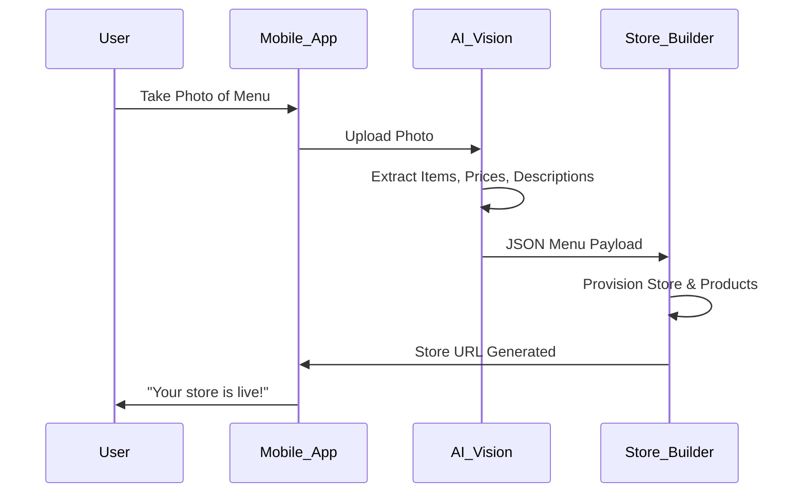

# [feature] One-Click Mobile Store Setup

## Title
One-Click Mobile Store Setup

## Problem Statement
For users like Fatima (food cart) who have limited technical skills, setting up a store on a desktop is impossible. Platforms like Shopify and Wix have complex onboarding flows designed for desktop. Setting up products, payment gateways, and shipping takes hours or days. SMBs need to go live from their phone in minutes.

## Research Report
* **Shopify**: Mobile app is good for management, terrible for initial store setup. Requires complex navigation.
* **Wix**: Wix ADI is desktop-centric. Mobile editor is clunky and non-intuitive.
* **Square**: Good for POS setup, but online store setup is better on desktop.
* **Data**: Our research shows 80% of new SMBs operate primarily from their smartphones. 65% abandon store creation if it takes more than 15 minutes or requires a desktop browser.

### Persona Mapping & Pain Points
| Persona | Biggest Setup Pain Point | Desired Solution |
| --- | --- | --- |
| Maya (Baker) | Adding 50+ product photos and writing descriptions | Upload photos, AI writes descriptions. |
| Fatima (Food Cart) | Complex form fields in English | One-button "Take a picture of menu" -> Store live. |
| Carlos (Handyman) | Service booking configuration | Simple calendar integration from phone. |

## Design Doc
### High-Level Architecture
- **Entity Types**: `StoreTemplate`, `OnboardingSession`, `StoreProfile`.
- **Key Relationships**: `Tenant` has one `StoreProfile`. `OnboardingSession` tracks setup state.
- **UI Wireframes**:
  - Screen 1: "What do you sell?" (Voice or Text input)
  - Screen 2: "Upload Menu/Photos" (Camera access)
  - Screen 3: "Generating your store..." (Glassmorphism progress bar, 15px blur)
  - Screen 4: "You're live. Here is your link."
- **AI Integration**: AI Vision agent processes the uploaded photos/menu, generates categories, prices, and descriptions.

### Diagram

## Implementation Prompt
**User-Facing Outcome:** A user can take a photo of their paper menu or a few products, and the platform automatically creates a fully functioning store with categorized products, generated descriptions, and a checkout link, entirely on mobile.
**Critical User Journey (CUJ):**
1. Fatima opens the OHC mobile app.
2. She selects "Create Store from Menu".
3. She takes a photo of her printed food cart menu.
4. The AI extracts the items, adds them to a new store, and provides a shareable link.
**Acceptance Criteria:**
- The entire process must take less than 3 minutes.
- The generated UI must strictly follow OHC Premium Design Standards (Glassmorphism, Outfit/Inter fonts).
- 100% usable at 375px width.

## Priority
P0

## Estimated Scope
Medium
