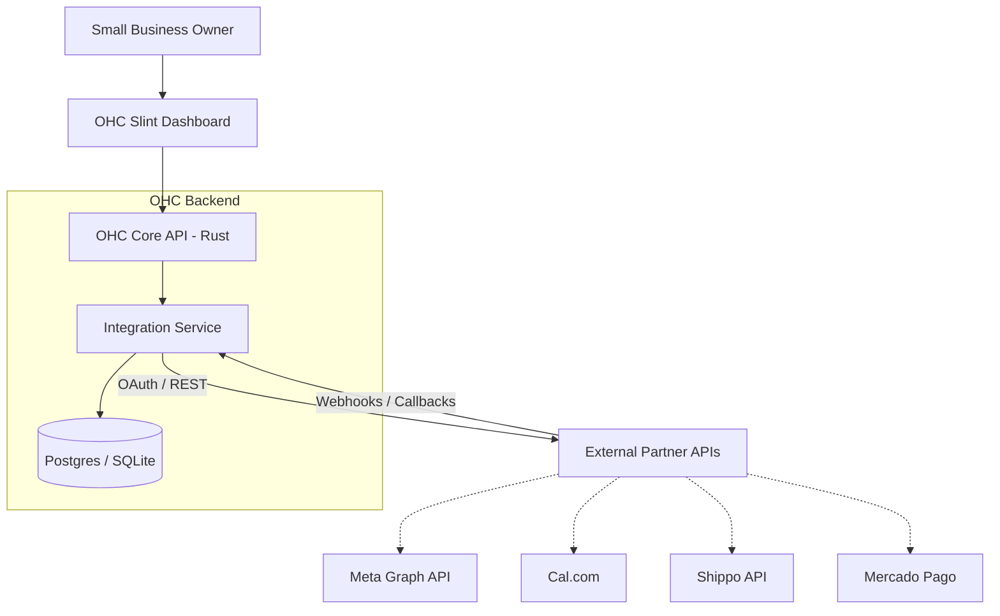

# Tool Integration Research Report Q4

## Executive Summary
This report evaluates seven key external tools for integration into the One Human Corp (OHC) platform. These integrations aim to solve critical pain points for non-technical small business owners across social media, scheduling, email marketing, payments, shipping, SMS, and video conferencing.

The evaluations prioritize the "Grandmother Test": ensuring that the resulting UI and functionality are instantly understandable and beneficial to the target persona without technical configuration.

## Persona-Specific Pain Point Summary
* **The Overwhelmed Owner**: Juggling Instagram DMs, WhatsApp, and Facebook comments leads to dropped leads. (Addressed by: Meta Business Suite)
* **The Chronically Double-Booked**: Manual scheduling causes timezone confusion and double-booking. (Addressed by: Cal.com)
* **The Local Merchant**: Needs to accept local payment methods (like Pix) that global processors ignore. (Addressed by: Mercado Pago)
* **The E-commerce Novice**: Wastes hours copying addresses to generate shipping labels. (Addressed by: Shippo)
* **The Urgent Communicator**: Relies on SMS because their clients ignore emails. (Addressed by: Twilio)

## Comparative Analysis Table

| Integration | Category | User Benefit | Est. Pricing | Cloud | Standalone |
| :--- | :--- | :--- | :--- | :---: | :---: |
| **Meta Business Suite** | Social Media | Unified messaging inbox (IG, FB, WhatsApp) | Free basic API; WA varies | Yes | Yes (requires webhook relay) |
| **Cal.com** | Calendar/Scheduling | Automated scheduling & timezone sync | Free tier; $12/user/mo | Yes | Yes |
| **Brevo** | Email Marketing | CRM-integrated newsletters & transactional emails | Free (300/day); starts $25/mo | Yes | Yes |
| **Mercado Pago** | Payments (LATAM) | Accept local payment methods (e.g., Pix, Oxxo) | 3-5% per transaction | Yes | Yes (requires webhook endpoint) |
| **Shippo** | Shipping & Logistics | Auto-calculated rates & label generation | Free tier; $10/mo | Yes | Yes |
| **Twilio** | SMS Notifications | Reliable, automated text alerts | Pay-as-you-go (~$0.0079/msg) | Yes | Yes |
| **Zoom** | Video Conferencing | Auto-generated meeting links for consultations | Free tier; $14.99/mo | Yes | Yes |

## Architecture Overview

The following diagram illustrates the general integration pattern for these tools within the OHC Hybrid Architecture. The core principle is that the Rust backend abstracts the complex external APIs and webhook handling, presenting a simplified, unified interface to the user via the Slint UI.

## Next Steps
1. The implementer team should begin work on P0 and P1 integrations (Meta Business Suite, Cal.com, Mercado Pago, Twilio).
2. For standalone deployments, the infrastructure team must finalize the design of the OHC webhook relay service to securely tunnel external webhooks (Meta, Mercado Pago) to local instances.
3. Design team to create unified UI mockups for the integration settings panel, ensuring it passes the Grandmother Test.
